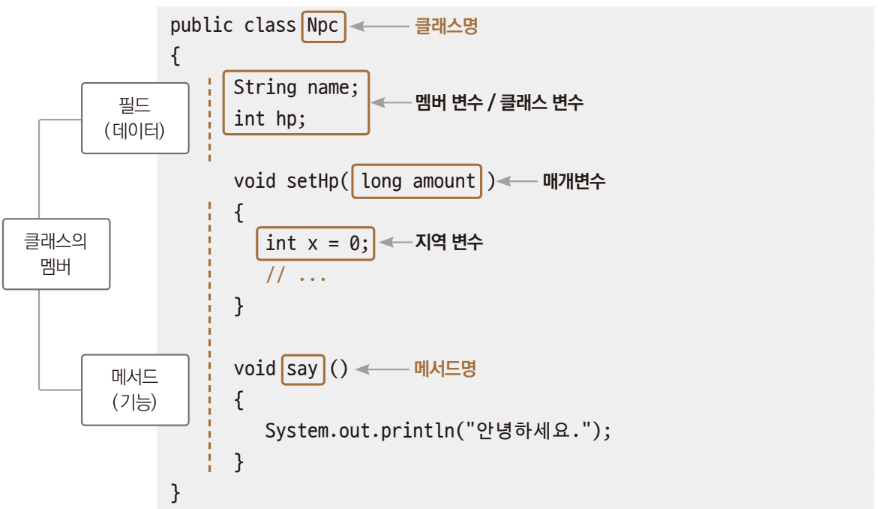
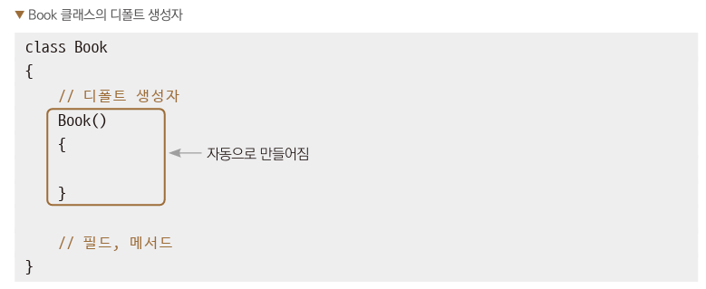

# Chpater 9 클래스의 기초

---
## 객체 
>object; 실제 세계의 모든 사물
> + 물리적인 객체 
>   + 동물, 자동차, ...
> + 개념적인 객체
>   + 개, 고양이, 호랑이, 소나타, k5, ...
---
## 클래스
>프로그래밍에서 객체와 관련된 데이터와 처리 동작을 한데 모은 코드 뭉치
> + 추상화 ; abstraction  
>    \=  특징적인 데이터와 동작을 추려내는 과정
>    + 객체를 프로그래밍에서 전부 묘사하기에는 데이터와 처리 동작이 너무 많기에
> > 명사적인 특징을 뽑아내는 추상화 과정  
>    → 멤버 변수 (필드) 추출  
> 동사적인 특정을 뽑아내는 추상화 과정  
>  → 멤버 함수(메서드) 추출

``` 
// 클래스 정의 : 객체를 추상화해놓은것
class Npc
    {
    // 필드 : 데이터
    String name;
    int hp;
    // 메서드 : 동작
    void say()
        {
            System.out.println("안녕하세요");
        }
    }
```
>클래스를 정의한다. :  
> 자바의 클래스 파일에 데이터는 필드로 동작은 메서드로 추상화해서 기술하는 것



---
## 객체와 클래스
> 클래스 : 객체를 프로그래밍에서 사용하려고 추상화해서 기술해놓은 설계도  
> >프로그래밍에서 사용하려면 설계도를 기초로 실체를 만들어야한다.
> + 객체(오브젝트) : 실제화한 것
>   + 클래스라는 설계도대로 구현한 것을 메모리에 탑재해 메모리 주소를 부여 
> + 인스턴스화 / 객체를 생성 : 실제화하는 작업
> + 
 | *예시*  |설계도|   |객체 생성(인스턴스화)|   |실물|
 |:-----:|:--:|:-:|:--:|:-:|:--:|
 |  실생활  |자동차 설계도| → |공장| → |(생산된) 자동차|
| 프로그래밍 | 클래스|→|new|→|(메모리에 적재된) 값|

+ 클래스를 객체로 만드는 코드
  +  ``Book myBook = new Book();``
     +  Book : 클래스 타입,   
     + myBook : 변수,   
     + new :  객체생성,   
      + Book(); : 생성자
     
>클래스를만들고 new로 새로 객체를 만드러어서 사용하기  
> → *NpcUse.java*  
> 1. Npc 클래스를 정의
> 2. Npc 클래스에서 데이터로 사용할 것, 즉 필드를 정의
> 3. Npc 클래스에서 기능으로 사용할 것, 즉 메서드를 정의
> 4. 클래스 타입의 참조 변수는 스택에, 생성된 객체는 힙에 적재됨
> 5. 자료형이 Npc클래스형인 saram1 변수를 만든다.
> 6. 객체의 필드는 dot.을 이용하여 접근한다.
> 7. 객체의 멤버 변수hp에 값을 대입한다.
> 8. 객체의 멤버 변수에 대입된 값을 출력한다.
> 9. 객체의 메서드를 호출해 기능을 동작시킨다.

___
## 오버로딩 (overloading)
> 하나의 클래스 내에 매개변수 개수나 자료형은 다르지만 메서드명은 같은 메서드를 여러 개 정의하는 것

오버로딩이 사용되는 예제  
→ *OverloadingUse.java*
1. 자료형이 Calc 클래스형인 메서드를 호출,. 매개변수 두개가 int형
2. 객체의 add() 메서드를 호출, 매개변수 두 개가 int형
3. 객체의 add() 메서드를 호출, 매개변수 한 개가 int형
4. 객체의 add() 메서드를 호출, 매개변수 두 개가 double형


   + 오버로딩이 적용되어 있었던 메소드  
```
System.out.println();// 매개변수 없이 줄바꿈만 출력   
System.out.println(1); // 정숫값 출력
System.out.println("홍길동");  // 문자열 출력
```

---
## 생성자 (constructor)
>생성을 할 때만 호출하는 특수한 메서드  
> new 연산자가 객체의 생성자를 이용하여 객체를 생성해줌  
> ``Book myBook = new Book();``
> + Book : 클래스 타입
> + myBook : 변수
> + new : 객체 생성
> + Book(); : 생성자  
>>생성자의 특징
>> + 생성자명은 클래스명과 같다.
>> + 메서드이지만 반환형이 없다.
>> + 매개변수가 없다.  
>> 
> _시그니처(signature) : 메서드명 + 매개변수_


+ 디폴트 새성자는 프로그래머가 굳이 정의하지 않아도 컴파일러가 클래스명만 보고 자동으로 만들어줄 수있다.  
+ 생성자의 오버로딩을 이용하면 클래스의 객체 변수가 만들어질 때 다양한 방식으로 변숫값을 초기화할 수 있다.
→ *ConstructorUse.java*
1. 자동으로 생기는 생성자에는 아마ㅜ런 기능이 없으므로 직접 만들고 객체가 생성될 때 변수에 값을 대입하여 초기화해준다.
2. 생성자를 오버로딩해서 매개변수가 있는 생성자를 만든다.
3. 매개변수로 값을 받아 멤버 변수의 값을 출력해준다.
4. 멤버 변수의 값을 출력해준다.
5. 디폴트 생성자와 new연산자를 이용하여 객체를 만든다.
6. 오버로딩된 생성자와 new 연산자를 이용하여 객체를 만든다.   이떄 생성자의 매개변수로 값을 넘겨 객체의 멤버 변수의 값을 초기화 할 수 있다.
7. 객체의 멤버 변수에 직접 값을 대입한다.
8. 객체의 메서드를 호출한다.

+ ``Book book1 = new Book();`` ▷ 에러발생
  + 디폴트 생성자에 아무 기능이 없더라도 디폴트 생성자도 꼭 명시적으로 만들어주어야 한다.
---
## 접근 제한자
> 변수나 메서드에 접근 제한자를 지정하면 접근을 제한할 수 있다.

| 접근 제한자      |설명|
|:------------|:--|
| public      |퍼블릭, 외부 클래스 어디에서나 접근 가능하다.|
| protected   |프로텍티드 같은 패키지 내부의 상속 관계의 클래스에서만 접근 가능하다.|
| (아무것도 표시 x) |디폴트, 같은 패키지 내부에서만 접근 가능하다.|
| private     |프라이빗 같은 클래스 내부에서만 접근 가능하다.|

+ 정보 은닉화(information hiding) : 클래스 외부에서 클래스 내부로의 변수와 메서드에 대한 접근을 제한
  + 새터(setter) : private 멤버 변수에 값을 대입하는 메서드
  + 게터(getter) : private 멤버 변수에 값을 가져오는 메서드
+ private으로 멤버 변수 접근 제한을 했더라도 해당 멤버 변수를 사용할 수 있는 메서드를 제공해서 프로그램 의도에 맞게 멤버 변수의 값을 사용하도록 유도할 수 있다.  

→ *PrivateUse.java*
1. Student1 클래스의 멤버 변수는 접근 제한자가 따로 지정되지 않았기 때문에 접근 제한 상태는 default 상태이다. 같은 패키지(폴더) 안읰 클래스에서 언제든지 변수에 접근하여 사용할 수 있다.
2. Stdent2 클래스의 name 변수는 public으로 age 변수는 private으로 접근 제한자를 지정
3. age 변수는 다른 클래스에서 접근할 수 없다.
4. age 변수의 값을 다른 클래스에서 가져갈 수 있도록 게터로 getAge() 메서드 제공
5. 값을 대입하는 setAge() 메서드 제공
6. 부적절한 값을 대입하지 못하도록 검사  
```
class Student2  
   {
   public String name;
   private int age;

   public Student2(String name, int age)
   {
   this.name = name;
   this.age = age;
   }
```
> 멤버 변수입을 구분해주기 위해 this를 사용한다.
7. sudent1 객체 변수의 멤버 변수는 접근 제한자가 특별히 지정되지 않았기 때문에 default 상태라 접근 가능
8. 연산자를 통해서 직접 접근해 값을 대입
9. 컴파일 과정에서 에러가 발생하지는 않지만 부적절한 값이 대입될 수 있다.
+ 직접 접근을 허용하지 않도록 클래스를 설계할 필요가 있다. 필요한 경우 private으로 선언하고 게터, 세터를 활용해 오류를 막을 수 있다.
  + 이러한 클래스 설계 ▶ 정보은닉
10. name은 public으로 지정되어 있기 때문에 직접 대입 가능
11. age는 private으로 지정되어 있기 때문에 직접 대입 불가
12. age는 세터를 이용하여 값을 대입
    + 만약 부적절한 값이라면 6. 에서 검열
13. 부적절한 값을 출력하면 에러를 발생시키지 않고 0을 출력한다.

---

---

## tossbank 부캠

```java
// 자바는 클래스에서 시작해서 끝난다.
// public : 접근 제한자
// class : 클래스 정의어
public class ex01 {
    // static : 정적 변수/함수로선언
    //        : 프로그램 시작점에 정의한다.
    // String[] : 문자열 배열, 프로그램 시작시
    //           파라미터 ex) hwp.exe a.hwp
    public static void main(String[] args) {
        // println : 콘솔 출력
        System.out.println("Hello Java!");
    }
}
```
- `public`	접근 제한자 : 어디서든 접근 가능하게 한다.
- `static`	정적 메서드 선언 : 객체 생성 없이 실행 가능한 메서드로 만들기 위해 사용. JVM이 프로그램 시작 시 호출함.
- `void`	반환형 없음 : main 메서드는 값을 반환하지 않는다.
- `main(String[] args)`	프로그램의 시작 메서드 : 실행 시 자동 호출되며, 문자열 배열을 통해 외부 파라미터를 받을 수 있다.
---
```java
import java.util.Arrays;

public class ex10 {
    public static void main(String[] args) {
        System.out.println("sout");
        int i=10;
        System.out.println("i = " + i);

        myFunc( 20);

        for (int j=5; j<5; j++) {
            System.out.println("args = " + Arrays.toString(args));
            System.out.println(i);
        }

        int[] array = { };
        if (array == null){
            
        }

    }
    static void myFunc(int p) {
        System.out.println("ex10.myFunc");
        System.out.println("p = " + p);
    }
}
```
- 코드 흐름
  - 메인 메서드 (main)
    1. 간단한 메시지와 변수 값을 출력
    2. 클래스 내의 다른 static 메서드(myFunc) 호출
    3. 반복문 정의 (하지만 조건이 false라 실행되지 않음)
    4. 빈 배열 선언 후 null 체크 (배열이 비었지만 null이 아니라서 실행 안 됨)

  - static 메서드 정의 (myFunc)
    - 매개변수로 받은 값을 출력하는 메서드

- 개념 요약
  -  메서드 호출 방식 (static)
      - `static` 메서드는 객체 생성 없이 호출 가능.
  - 빈 배열과 null 체크 구분하기
     - 빈 배열은 null이 아님.
  - 배열 출력 시 `Arrays.toString()` 활용
     - 배열 내용을 확인할 때는 반드시 사용.

```java
//클래스 선언
class Car {
    //속성(변수)
    int price = 1000;
    //행동(메소드)
    void run() {
        System.out.println("차가 달린다.");
    }
}

public class ex19 {
    public static void main(String[] args) {
        //클래스이름 객체(인스턴스)이름 = new 클래스이름();
        Car car = new Car();

        //멤버변수 접근하려면, 객체이름 뒤에 점.을 찍는다.
        System.out.println(car.price);
        //멤버함수 접근하려면, 객체이름 뒤에 점.을 찍는다.
        car.run();

        //System.out.println( car.run() ); //void변환값을 출력X
    }
}
```
- 객체지향프로그래밍(OOP)  
  - 현실 세계의 사물을 객체(속성과 행동)로 모델링하여 프로그래밍하는 방식
  - 절차지향(C)와 달리, 코드의 재사용성과 확장성, 유지보수성이 높아짐


  - C언어 - main()함수과 일반함수로 모든 코드를 구현했다.
    main.c 5000행이다.
    - 예) 자동차  
     속성과 행동으로 정의한다.  
     변수,필드   함수,메소드
```java
class Desk {
    private int price = 1000;

    public int getPrice() {
        return price;
    }

    public void setPrice(int price) {
        this.price = price;
    }
}

public class ex23 {
    public static void main(String[] args) {
        Desk desk = new Desk();
        desk.setPrice( 2000 );
        System.out.println( desk.getPrice() );
    }
}
```
```java
public class ex24 {
    static void echo(){
        System.out.println("echo");
    }
    static void echo(String str){
        System.out.println("echo "+str);
    }
    static void echo(int i){
        System.out.println("echo "+i);
    }
    static void echo(int i, int j){
        System.out.println("echo "+i+" "+j);
    }

    public static void main(String[] args) {
        echo();
        echo("hey~");
        echo( 10 );
        echo( 10, 20 );

    }
}
```

✅ 싱글톤(Singleton) 패턴
- 자바에서 객체를 new 키워드로 계속 생성하면 여러 인스턴스가 생김  
그러나 하나의 인스턴스만 존재해야 하는 경우, 싱글톤 패턴을 사용함
```java

class FishBun {
    int bunNo = 10;
}
class UniqueFishBun {
    int bunNo = 30;
    private static UniqueFishBun singletone;
    static UniqueFishBun getInstance() {
        if (singletone == null) {
            singletone = new UniqueFishBun();
        }
        return singletone;
    }
}

public class ex25 {
    public static void main(String[] args) {


        FishBun bun1 = new FishBun();
        FishBun bun2 = new FishBun();
        FishBun bun3 = new FishBun();
        System.out.println(bun1);
        System.out.println(bun2);
        bun1.bunNo = 20;
        System.out.println(bun1.bunNo);
        System.out.println(bun2.bunNo);
    }
}
```
### ✅ 요약
| 비교 대상       | 일반 클래스          | 싱글톤 클래스 |
|----------------|----------------------|----------------|
| 객체 생성 방식  | new 키워드로 매번 생성 | getInstance()로 1회 생성 |
| 인스턴스 개수   | 여러 개               | 단 하나          |
| 사용 목적       | 일반적인 클래스 사용    | 전역 객체, 설정, 로그 등 |

> ⚠️ 주의: 싱글톤도 너무 남용하면 전역 상태 관리가 어려워질 수 있으므로 필요한 상황에서만 사용해야 함.

✅ 생성자(Constructor) 함수
> 클래스 객체가 생성될 때 자동으로 호출되는 특수한 메서드

### 📌 목적
- 객체 생성 시 클래스 내부의 **필드를 초기화**하는 데 사용
- 생성자는 클래스 이름과 같고, 반환형이 없다

### 📌 기본 생성자 예제
```java
class Book {
    int price = 1000;

    // 생성자 함수 (클래스명과 동일, 반환형 없음)
    public Book() {
        System.out.println("생성자 호출됨!");
        this.price = 2000; // 생성자를 통해 필드 값 초기화
    }

    void read() {
        System.out.println("읽는다.");
    }
}

public class ex27 {
    public static void main(String[] args) {
        Book book = new Book(); // 생성자 자동 호출됨
        System.out.println(book.price); // 2000 출력
    }
}
```

### ✅ 생성자 특징
- 클래스명과 동일한 이름을 가진 메서드
- 반환형이 없다 (`void`도 쓰지 않음)
- 객체 생성 시 자동으로 호출됨
- `this` 키워드로 멤버 변수와 지역 변수 구분 가능
- 여러 개의 생성자를 만들 수 있음 → **생성자 오버로딩** (Overloading)

> 📝 생성자는 클래스 내부에서 객체 초기화 용도로 자주 사용되며, 필드 값을 객체 생성 시점에 미리 세팅해줄 수 있어 효율적인 초기화가 가능하다.

✅ 생성자 오버로딩 (Constructor Overloading)
> 하나의 클래스에 매개변수가 다른 여러 생성자를 정의하는 것

### 📌 목적
- 다양한 방식으로 객체를 초기화할 수 있도록 유연성 제공
- 생성 시 필요한 값만 전달하여 다양한 초기값 설정 가능

### 📌 예제 코드
```java
class Robot {
    String color = "빨강";
    int price = 1000;

    // 기본 생성자
    public Robot() {
        System.out.println("기본생성자 호출");
    }

    // 생성자 오버로딩 - 매개변수 1개
    public Robot(String color) {
        this.color = color;
        System.out.println("매개변수가 1개 있는 생성자 호출");
    }

    // 생성자 오버로딩 - 매개변수 2개
    public Robot(String color, int price) {
        this.color = color;
        this.price = price;
        System.out.println("매개변수가 2개 있는 생성자 호출");
    }
}

public class ex31 {
    public static void main(String[] args) {
        Robot robot1 = new Robot();                 // 기본 생성자 호출
        Robot robot2 = new Robot("파랑");         // color만 설정
        Robot robot3 = new Robot("노랑", 2000);   // color + price 설정
    }
}
```

### ✅ 출력 결과 예시
```
기본생성자 호출
매개변수가 1개 있는 생성자 호출
매개변수가 2개 있는 생성자 호출
```

---

### 📌 생성자 오버로딩 요약
| 생성자 선언                        | 설명                     |
|----------------------------------|--------------------------|
| `Robot()`                        | 기본값으로 초기화        |
| `Robot(String color)`           | 색상만 지정해 초기화     |
| `Robot(String color, int price)`| 색상과 가격 모두 초기화 |

> 📝 오버로딩을 통해 같은 클래스지만 다양한 상황에 맞는 객체를 효율적으로 생성할 수 있다.

---