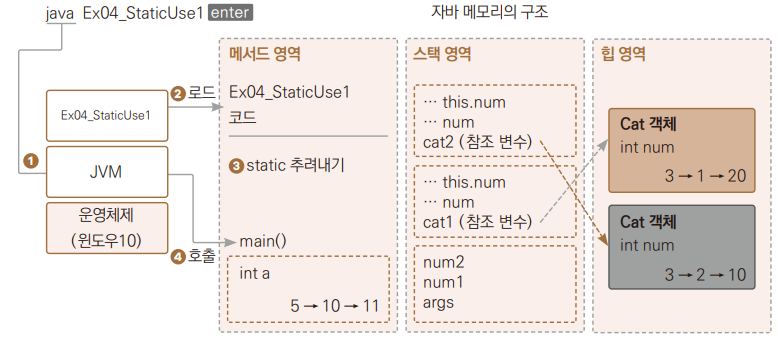

# Chapter 11 스태틱의 이해

---

## 스태틱
> 스태틱 변수 및 스태틱 메서드는 메서드 영역에 저장  
> 프로그램 시작 전 로드, 프로그램 종료 시 소멸  
> + 먼저 추려내야 하는 변수와 메서드가 있다면 static 예약어 표시를 하여 메모리의 특정 영역에 따로,  
> 미리 로딩시키니다.
> + 메서드는 누가 호출해줘야 실행되기 때문에 로딩만 된다.

---
## 전역 변수로 사용
> 메서드 영역 내 스태틱 영역의 변수 및 메서드는 어떤 객체에서도 접근하여 사용 가능
> 
  
  + 스택틱 변수를 어떻게 사용할 수 있는지
*→ Ex01_GlobalVariable*  

---
## main()보다 먼저 실행
> 스태틱 예약어는 변수, 영역, 메서드에 붙힐 수 있다.  
> 메서드는 호출을 해야 실행이 되므로 스태틱 예약어로 지정한 영역이 프로그램 실행 전 메모리에 먼저 로드가 되고 실행   
> *→ Ex02_Preload.java* ( 프로그램 실행 전에 스태틱 예약어가 붙은 변수에 값의 대입이 끝나 있는지 확인)

+ 모든 클래스에서 변수의 값을 공유할 수 있다고 스태틱 변수를 남발하여 사용하는 일은 지양해야한다.
  + 사용하는 메모리의 정확한 크기 계산을 하지 않더라도 힙 영역을 사용하지 않고 메서드 영역의 일부분만 사용하므로 메모리 사용이 비효율적이다.
  + 한 객제가 가지고 있는 데이터들은 외부에서 함부로 접근하여 수정할 수 없도록 해야 한다는 객체지향 프로그래밍 원칙에 위배된다.

---

## 유틸 메서드로 사용
> 특정 기능이 필요한데 자주 사용된다면 많은 클래스에서 중복되어 만들어지지 않게 하기 위해  
> 스태틱 메서드는 유틸리티 성격의 프로그램에서 많이 사용된다.
> 
*→ Ex03_UtilMethod.java*
+ 클래스명으로 바로 메서드 호출 가능, 스태틱을 메서드에 붙혀주면 객체 생성 없이 클래스명, 메서드명 형식으로 유틸 메서드 사용 가능
  +   static이 붙은 변수를 클래스 변수, 메서드를 클래스 메서드라고도 부른다.
+ 계산기 클래스가 같은 폴더에 있기 때문에 import를 사용하지 않아도 계산기 클래스를 사용가능
> < System.ou.println() >
> > System 클래스의 멤버 변수 out은 객체를 참조하고 있고, 그 참조한 객체의 pirntln() 메서드를 이용해 출력 기능을 제공한다.
> + System은 대문자로 시작한다.
>   + 첫 글자가 대문자로 시작하므로 클래스이다.
>   + 점. 연산자를 이용하여 System.out이라고 사용한다.
> + 객체를 만들지 않고 바로 클래스명에 접근하여 사용하여 out에는 static이 붙어 있다.
>   + out은 메서드의 특징인 소괄호 없다. out은 메서드가 아닌 멤버 변수이다.
>   + 점. 연산자를 이용하여 println() 메서드를 호출한다.
> + 메서드를 호출하고 있으므로 일반 자료형의 변수가 아니고 객체형의 변수이다. 

+ System 클래스는 자바로 개발하는 개발자라면 다 사용해야 하는 기능이므로 자바 컴파일러가 자동으로 import 시켜준다.\
```import java.lang.System;```
+ 반면 입력을 받을 때에는 수작업으로 임포트한다.  
``import java.util.Scanner;``
