# Chpater 12 클래스의 상속

---

## 상속
> 클래스가 가지고 있는 멤버를 다른 클래스에게 계승시키는 방법  
> 객체 지향 언어의 가장 큰 특징 중 하나  
> 상속한 멤버는 자식 클래스에서 저의하지 않아도 사용할 수가 있으며, 자식 클래스 내에세 멤버를 추가로 정의해서도 사용 가능  
> 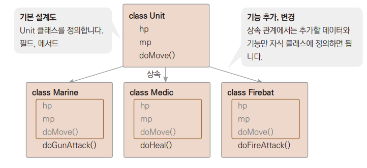
>   
> <장점>
> + 클래스 간의 전체 계층 구조를 파악하기 쉽다.
> + 재사용성 증대 : 기존 클래스에 있는 것을 재사용할 수 있다.
> + 확장 용이 : 새로운 클래스, 데이터, 메서드를 추가하기 쉽다
>   + 고스트, scv 등 추가 할 유닛이 생기면 쉽게 추가할 수 있다.
> + 유지보수 용이 : 데이터와 메서드를 변경할 때 상위에 있는 것만 수정하여 전체적으로 일관성을 유지할 수 있다.
>   + 종족 간 밸런스를 맞추고자 테란 유닛의 기본 체력을 일괄 변경 할 수 있다.

+ 상속 관련 다양한 호칭

    | 상속 대상 클래스 호칭 |    | 상속을 받은 클래스 호칭 |
    |:------------:|:--:|:--------------|
    |    슈퍼 클래스    | ↔  | 서브 클래스        |
+ |    부모 클래스    | ↔  | 자식 클래스        |
+ |    기반 클래스    | ↔  | 파생 클래스        |
+ |    조상 클래스    |↔    | 자손 클래스        |
+ |    상위 클래스    | ↔   | 하위 클래스        |
  + private 으로 접근 제한이 되어 있는 멤버들은 서브 클래스로 상속되지 않는다.  
  + 자바에서 이런 자식 클래스를 코드로 구현할 때 다음과 같이 extends 예약어를 사용한다.
  + ``clss Marine extends Unit { }``  *→ MyTerran.java*

### 자바의 다중 상속
>자바는 여러 클래스를 동시에 상속하는 다중 상속을 지원하지 않습니다. 예를 들어 두 개
이상의 상위 클래스에 같은 이름의 메서드가 정의되어 있다면, 다중 상속을 받는 하위 클래
스는 어떤 클래스의 메서드를 상속받아 사용해야 할지 헷갈리게 됩니다. 다중 상속을 지원
하는 C++ 같은 언어는 이것을 문법적으로 구분해서 사용하지만, 자바는 이런 모호함 자체
를 없애기 위해 다중 상속 대신 단계별 상속을 사용합니다.

---

## 오버라이딩
> overriding : 상속된 메서드와 동일한 이름, 동일한 매개변수를 가지는 메서드를 정의하여 메서드를 덮어씌운다. 반환값의 형도 같아야 한다.  
>+ 목적
>  + 상속받은 부모 클래스 메서드의 기능 변경
>  + 상속받은 부모 클래스 메서드의 기능 추가
    
*→ MyTerran.java*  [기능 추가]
````
void doMove()       // 1.
{
System.out.println("이동속도 10으로 이동");
}

class Marine extends Unit 
{
int attack;

    void doMove()       // 2.
    {
        super.doMove();     // 3.
        System.out.println(attack + " 공격");     // 4.
    }
    void printMarine()          
    {
        printUnit();
        System.out.println("공격력 : " + attack);      
    }
    class Medic extends Unit        
{
    int heal;      
    
    void doMove()       // 5.
    {
        System.out.println("이동속도 8으로 이동");
        System.out.println(heal + "치유");
    }
    void printMedic()       
    {
        printUnit();
        System.out.println("치유량 : " + heal);
    }
}
 ````
1. 메서드 정의
2. 부모에서 상속받은 메서드에는 super예약어를 이용하여 구분해서 정의
3. 부모의 메서드 호출
4. 자체 기능 추가
5. 메서드를 따로 호출하지 않았기 때문에 부모의 기능은 사용하지 않고 자체 구현한 기능만 사용

---

## 상속이 제한되는 final
> final은 필드나 메서드, 클래스에 붙이는 예약어이다.    
> final 상수 때처럼 클래스도 "이 클래스가 마지막이야 더 이상 상속 안됨" 이라는 의미로 클래스 앞에 붙혀 준다.  
> `` final int MAX_NUM = 100;
> final class Maine { }``

+ final 위치 별 의미

    | 사용 위치 |                설명                 |
    |:-----:|:---------------------------------:|
    |  변수   |         final 변수는 상수를 의미          |
+ |  메서드  | final 메서드는 하위 클래스에서 오버라이딩 할 수 없다. |
+ |  클래스  |      final 클래스는 상속을 할 수 없다.       |
+ 클래스의 일부 메서드를 상속 제한하려면 메서드에 접근 제한자 private을 사용한다.

---

## 추상 클래스
> 구체적인 처리 내용을 기술하지 않고, 호출하는 방법만을 정의한 메서드를 추상 메서드라고 한다.   
> 메서드를 표현할 떄 구상(concrete)메서드라고 하는 반면 추상(abstract)메서드가 있다.

````
// 구상 메서드
public int adder (int n1, n2)
{
    return n1 + n2;
}

// 추상 메서드
abstract public int adder (int n1, n2);
````
> 추상 메서드를 가진 클래스를 추상 클래스라고 한다.   
> abstract표시를 클래스 앞에 붙여주어 추상 메서드를 가진 클래스라고 표시한다
>> + 추상 클래스로 객체를 직접 만들게 되면 추상 메서드를 어떻게 동작시켜야 할지 알 수 없기 때문에 추상 클래스로는 객체를 생성할 수 없다.  
>> + 상속받은 클래스의 기능을 미리 지정하기 위해 추상 클래스를 이용한다.
>>   + 클래스를 상속받은 클래스는 이런 기능이 반드시 있어야 하므로 어떤 클래스가 상속받을지 모르기 때문에 그 기능을 구체적으로 미리 만들어 놓을 수 없을 떄 사용한다.
>
> *→ MyStarcraft.java*

 ---

## 인터페이스
> 상속 관계가 아닌 클래스에 기능을 제공하는 구조, 추상 클래스처럼 메서드로 기능을 제공  
> 정의와 추상 메서드제공, 디폴트 메서드, 스태틱 메서드까지 인터페이 멤버가 되어 활용성이 올라간다.  

### 인터페이스 구현
+ 추상 클래스
````
abstract class Unit
{
 String name;
 int hp;

 void printUnit()
 {
 System.out.println(" 이름 : " + name);
 System.out.println("HP : " + hp);
 }
 abstract void doMove();
}
````
+ 인터페이스
````
interface A
{
 public static final int a = 2;
 public abstract void say();
 public default void desc()
 {
 System.out.println("기능이 구현된 메서드입니다.");
 }
}
````
+ 줄여서
 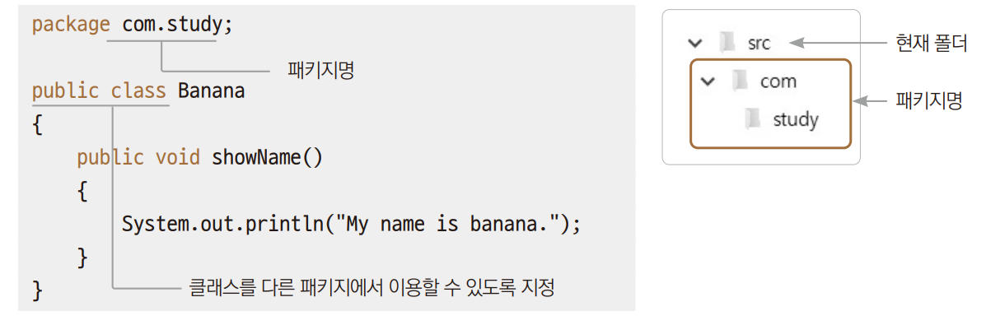
> 인터페이스끼리 상속 가능 / 인터페이스가 일반 클래스를 상속 불가
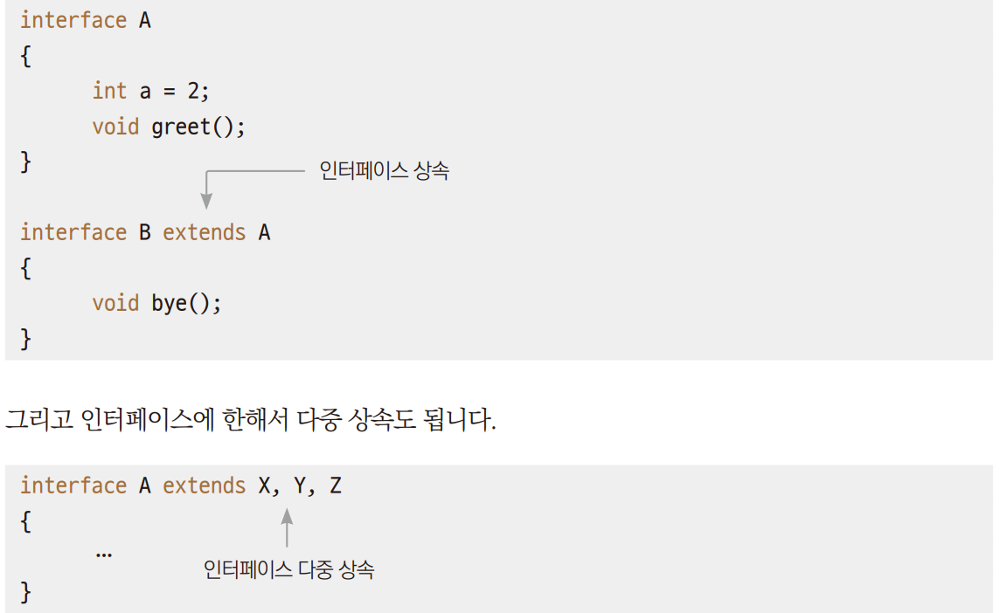

+ implements 예약어를 이용해서 코드를 작성한다.
+ 인터페이스의 메서드는 추상 메서드이므로  implements 예약어를 사용했다면 반드시 추상 메서드를 구상 메서드로 오버라이딩해서 구현해주어야 한다.
+ 클래스에서 인터페이스를 이용하도록 하는 것이 인터페이스 구현이라고 한다.

````
class B implements A
{
public void say()
{

}
}
````
+ 클래스의 상속은 extends 예약어 사용
+ 인터페이스의 구현은 implements 예약어 사용
인터페이스는 한 번의 여러 개를 구현할 수 있다.  
 


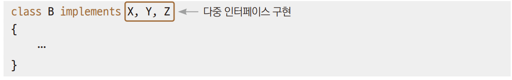
> 상속과 인터페이스를 동시에 사용한다면 다음 순서를 따른다.
> + 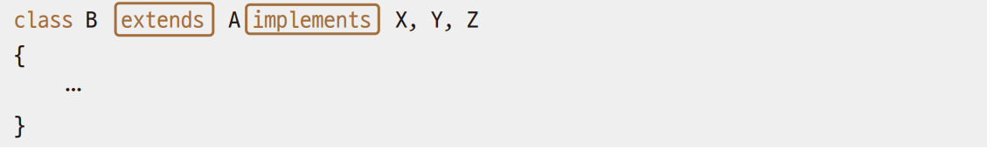


*→ Ex01Meet.java*

### 인터페이스와 추상 클래스의 차이
> 클래스 간의 상속 관계를 통해 건물이라는 본질을 유지하게 하려면 추상 클래스를 통한 상속기능을 사용.  
> 단지 기능만을 구현하려면 인터페이스를 사용한다.  
>  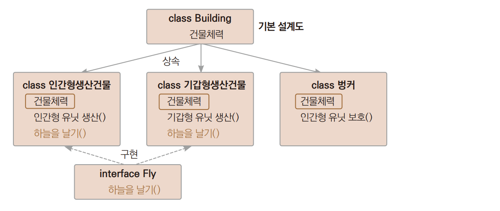  
> *→ Ex02_Starcraft.java*

### 디폴트 메서드
> 호환성을 유지하면서 기존 인터페이스에 새로운 기능을 추가 할 수 있다.  
> 어떤 인터페이스를 구현한 클래스가 이미 사용되고 있는 상태에서 새로운 클래스가 그 인터페이스를 구현하면서 기능이 부족해서 기능을 추가하고자 할떄  
> 기존에 그 인터페이스를 사용하던 모든 클래스에 추가된 기능을 구현해야 하는 불편함이 있다.
> 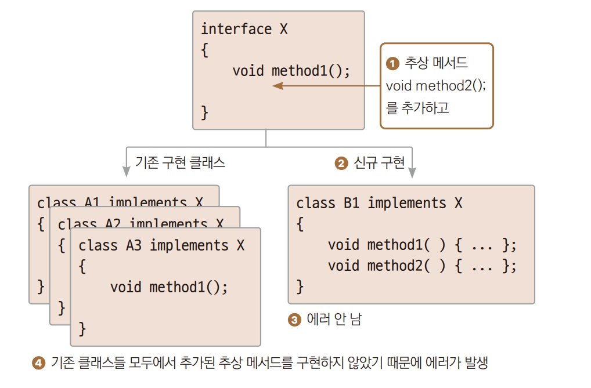

+ 네이밍이 문제이기 때문에 디폴트 메서드를 이용하면 해결 할 수 있다.
+ 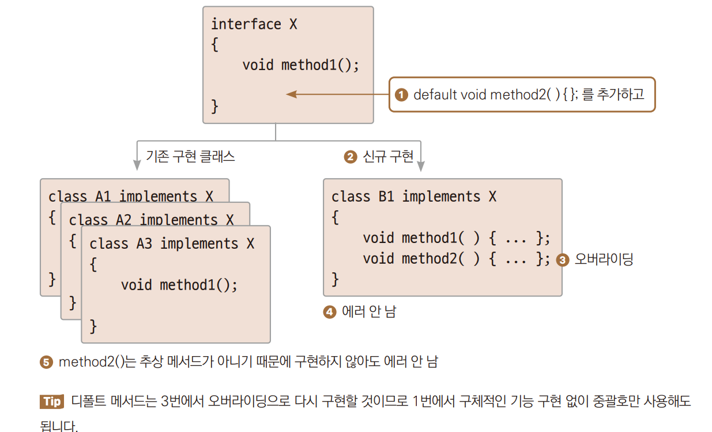

---

## 다형성
> polymorphism : 상속한 클래스의 객체는 슈퍼 클래스로도 다룰 수 있다.  
> 하나의 객체와 메서드가 많은 형태를 가지고 있는 것

+ 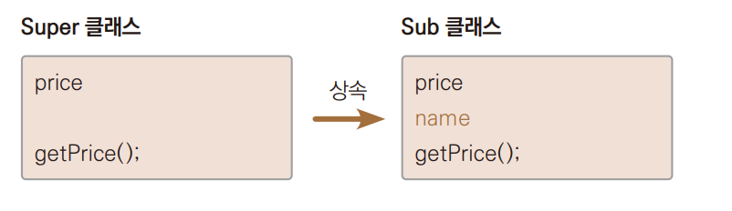
  + 위와 같이 super클래스를 상속받은 Sub 클래스가 있다고 할떄 하위 클래스 객체를 상위 클래스형의 변수에 대입하여 사용 가능
+ 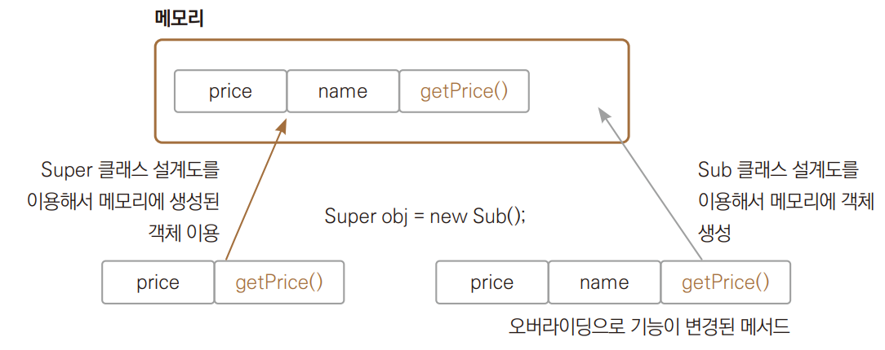
  + 실제 객체는 Sub 클래스의 설계도를 이용해 힙에 만들어져 있지만 스택에 마늘어진 변수는 Super의 설계도를 이용한다.
  + obj 변수는 설계도상 name은 몰라서 못쓰겠지만 나머지 price나 getPrice()메서듣를 사용 할 수 있다.
  + 상위 클래스의 객체를 하위 클래스형의 변수로 대입 할 수는 없다.
+ 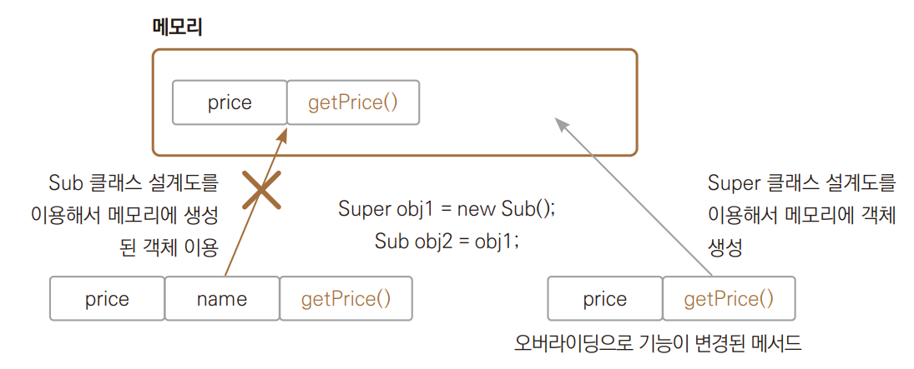
  + 실제 객체는 Super클래스의 설계도를 이용해 힙에 만들어져 있다.
  + 그런데 스택에 만들어진 변수가 Sub의 설계도를 이용하게 된다면, name이라는 변수에 접근하려고 할 때 100% 에러가 발생한다.
  + 자바 컴파일러 입장에서 에러가 날 게 뻔한 이런 상황을 허용하지 않는다.
+ ★ 자식 클래스의 객체는 부모 클래스형의 변수에 대입할 수 있다. 

*→ Ex01_Polymorphism1.java*
+ 다형성을 사용하는 이유
  + *→ Ex02_Polymorphism2.java*
````
public static Human humanCreate(int kind)
{
if (kind == 1)
{
//Human m = new Man();      // 2.
//return m;
return new Man();           // 3.
} else {
//Human = new Woman();
//return w;
return new Woman();
}
}
````
+ humanCreate() 메서드는 입력되는 매개변수에 따라 두 가지 타입의 객체를 만드는데 메서드의 반환값은 하나밖에 지정을 못한다.
2. 객체를 만드로 상위 클래스형의 변수에 넣어서 반환해 줄 수 있다.
3. 자동 형변환한다.

---

## instanceof 연산자
> 객체가 지정한 클래스형의 객체인지를 조사하는 연산자  
> 지정한 인터페이스를 오브젝트가 구현하고 있는지 조사할 수 있다.  
``boolean bCheck = obj instanceof MyClass;``
> + obj = 클래스형 변수
> + MyClass = 클래스명
> 
> ``boolean bCheck = obj instanceof MyInterface;``
> + obj = 클래스형 변수
> + MyIterface = 인터페이스명

*→ Ex03_instanceof.java*

+ instanceof연산자는 결국 다형성을 잘 사용하려고 한다. *→ Ex04_Polymorphism3.java* 