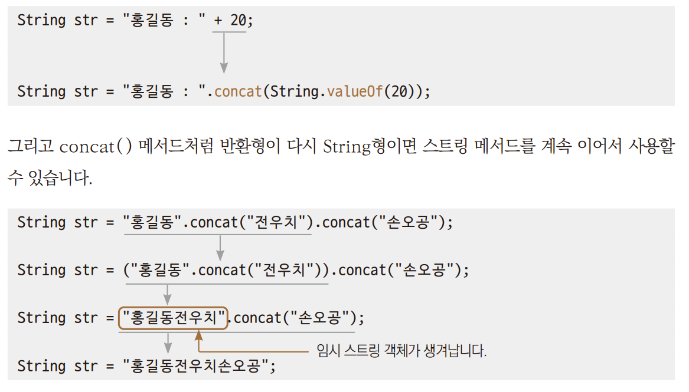

# Chpater 14 String  클래스

---

## String을 선언하는 두 가지 방법
> 자바는 문자열을 사용할 때 String 클래스를 사용한다.  
> 문자열은 자바 코드에서 글자들을 큰따옴표로 묶은 값이다.

| 구분  |  자료형   |    기호    |         예시         |
|:---:|:------:|:--------:|:------------------:|
| 문자  |  char  | 작은따옴표 사용 |   'A', '가', '0'    |
| 문자열 | String | 큰따옴표 사용  | "A", "가", "안녕하세요?" |

+ 자바에서 문자열을 생성하는 방법
  + ``` String str1 = new String("홍길동");```
  + ```Stirng str2 = "전우치";```  
  
    
+ *→ Ex01_StringUse.java*
  1. new 연산자와 문자열 리터럴 매개변수가 있는 생성자를 이용하여 객체를 힙에 만들고 그 참조 값을 변수에 대입하고 있다.  
  이 떄 객체를 무조건 새로 만든다.
  2. 문자열 리터럴을 직접 대입하고 있다. 상수를 직접 대입할 수 없기 때문에 내부적으로 new String()을 호출하여 객체를 힙에 생성하고 그 참조 값을 변수에 대입해준다.
  + 이때 매번 새로 만드는 것이 아니고 똑같은 문자열 리터럴로 이미 만들어져 있는 객체가 있다면 그 객체의 참조 값을 변수에 대입해준다.
  + 변수 str1과 변수str2에 담긴 객체의 참조 값은 서로 다를 것이 확실.  
    new를 이용하여 생성된 객체는 무조건 새로 만들기 때문, 우측에서 id값을 확인
  + 문자열 리터럴을 직접 대입 받은 str3도 처음에는 객체를 내부적으로 new를 이용하여 만들게 되므로 참조 값 26 생성
  + str4에도 문자열 리터럴 대입
+ 자바는 문자열 리터럴을 직접 대입하여 만들어지는 객체를 힙의 String Constant Pool이라는 곳에서 일반 객체와 분리하여 따로 관리.

---

## 문자열형 변수의 참조 비교
> 문자열을 if(str1 == str2)로 비교할 수 없다.
> 문자열형의 변수에는 문자열이 아닌 문자열 객체를 참조하는 id 값이 들어 있고 참조하고 있는 id값들을 비교한다

+ *→ Ex02_RefCompare*
---
## 문자열형 변수의 내용 비교
> 단순히 같다를 비교할 떄는 String() 클래스의 equals() 메서드를 사용.  
> 크기 비교를 할 때는 compareTo()를 사용  
> *→ Ex03_ContentsComapre.java*

---

## String 클래스의 메서드
> 많은 메서드를 제공한다.


### 문자열 합치기
> concat() 메서드로 두 문자열을 연결한다.  
> *→ Ex05_indexOf.java*

### 문자열 자르기
> substring() 메서드로 문자열에서 특정 위치의 문자열을 잘라낼 수 있다.  
> *→ Ex06_Substring.java*

### 문자열의 길이 구하기
> length() 메서드로 문자열의 길이를 알 수 있다.  
> *→ Ex07_length.java* 
> 1. length() 메서드를 이용하여 문자열의 길이를 구해온다.
> 2. charAt() 메서드를 이용하여 문자열에서 해당 인덱스의 문자를 가져온다

### 기본 자료형의 값을 문자열로 바꾸기
> 클래스 메서드를 이용하여 기본 자료형의 값을 문자열로 바꿀 수 있다.

+ 메서드의 오버로딩
  ```
  static String valueOf(boolean b)
  static String valueOf(char b)
  static String valueOf(double b)
  static String valueOf(float b)
  static String valueOf(int b)
  static String valueOf(long b)
  ```
+ double형 자료를 String.valueOf()에 인수로 주는 코드
  ```
  double e = 2.718281;
  String se = String.valueOf(e);
  ```
  
### 자주 사용되는 String 클래스의 메서드들
|메서드 | 설명  |
|:--|:---|
|boolean contains(String s)|문자열 s를 포함하는지 조사한다.|
|boolean startsWith(String s)|시작하는 문자열이 s인지 조사한다.|
|boolean endsWith(String s)|끝나는 문자열이 s인지 조사한다.|
|boolean isEmpty()|문자열의 길이가 0이면 true를 반환한다.|
|String toLower()|문자열을 모두 소문자로 변환한다.|
|String toUpper()|문자열을 모두 대문자로 변환한다.|
|String trim()|문자열 앞뒤에 있는 공백을 제거한 후 반환한다.|

### 문자열 대상 연산

+ 문자열 + 대상
  > 컴파일러에 의해 자동 변환이 일어나서 String 클래스의 concat() 메서드가 수행횐다.
  
  ````
  String str = "자바" + "프로그래밍";    // 컴파일러에 의한 자동 형변환
                          ↓
  String str = "자바".concat("프로그래밍");

  + 문자열 대상 += 연산  
    ````
      String str = "자바"; 
      str += "프로그래밍";   // 컴파일러에 의한 자동 형변환
      ↓
      str = str.concat("프로그래밍");
      

### 문자열과 기본 자료형의 + 연산


---

## 문자열 결합
> concat() 메서드는 결과물에 대한 객체를 계속해서 만들어낸다.  
> 그러므로 많은 수의 문자열을 합치면 문자열 결합에 메모리가 비효율적으로 사용된다.  
> 스트링 클래스는 한 번 생성되면 그 내부의 문자열이 변경되지 않기 때문에  String 클래스를 사용해 문자열을 계속 연결하거나 변경하는 프로그램을 작성하면 메모리가 많이 낭비된다.  
> StringBuilder 클래스를 사용하여 문자열을 연결하면 기존에 사용하던 변수의 값을 계속 확장하므로 임시 객체를 만들지 않는다.  
> 새로운 메모리를 확보하고 객체를 만드는 작업을 하지 않으므로 문자열 연결 속도도 빨라진다.  
> *→ Ex08_StringBuilder.java*
 
 StringBuilder와 StringBuffer 클래스
StringBuilder와 StringBuffer 클래스는 내부에 변경 가능한 char[ ]1를 변수로 가지고 있습니다.  
 이 두 클래스를 사용하여 문자열을 연결하면 기존에 사용하던 char[ ] 배열이 확장되므로 임시 객체를 만들지 않습니다.  
StringBuffer와 StringBuilder는 기능적으로는 완전히 동일합니다.  
• 생성자를 포함한 메서드 수
• 메서드 기능
• 메서드 이름과 매개변수 선언
StringBuffer는 스레드에 안전합니다.  
 그러나 모든 프로그램이 스레드 기능을 사용한 프로그래밍을 하지는 않습니다.  
 따라서 스레드 안전성이 불필요한 상황에서 StringBuffer를 사용하면 성능의 저하만 유발하게 됩니다.  
 그래서 StringBuilder가 등장하게 된 것뿐입니다.
 
---

## 문자열 분할
> StringTokenizer는 문자열을 분할하는 클래스이다.  
> 분할한 문자열을 토큰이라고 한다.

`` StringTokenizer st = new StringTokenizer("동해물과, 백두산이, 마르고, 앓도록", ", ");``  
+ 첫 번째 매개변수 : 데이터로 사용될 문자열
+ 두 번째 매개변수 : 어떤 구분자를 이용해서 자를 것인지를 지정, 생략하면 공백이나 탭으로 구분  
  ``StringTokenizer st = new StringTokenizer("동해물과, 백두산이, 마르고, 닳도록", ", ");``

+ StringTokenizer 클래서 메서드
  + hasMoreTokens(); : 토큰이 있으면 true를 반환다.
  + next(); : 토큰을 차례로 가져온다.

*→  Ex09_StringTokenizer.java*