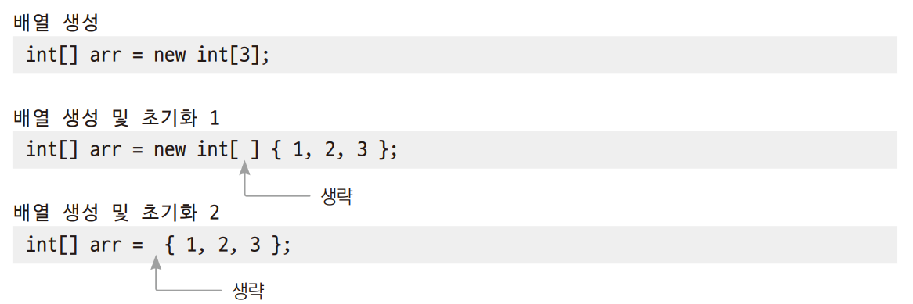
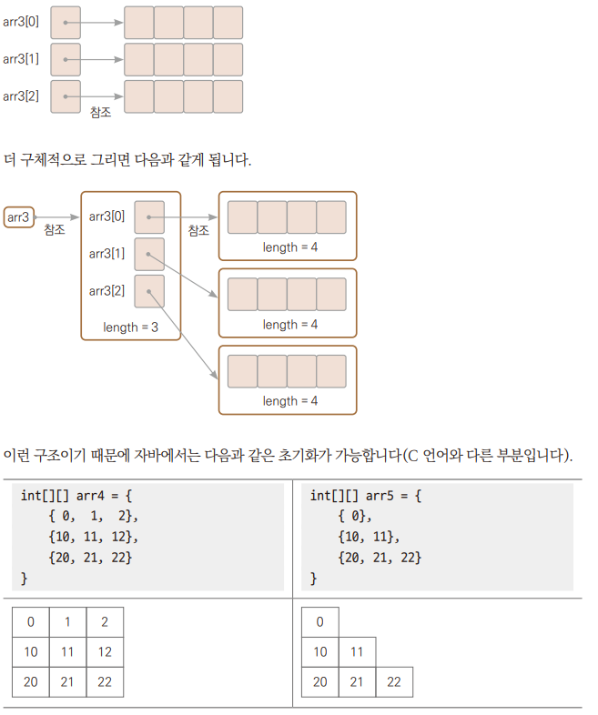

# Chapter 15  배열

---

## 1차원 배열
> 배열은 동일한 자료형 여러 개의 값을 함께 저장할 수 있다.

### 배열 선언
``자료형 [ ] 변수명 = new 자료형 [ 개수 ] ;    // 자바에서 선호하는 방법``  
``자료형 변수명 [ ] = new 자료형 [ 개수 ] ;    // 자바에서 선호하는 방법``

+ 자료형은 기본 자료형부터 사용자가 만든 클래스까지 다양하므로 자료형을 적어주고 대괄호를 통해서 배열 표시를 해주고 생성할 때 몇 개인지 알려준다.
+ 배열 인덱스를 이용하여 개별 요소에 접근하여 사용한다.
    > ``int num = 0;`` ``int[] num = new int[10];``  
  > ``int num; num = 0;`` ``int[] num; num = new int[10];``
    
+ *→ Ex01_ArrayInstance*

###  배열 사용 : 기본 자료형
> int형 배열을 만들고 값을 대입하고 참조하는 방법  
> *→ Ex02_intArray.java*

### 배열 사용 : String형
> String형 배열을 만들고 값을 대입하고 참조하는 방법  
> *→ Ex03_StringArray.java*

### 배열 사용 : 클래스형
> 클래스형 배열을 만들고 값을 대입하고 참조하는 방법  
> *→ Ex04_BoxArray*

### 배열 사용 : 매개변수, 반환형
> 배열은 일반 변수처럼 메서드의 매개변수로 사용할 수도 있고 메서드의 반환형으로도 사용 가능하다.  
> *→ Ex05_ArrayInMethod*

### 배열 생성과 동시에 초기화
> 앞의 예제는 배열을 선언하고, 배열의 요소에 개별적으로 접근해 값을 대입했지만,  
> 배열은 생성과 동시에 초기화를 할 수도 있다.
+ 
  + 뒤에 초기화하는 데이터 개수를 보고 생략된 숫자를 알 수 있다.
  + 초기화하는 데이터를 보고 당연히 배열의 초기화 값이라고 생각할 수 있다.
  + 자바 컴파일러가 유추할 수 있는 부분은 생략이 가능하다.
  + 배열의 값을 초기화하지 않았을 떄도 디폴트 초기화는 진행된다
  + 기본 자료형 배열은 모든 요소를 0으로 초기화하고, 객체 배열은 모든 요소가 null로 초기화된다
+ *→ Ex06_ArrayInit.java*

### main()메서드의 매개변수
>개발자가 직접 호출하는 메서드가 아닌 JVM이 프로그램을 실행할 떄 불리는 메서드  
> 명령 프롬프트에서 프로그램을 실행할 떄 인수를 넘겨주거나 IDE에서 따로 인수를 넘겨준다.

---

## for ~ each문
> for문 안에 항상 배열 길이만큼 반복을 하는 코드  
> *→ Ex08_EnhanceFor.java*

+ for ~ each문에는 기본 자료형뿐 아니라 객체 자료형을 가진 배열도 사용가능하다.  
  *→ Ex09_EcnHancedForObject.java*

---

## 다차원 배열
> 2차원, 3차원 등 더 많은 차원의 배열을 만들어 사용 가능하다.

### 2차원 배열
``int [][] arr2 = new int [3][3]``  
*→ Ex10_ForInFor.java*

### 2차원 배열의 실제 구조
> ``int[][] arr3 = new int[3][4];``  
> 위 코드는 다음처럼 세 배열이 각각 길이가 4개인 배열을 가지고 있는 구조이다.  
  
> *→ Ex11_PartiallyFilled.java*

---

## 배열 관련 유틸리티 메서드
> 배열을 편하게 사용하게 해주는 여러 메서드

### 배열의 초기화 메서드
> 메서드를 사용하여 원하는 값으로 배열 전부 또는 일부를 채울 수 있다.
+ java.util.Array 클래스에 정의되어 있는 메서드
  + ``public static void fill(int[] a, int val)``
    + 두 번째 매개변수로 전달된 값으로 배열 초기화 
  + ``public static void fill(int[] a, int fromIndex, int toIndex, int val``
    + 인덱스 fromIndex ~ (toIndex-1) 범위까지 val값으로 배열 초기화 

### 배열의 복사 Array 클래스
> 배열 복사는 다음 두 클래스에 있는 메서드를 사용할 수 있다.
+ java.util.Array 클래스에 정의되어 있는 메서드
  + ``public static int[] copyOf(int[] original, int newLength)``
    + original에 전달된 배열을 첫 번쨰 요소부터 newLength 길이만큼 복사
  + ``public static int[] copyOfRange(int[] original, int from, int to)``
    + original에 전달된 배열을 인덱스 from부터 to 이전 요소까지 복사
+ java.util.System
  + ``public static void arraycopy(Object src, int srcPos, Object dest, int destPos, int length)``
     + 배열 src의 srcPos에서 배열 dest의 destPos로 length 길이만큼 복사   

*→ Ex_12ArrayCopy.java*

### 배열 내용 비교
> Array 클래스에는 배열을 비교해주는 equals() 메서드가 있다.  
> 두 배열에 저장된 데이터의 수, 순서 그리고 내용이 같을 떄 true를 반환한다.  
> *→ Ex_Arrayequals.java*

### 배열의 내용 정렬
> Arrays 클래스에는 배열을 내용을 정렬해주는 sort() 메서드가 있다.
> + ``public static void sort(int[] a)``
>    + 매개변수 a 로 전달된 배열을 오름차순으로 정렬  
>
> *→ Ex14_ArraySort.java*