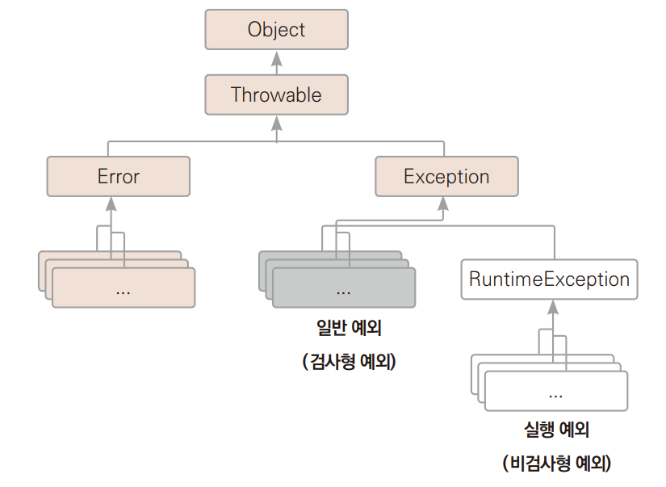
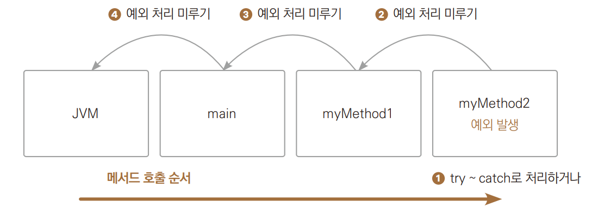

# Chapter 16 예외 처리

---

## 예외와 에러
> + 에러
>   + 컴파일에러
>   + 런타일 에러
>     + 예측 불가능 - 시스템 에러
>     + 예측 가능 에러 - 예외
>       1. 프로그램의 정상 종료
>       2. 예외 발생 시 무시하고 프로그램 계속 실행

+ 자바에서 제공하는 에러에 대한 전체 클래스
    

---

## 예외 종류
> + 실행 예외 : 개발자가 판단하여 예외를 처리하든지 처리가 안되었다면 자바 가상 머신에 처리를 맡긴다.
>   + 예외 처리를 하지 않아도 컴파일할 수 있는 비검사형 예외
>   + 실행 단계에서 체크
> + 일반 예외 :  모든 상황에서 예외 처리를 하면 포르그램의 성능 정하 문제로 이어지기 때문에 컴파일러가 확실히 확인

+ 대표적인 실행 예외

  | 예외 클래스                           | 발생 이유                                  |
  |----------------------------------|----------------------------------------|
  | `NullPointerException`           | 객체 참조가 없는 상태에서 인스턴스 멤버에 접근하려고 할 때 발생   |
  | `ArrayIndexOutOfBoundsException` | 배열의 범위를 벗어난 인덱스로 배열에 접근하려고 할 때 발생      |
  | `ArithmeticException`            | 수학적 계산에서 부적절한 산술 연산이 수행될 때 발생          |
  | `ClassCastException`             | 객체의 형 변환이 잘못된 타입으로 시도될 때 발생            |
  | `NumberFormatException`          | 문자열을 숫자로 변환할 때, 부적절한 형식의 문자열이 들어올 때 발생 |
  | `IllegalArgumentException`       | 메소드에 잘못된 인수가 전달될 때 발생                  |
  | `RuntimeException`               | 프로그램 논리 오류에 의해 발생하는 예외의 일반적인 범주        |
    | `ArtithmeticException`           | 0으로 나누기와 같은 부적절한 산술 연산을 수행할 때 발생       |
    | `IndexOutOfBoundException`       | 배열, 벡터 등에서 범위를 벗어난 인덱스를 사용할 떄 발생       |       
    |` NoSuchElementException`          | 요구한 원소가 없을 때 발생                        |

+ 대표적인 일반 예외

  | 예외 클래스                     | 발생 이유                                                          |
  |-----------------------------|------------------------------------------------------------------|
  | `IOException`              | 파일 또는 입출력 작업에서 예외적인 상황이 발생했을 때 발생      |
  | `SQLException`             | 데이터베이스와 관련된 작업에서 예외가 발생했을 때 사용됨         |
  | `ClassNotFoundException`     | 클래스를 로드할 때 해당 클래스를 찾을 수 없는 경우 발생         |
  | `InterruptedException`      | 스레드가 중단될 때(일시 중지될 때) 발생                           |
  | `ArrayIndexOutOfBoundsException` | 배열에서 유효하지 않은 인덱스에 접근하려고 할 때 발생     |
  | `NoSuchFieldException`      | 리플렉션을 통해 필드에 접근하려는데 해당 필드가 존재하지 않을 때 발생 |
  | `NoSuchMethodException`     | 리플렉션을 통해 메소드에 접근하려는데 해당 메소드가 존재하지 않을 때 발생 |

*→ Ex01_ExceptionCase.java*

---

## 예외 처리하기
> 예외 처리의 진행 형식은 다음과 같다.

````
try
{
  JAVA 코드
}
  catch (예외 타입 1 e)
{
  예외 1 발생 시 이 부분 실행
}
  catch (예외 타입 2 e)
{
  예외 2 발생 시 이 부분 실행
}
  finally
{
  이 부분은 마지막에 무조건 실행
 }
````

일부분 생략 가능
````
try
{
  JAVA 코드
}
  catch (예외 타입 e)
{
  예외 발생 시 이 부분 실행
}
  try
{
  JAVA 코드
}
  finally
{
  이 부분은 마지막에 무조건 실행
}
````

### try ~ catch
> 다음과 같이 코드를 추가하여 예외를 처리해주도록 한다.  
> *→ Ex02_TryCatch.java*

### finally
> 예외가 발생하더라도 무조건 실행하고 싶다면 finally문을 추가하고 그쪽으로 코드를 이동해주어야 한다.  
> *→ Ex03_Finally.java*
+ 예외가 발생해도 반드시 실행되어야 하는 문장이라면 위 코드와 같이 fianlly문 안에 작성을 해준다.
+ try 문을 실행하다 예외가 발생하면 예외 발생 지점에서 catch문으로 실행이 이동하게된다.
  + 하지만 catch 영역이 실행되고 맨 마지막에 finally문의 내용이 반드시 실행된다.

### 예외 처리 합치기
> 예외 상황에 대해서 CATCH문 하나당 예외 하나를 처리할 수도 있지만, catch 문 하나에서 여러 예외를 한꺼번에 처리할 수도 있다.  
> *→ Ex04_CatchConcat.java*

### 모든 예외 한 번에 처리하기
> 어떤 예외가 발생할지 모를 때 모든 예외의 최상위 클래스를 이용해서 예외를 처리 
> '자식 클래스의 객체는 부모 클래스형의 변수에 대입할 수 있다'가 적용되어 모든 예외 처리 가능  
> *→ Ex05_Exception.java*
> + 예외를 한번에 다 처리하려면 1.의 Exception 클래스나 Throwalbe 클래스를 사용할 수 있다.
> + 모든 예외는 Exception 클래스를 상속받은 것이기 때문에 다형성에서 배운 것처럼 수많은 예외 클래스들은
>   1.의 매개변수 Exception e에 대입이 될 수 있다.

---

## 예외 처리 미루기(던지기)
> 예외가 발생한 메서드에서 처리하지 않고 메서드를 호출한 곳으로 예외를 던져 메서드를 호출한 부분에서 예외를 처리하는 방법


+ myMethod2에서 try ~ catch 문으로 예외를 직접 처리할 수도 있지만 미룰 수도 있다.
+ myMethod2()에서도 예외 처리를 미루면 예외는 myMethod2()를 호출한 myMethod1()에서 예외를 처리해야 한다.
+ myMethod1()에서도 예외 처리를 미루면 예외는 main()으로 전달된다.
+ main()에서도 예외처리를 미루면 예외는 JVM으로 전달되고 JVM은 프로그램을 종료시킨다.

### 예외 처리 미루기
> 예외 처리가 어떻게 미루어지는에 대한 예제  
> *→Ex06_ExceptionThrow.java*
+ 1.에서 0으로 나누기 때문에 예외가 발생한다.
+ 그런데 예외에 대한 처리를 하지 않았기 때문에 myMethod2()를 호출한 myMethod1()으로 예외가 던져진다.
+ 그런데 myMethod()1에서도 예외 처리가 안 되어 있기 때문에 myMethod1() 메서드를 호출한 main()으로 다시 던져진다.
+ main()에서도 예외에 대한 처리가 되어 있지 않아서 예외를 JVM으로 던지다.
+ 이 라인에서 프로그램은 종료된다.
+ 2.는 실행되지 못한다.

### Throwable로 잡기
>던져진 예외를 처리하려면 어떤 예외가 올지 모르므로 catch문으에서 앞서의 Exception을 사용할 수도 있지만  
> 던져진 것을 처리한다는 의미로 Exception의 상위 객체인 Throwable을 사용할 수도 있다.  
> *→ Ex07_CatchTrowable.java*

### 예외처리를 미루는 이유
> 예외가 발생한는 지점의 메서드를 많은 곳에서 호출하는 경우 예외 처리가 다양할 수 있기 때문  
> *→ Ex08_WhyThrow*

### 메서드에 예외 선언
> 메서드 선언부에 예외를 써주는 문법  
>
````
public static void 메서드명()
  throws 예외, 예외, 예외
{
  본문
}
````
+ 메서드를 사용하는 사람이 메서드의 선언부만 보아도 이 메서드를 사용하려면 어떤 예외들을 처리하면 되는지 쉽게 알 수 있다.
+ 메서드에 예외를 선언할 때 일반적으로 RuntimeException 클래스들은 적지 않는다.
+ 메서드 선언부의 throws에 선언한다고 해서 문제가 되자 않지만, 보통 반드시 처리해주어야 하는 예외들만 선언한다.  

*→ Ex09_ThrowsInMethod.java*