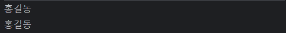
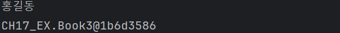
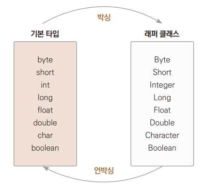

# Chapter 17 자바의 기본 클래스

---

## java.lang 클래스
> 우리가 많이 사용하는 기본 클래스를 포함하는 패키지로 이 패키지에 속한 클래스들은 임포트하지 않아도 자동으로 임포트된다.

+ 대표적인 실행 예외

| 클래스                                 | 설명                   |
|:------------------------------------|:---------------------|
| Object                              | 최상위 클래스로 기본적인 메서드 제공 |
| String, StringBuffer, StringBuilder | 문자열을 처리하는 메서들르 제공    |
| Number, Integer, Long, Double       | 기본형 데이터를 객체화         |
| System                              |시스템 정보나 입출력을 처리하는 메서드를 제공|
| Math                                |각종 수학 함수를 제공|
| Thread                              |스레드를 처리하는 메서드를 제공|
| Class                               |실행 중에 클래스 정보를 제공|

---

## Object 클래스
> 모든 자바 클래스의 최상위 클래스이다.  
> 모든 자바 클래스는 Object 클래스를 상속을 받는다 
>+ 컴파일 과정에서 extends Object가 자동으로 사용된다.

+ 다음 두개의 코드는 의미가 같다.
````
public class Ex01_Object
{
String name;
String getName()
{
return name;
}
}
````
````
public class Ex01_Object extends Object
{
 String name;
 String getName()
 {
 return name;
 }
}
````
+ 자바에서 제공하는 기본 클래스들도 Object클래스를 상속받아서 만들어졌다.
+ String 클래스 역시 Object 클래스를 상속받았다.
+ 모든 클래스가 Object 클래스를 상속받았으므로 Object 클래스의 메서드를 사용할 수 있고, 재정의할 수도 있고, Object형으로 형변환 가능하다.

+ Object 주요 메서드

    | 메서드                               |설명|
  |:----------------------------------|:--|
  | public String toString()          |객체의 문자 정보를 반환|
  | public boolean equals(Object obj) |두 객체가 동일한지 여부 반환|
  | public int hashcode()             |객체의 해시 코드를 반환|
  | protected Object clone()          |객체의 사본을 생성|

### toString() 메서드
> 생성된 객체의 클래스명과 해시 코드를 보여준다.  
> 보통 객체 정보를 String으로 바꿔서 사용할 때 사용  
> String 클래스에는 이미 오버라이딩하여 재정의를 해놓았다.  
> String 클래스명과 해시 코드를 보여주는 대신 안에 들어 있는 문자열 내용을 반환한다.
````
    public String toString() {
    return getClass().getName() + "@" + Integer.toHexString(hashCode());
    } // Onject 클래스에 정의 되어 있는 원형
````                

*→ Ex03_toString1.java*  ↔(비교)  *Ex03_toString2.java*
+ Ex03_toString1.java의 결과
     >
    1. 우리가 만든 클래스를 이용하여 객체를 생성
  2. 참조 변수의 멤버 변수의 값을 출력
  3. 객체 자체 출력
  
+ Ex03_toString2.java의 결과
    >
  + 클래스명@해시 코드 대신 그 안의 author 변수의 값 출력
  
  1. toString() 메서드를 오버라이딩하여 author 변수의 값을 반환하도록 재정의
  2. 참조 변수를 이용하여 객체의 멤버 변수의 값을 가져와서 출력
  3. 참조 변수를 이용하여 객체 자체를 출력
+ Object 객체의 toString() 메서드를 오버라이딩으로 재정의하여 사용  
*→ Ex03_toString3.java*
  > 실행결과  
    1. toString() 메서드를 오버라이딩하여 author 변수의 값을 반환하도록 정의
  2. 참조 변수를 이용하여 객체의 멤버 변수의 값을 가져와서 출력
  3. 참조 변수를 이용하여 객체 자체를 출력
  + 메서드에 객체 자체를 넘겨도 객체가 가지고 있는 문자열이 출력

### equals() 메서드
> 자신과 매개변수로 들어온 객체의 주솟값 자체를 비교하여 같은지 아닌지를 반환  
> 참조하고 있는 변수의 id끼리 비교
> 보통 오버라이딩으로 재정의하여 객체 안 변수의 값끼리 비교하는데 사용
+ equals() 메서드 원형 
  ````
  public boolean equals(Object obj) {
  return (this == obj );
  ````

*→ Ex05_equals.java*
+ Book5 클래스에는 equals 메서드가 재정의 되어 있지 않기 떄문에  
  Object 메서드에서 상속받은 그대로 사용하게 된다.  
  그 결과 주소 비교를 하게 되고 둘은 서로 다른 주소에 생성된 객체이기 때문에 false 반환

*→ Ex05_equals2.java*
+ equals() 메서드를 오버라이딩으로 재정의
  1. Object 클래스의 equals() 메서드를 오버라이딩하여 Book6 클래스 안의 author 변수의 값을 비교
  2. equals() 메서드는 객체의 주소를 비교하는 것이 아닌 객체 안에 들어 있는 변수의 값 비교

---

## 래퍼 클래스
> wrapper class : 기본 자료형에 대해서 객체로서 인식되도록 **포장**을 했다.
> + 자바는 기본 데이터형(정수형, 문자형, 논리형)에 대응하는 클래스를 마련해놓았다.

+ 기본형과 래퍼 클래스

  |메서드|    설명     |
  |:--:|:---------:|
  |boolean|  Boolean  |
  |byte|   Byte    |
  |char| Character |
  |short|   Short   |
  |int|Integer|
  |long|Long|
  |float|Float|
  |double|Double|
  + 기본 자료형 대신 래퍼 클래스를 사용하는 이유
    + 클래스가 제공하는 편리한 메서드 사용 ( 값 변환, 형 변환, 진법 변환)
    + 클래스가 제공하는 상수 사용 (MIN_VALUE, MAX_VALUE)
    + 메서드 매개변수의 형이 Object여서 기본 자료형을 사용 못하고 클래스 형태인 래퍼로 넘겨야 할 떄 사용
      + 컬렉션 프레임워크 

### Number 클래스
>java.lang.Number 클래스는 모든 수치형 래퍼 클래스가 상속하는 추상 클래스
+ byteValue()
+ shortValue()
+ intValue()
+ longValue()
+ floatValue()
+ doubleValue()

*→ Ex07_Number.java* : 수치형을 다른 수치형 자료로 형변환하는 메서드


### 문자열 변환
> 수치형의 래퍼 클래스인 Byte, Integer, Long, Float, Double에는 각각 문자열을 수치형으로 변환하는 메서드가 있다.

+ 문자열을 수치형으로 변환하는 메서드

  |   클래스   |      메서드      |기능|
  |:-------:|:-------------:|:--|
  |  Byte   |  parseByte()  |문자열을 Byte형으로 변환|
+ |  Short  | parseShort()  | 문자열을 Short형으로 변환 |
+ | Integer |  parseInt()   | 문자열을 Int형으로 변환  |
+ |  Long   |  parseLong()  | 문자열을 Long형으로 변환  |
+ |  Float  | parseFloat()  | 문자열을 Float형으로 변환  |
+ | Double| parseDouble() | 문자열을 Double형으로 변환  |

*→ Ex08_parseXXX.java* : 문자열을 수치형으로 형변환하는 메서드

+ 클래스형.메서드명을 사용하고 있기 때문에 parseInt는 스태틱 메서드이다.
+ try ~ catch문을 이용하면 예전 프로젝트에서, 입력받은 내용이 숫자인지 검사하는 로직도 아주 간단하게 구현할 수 있다.

---

### 오브젝트의 비교
> 래퍼 클래스의 오브젝트끼리 비교하려면 == 대신 equals() 메서드를 사용해야 한다.

+ ex)
  + ``Intger a = new Intger(10);``
  + ``Intger b = new Integer(20);``
  + ``boolean c = a.equals(b);``
+ 오브젝트들의 형과 값이 동일하면 true를 반환한다.

---

### 다양한 static 메서드들
*→ Ex09_UtilMethod.java*

### 박싱과 언박싱
> 박시은 인스턴스의 생성으로 이뤄지지만 언박싱을 래퍼 클래스에 정의된 메서드를 호출해 이뤄진다.

 
+ 래퍼 객체들은 담고 있는 값을 수정하지 못한다.
+ 값의 수정이 필요하다면 새로운 래퍼 객체를 생성해야 한다.
  + *→ Ex10_BoxingUnboxing.java*
    1. 기본 자료형의 갑싱 박싱에 의해 클래스 자료형으로 대입된다.
    2. 래퍼 클래스의 메서드를 통해 기본 자료형의 값을 구해온다, 언박싱이 일어난다.
    3. 값을 출력, 래퍼 클래스는 toString() 메서드가 오버라이딩으로 재정의되어 있기 떄문에 기본형 자료의 값이 출력
    4. 래퍼 클래스의 값을 증가시키려면 언박싱으로 값을 구해오고 더한 다음에 다시 박싱으로 객체를 만들어서 대입해야 한다.

### 오토 박싱과 오토 언박싱
> *→ Ex11_AutoBoxingUnBoxing.java*
>   1. 기본 자료형을 바로 래퍼 클래스형의 변수에 대입 가능, 오토 박싱이 일어난다.
> 2. 래퍼 클래스형 변수를 기본 자료형의 변수에 대입, 오토 언방싱이 일어난다.  
> 
> *→ Ex12_AutoBoxingUnBoxing2.java*
>   1. 값이 대입되면서 오토 박싱이 일어난다.
> 2. 래퍼 클래스도 증갑 연산자 사용 가능
> 3. 래퍼 클래스도 복합 대입 연산자 사용 가능
> 4. 래퍼 클래스와 기본형 자료의 연산은 오토 언박싱이 일어난 후 연산이 이루어진다.
> 5. 래퍼 클래스와 기본형 자료의 연산은 오토 언박싱이 일어난 후 연산이 이루어진다.  
>   그 후 래퍼 클래스에 값이 대입되기 위해 박싱이 일어난다.

---

## Math 클래스
>Math 클래스에 정의된 메서드는 모두 static으로 선언되어 있다.  
> Math는 기능 제공이 목적일뿐 인스턴스 생성을 목적으로 정의된 클래슨 아니다.

*→ Ex13_MathUse.java*

---

## Random 클래스
> 임의의 랜덤 값을 만들어낼 때 사용하는 클래스  
> ``Random rand = new Random();``

+ 다음처럼 다양한 메서드가 제공되는데, 보통의 경우 nextInt(int bound)메서듣 이용한다.
  + ``public boolean nextBoolean()`` : boolean형 난수 반환
  + ``public int NextInt()`` : int형 난수 반환
  + ``public long nextLong()`` : long형 난수 반환
  + ``public int nextInt(int bound)`` : 0 이상 bound 미만 범위의 int형 난수 반환
  + ``public float nextFloat()`` : 0.0 이상 1.0미만의 float형 난수 반환
  + ``public double nextDouble()`` :  0.0 이상 1.0 미만의 double형 난수 반환

*→ Ex14_RandomUse.java*

---

## Arrays 클래스
> 객체를 저장한 배열이라면 무엇을 기준으로 삼고 어떻게 정렬할까?

### 객체 저장 배열의 비교
>배열의 비교는 두 배열을 저장된 데이터 수, 순서, 내용 모두가 같을 떄 true를 반환

+ Object 클래스로부터 상속받은 equals() 메서드가 오버라이딩으로 재정의되어 있지 않은 일반 클래스로 배열을 만들고 비교  
   *→ Ex_15ArrayObjectEquals1.java*
    1. 두 배열에 동일한 값으로 초기화된 서로 다른 객체를 각각 저장
    2. 객체의 내용이 아닌 참조값이 비교되었기 때문에 false 출력

+ Object 클래스로부터 상속받은 equals() 메서드가 오버라이딩으로 재정의되어 있는 클래스로 배열을 만들고 비교
+ equals() 메서드만 오버라이딩 추가  
  *→ Ex_16ArrayObjectEquals2.java*

### 객체 저장 배열의 정렬
> 객체가 저장된 배열의 정렬은 저장된 데이터 크기를 비교할 때, 어떤 기준으로 크기 비교를 할지 프로그래머가 정한다.  
> *→ Ex17_ArrayObjSort.java*  
>   1. 오름차순 순서상 크고 작음에 대한 기준을 제공
>   2. 메서드 구현
> 3. 이름으로 비교하여 순서 구함
> 8. 객체를 출력할 때 멤버 변수를 이용하여 정보를 출력
> 9. Array 클래스의 메서드를 이요앟여 배열을 정렬
> 10. 향상된 for문을 이용하여 배열의 모든 요소를 차례대로 꺼낸다

+ 위 예제의 주석처리 부분
  ````
  if(this.age > p.age) // 4 나이 비교
      return 1; // 5
  else if(this.age < p.age)
      return -1; // 6
  else
      return 0; // 7 
  ````
  4. 나이로 비교하여 순서를 지정
  5. 비교되는 대상보다 크면 양수를 반환
  6. 비교되는 대상보다 작으면 음수 반환
  7. 비교되는 대상과 값이 같으면 0을 반환