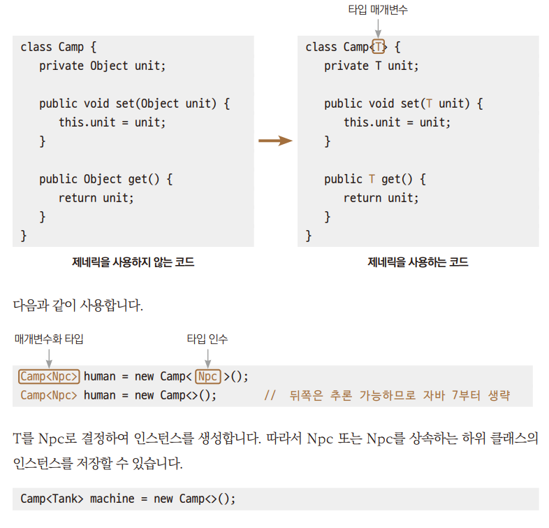

# Chpater 20 제네릭

---

## 제네릭의 필요성
> + *→ Ex01_MyGmae1.java*  
>   + 위 코드는 종족 클래스에 종복별 유닛을 생산해서 저장하고 가져오는 것인데  
>   + 종족을 표현하는 클래스인 HumanCamp1 클래스와 MachineCamp1 클래스 구조가 똑같다.  
>   + 그 결과 코드가 중복된다는 단점이 생긴다.  
> + *→ Ex02_MyGmae2.java* : 
>  + '자식 클래스의 객체는 부모 클래스형의 변수에 대입할 수 있다'를 이용해 코드 수정
>  + HumanCamp1클래스와 MachineCamp1 클래스 구조가 똑같으므로 Camp2로 합치고 어떤 자식 클래스라고 받아들일 수 있도록 1.에서 매개변수의 자료형을 Obect로 만든다.  
>  + 꺼낼 떄 약간 불편하지만 이는 컴파일러의 오류 발견 가능성을 낮추는 결과로 이루어진다. 
> + *→ Ex03_MyGmae3.java*
>   + 1.에서 우리가 만든 유닛을 생성하여 넣어줘야 하는데 실수로 스트링 객체를 생성해서 넣었다.  
>       매개변수가  Object 타입이고, 우리도 객체를 생성해 넣어준 것이기 때문에 문법적으로 오류는 나지 않는다.
>   + 2.에서 꺼낼 떄 에러가 발생한다. 꺼내 쓰는 입장에선 당연히 게임 유닛이 들어 있을 거라고 생각하기 때문에 형변환을 하게 되고 에러가 발생한다.
>+ 다음 예제처럼 사용한다면 에러조차 발생하지는 않는다.
>*→ Ex04_MyGame4.java*
>  + 에러는 발생하지는 않지만 원하는 결과가 아니다.  
>  + 제네릭을 적용하기 이전의 코드는 객체를 돌려받을 떄 형변환을 잊지 말고 해야 한다는 불편함이 있고,  
>   코드 진행상 프로그래머가 실수를 해도 그 실수가 드러나지 않을 수도 있다는 잠재적 위험이 존재한다.

---

## 제네릭 기반의 클래스 정의하기
> 제네릭은 클래스, 메서드에서 사용할 자료형을 나중에 확정하는 기법이다. 
> 객체를 생성할 때나 메서드를 호출할 떄 정한다.  
> 객체 생성 시 셜정이 되는 자료형의 정보를 T로 대체한다.  
> 다이아몬드 연산자 <>를 통해 자료형을 전달한다.


+ T를 Tank로 결정하여 인스턴스를 생성, Tank 또는 Tank를 상속하는 하위 클래스의 인스턴스를 저장할 수 있다.

+ 제네릭 관련 변수 용어

    | 용어                                         | 대상               |
    |:-------------------------------------------|:-----------------|
    | 타입 매개변수( type parameter )                  | Camp<T>에서 T      |
    | 타입 인수    ( type argument )                 | Camp<NPC> 에서 NPC |
    | 매개변수화 타입             (parameterized type ) | Camp<NPC>        |

+ 타입 매개변수의 이름 규칙
  + 일반적인 관례
    + 보통 한 문자로 이름을 짓는다.
    + 대문자로 이름을 짓는다.
  + 보편적인 선택
    + E - Element
    + K - key
    + N - Number
    + T - Type
    + V - Value

---

## 제네릭 기반의 코드로 개선한 결과
> 이전 코드에 제네릭을 적용하여 코드를 개선  
>   *→ Ex05_MyGameGeneric.java*  
> + 프로그래머의 실수 유발 *→ Ex06_MyGameGeneric2.java*

+ 제네릭을 적용함으로써 가지게 되는 장점
  + 중복된 코드의 결함 & 간소화
  + 데이터를 가져올 떄 형변환 없이 가져올 수 있음
  + 데이터 대입시 다른 자료형이 대입되는것 방지, 강한 자료형 체크

---

## 매개변수가 여러 개일 떄 제네릭 클래스의 정의
> 매개변수가 여러 개일 떄도 제네릭을 적용할 수 있다.  
> *→ Ex07_MultiParameter.java*

---

## 제네릭 클래스의 매개변수 타입 제한하기
> 상속 관계를 표시하여 매개변수의 타입을 제한할 수도 있다.  
> ``class Box< T extends Number> { ... }``

+ 인스턴스 생성 시 타입 인수로 Number 또는 이를 상속하는 클래스만 올 수 있게 설정
  + Number에서 상속받은 메서드를 안전하게 사용할 수 있다.
1. 매개변수 타입을 제한하지 않는 경우
    ````
   class Camp<T> {
        private T ob;
        ....
        public int toIntValue() {
            return ob.intValue();       // ERROR!
        }
   }
   ````
   +  아무 자료형이나 들어올 수 있기에 래퍼 클래스의 메서드를 호출하면 에러가 발생
2. 매개변수 타입을 제한하는 경우
    ````
   class Camp<T extends Number> {
     private T ob;
     ....
   public int toIntValue() {
     return ob.IntValue();           // OK!
     }
   } 
   ````
   + 제네릭에 지정할 수 있는 자료형을 Number를 상속받은 래퍼 타입 만으로 한정한다면  
        intValue() 메서드를 사용할 때 에러 걱정을 할 필요가 없게 된다.

*→ Ex08_BoundedCamp.java*

---

## 제네릭 메서드의 정의
> 클래스 전부가 아닌 메서드 하나의 대해서도 제네릭으로 정의할 수 있다.

+ 다이아몬드 연산자에 주어진 자료형으로 바꿔 써서 보면 그냥 일반 메서드이다.
    ````
  class MyDate
  {
    public static <T> T showData(T data)
    {
       if (data instanceof String)
            System.out.println("String");
        else if (data instanceof Integer)
            System.out.println("Integer");
        else if (data instanceof Double)
            System.out.println("Double");
        return data;
      }
  }
  ````

+ 제네릭 메서드의 T는 메서드 호출 시점의 결정  
    ``MyData.<String>showData("Hello world");``
+ 아래와 같이 인수 생략 가능, 생략된 인수는 매개변수로 들어온 데이터의 자료형으로 추론하게 된다.  
  ``MyData.showDate(1);``  

*→ Ex09_GenericMethod.java*

---

---

## tossbank 부트캠프
- **제네릭(Generic)** 은 데이터 타입을 일반화하여 클래스나 메서드에서 **다양한 타입의 데이터를 처리할 수 있도록 하는 기능**입니다.
- JDK 1.5부터 도입되었으며, **컴파일 시 타입 안정성 확보**와 **형변환 제거**의 장점이 있습니다.
 🔧 주요 개념

| 구분 | 설명 |
|------|------|
| 목적 | 다양한 타입의 데이터를 유연하게 처리하기 위함 |
| 장점 | 코드의 재사용성 증가, 컴파일 시 타입 체크 가능, 형변환 생략 가능 |
| 사용 위치 | 클래스, 인터페이스, 메서드 등 |
| 문법 | `클래스명<T>` 또는 `메서드명<T>` |

 📂 코드 비교: 일반 클래스 vs 제네릭 클래스

 💡 `Keyboard1` – 제네릭을 사용하지 않은 경우

```java
class Keyboard1 {
    private Object object;

    public Object getObject() {
        return object;
    }

    public void setObject(Object object) {
        this.object = object;
    }
}
```

 ❗ 단점
- 타입 안정성이 보장되지 않음
- 데이터를 꺼낼 때 `형변환(casting)` 필요

```java
Keyboard1 k1 = new Keyboard1();
k1.setObject("키보드1"); // 업캐스팅
String str = (String) k1.getObject(); // 다운캐스팅
```
 ✅ `Keyboard2<T>` – 제네릭을 사용한 클래스

```java
class Keyboard2<T> {
    private T object;

    public T getObject() {
        return object;
    }

    public void setObject(T object) {
        this.object = object;
    }
}
```

- `T`는 타입 매개변수 (Type Parameter)로, 객체 생성 시 구체적인 타입을 지정

```java
Keyboard2<String> k2 = new Keyboard2<>();
k2.setObject("키보드2");
String str2 = k2.getObject(); // 형변환 불필요
```

🧪 실행 결과 예시

```java
Keyboard1 k1 = new Keyboard1();
k1.setObject("키보드1");
System.out.println((String) k1.getObject());  // 형변환 필요

Keyboard2<String> k2 = new Keyboard2<>();
k2.setObject("키보드2");
System.out.println(k2.getObject());           // 형변환 불필요

Keyboard2<Integer> k3 = new Keyboard2<>();
k3.setObject(10);
System.out.println(k3.getObject());           // int로 지정
```