# Chapter 21 컬렉션 프레임워크

---

## 자료구조
> 대량의 데이터를 효율적으로 관리하는 메커니즘

+ 배열
    > 배열은 크기가 고정되어  있어 데이터를 추가하거나 삭제할 수 없다

  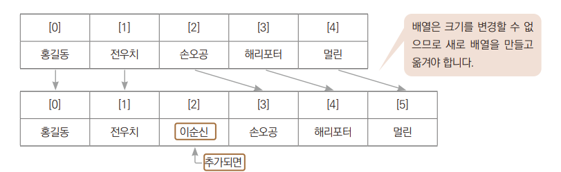
+ 리스트
  > 원소가 원소를 가리켜서 관리하는 자료구조  
  > + 데이터가 추가되거나 삭제될 떄 연결하는 정보만 바꾸면 쉽게 추가, 삭제 된다.
  
   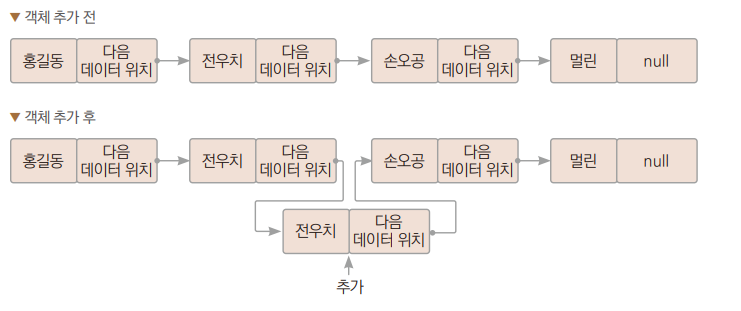

+ 스택
  > LIFO구조로 되어 있다.
  > + 자료 넣는것은 push, 자료를 꺼내는 것을 pop이라고 한다.

  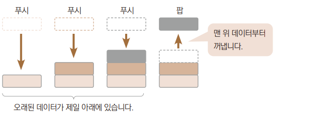

+ 큐
    > FIFO구조 되어 있다.

  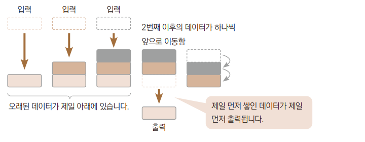
  
+ 트리 구조
    > 부모 노드 미텡 여러가 자식 노드가 연결되고, 자식 노드 각각의 다시 자식 노드가 연결되는 형태
    > + 루트 노드 : 부모가 없는 하나의 노드

  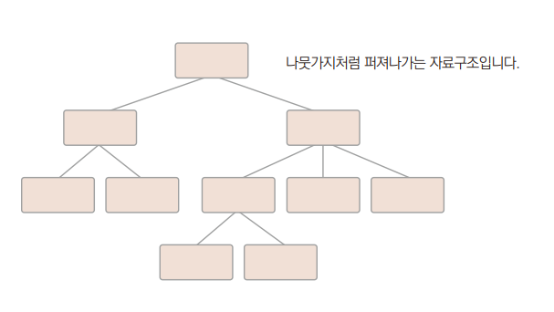
  
---

## 컬렉션 프레임워크의 구조
> 자료구조를 개발자가 편리하게 사용할 수 있도록 컬렉션 프레임워크를 제공
 + 컬렉션 프레임워크에서 제공하는 인터페이스들은 다음과 같은 상속 관계를 갖는다.
  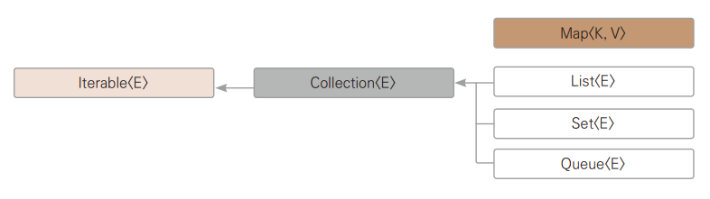


 + 컬렉션 프레임워크에 속하는 인터페이스
  
  |    인터페이스    |설명|구현 클래스|
  |:-----------:|:--:|:--:|
  |  List\<E>   |순서가 있는 데이터 집합, 추가된 데이터의 순서도 유지되며 데이터 중복도 허용|ArrayList, LinkedList, Vector, Stack|
  |   Set\<E>   |중복된 데이터가 제거되는 등 추가된 데이터의 순서가 유지되지 않는 데이터 집합, 데이터 중복이 허용되지 않는다.|HashSet, TreeSET|
  | Map \<K, V> |키와 값으로 이루어진 데이터들의 집합, 키는 중복을 허용하지 않지만 값은 중복될 수 있다.|HashMap, TreeMap, Hashtable, Properties|
  | Queue \<E>  |순서가 있는 데이터 집합, 추가된 데이터의 순서도 유지되며 데이터 중복도 허용|LinkedList|

+ Vector, Stack, Hashtable, Properties와 같은 클래스들은 컬렉션 프레임워크가 만드어지기 전부터 존재하던 것이기 때문에  
   기존 코드와의 호환을 위해 남겨져 있을 뿐 현재는 사용하지 않는다.

---

## List\<E> 인터페이슬르 구현하는 컬렉션 클래스들
> List\<E> 인터페이스를 구현하는 대표적인 컬렉션 클래스 둘은 다음과 같다.
> + ArrayList\<E> :  배열 기반 자료구조, 배열을 이용하여 객체를 저장
> + LinkedList\<E> :  연결 기반 자료구조, 리스트를 구성하여 객체를 저장
>   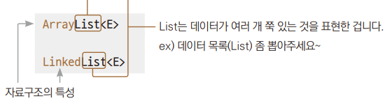
> + List\<E> 인터페이스를 구현하는 컬렉션 클래스들의 공통 특성
>   + 데이터의 저장 순서가 유지된다.
>   + 동일 데이터의 중복 저장을 허용한다.

### ArrayList 사용하기
  *→ Ex01_ArrayList.java*
  1. ArrayList 객체를 생성, 이 객체는 제네릭을 이용하여 String형만 저장할 수 있게 한다.  
      자식 객체는 부모 클래스형의 변수에 대입할 수 있다를 이용
  2. 객체 추가에 add() 메서드 사용
  3. List의 전체 개수를 size() 메서드로 구해온다. 
4. 객체 참조에 get() 메서드 사용
5. 객체 삭제에 remove() 메서드 사용

### LinkedList 사용
  *→ Ex02_LinkedList.java*
  
### ArrayList vs LinkedList
> + ArrayList :  배열은 아니지만 배열 기반이라 데이터의 추가, 삭제보다는 참조가 LinkedList보다 빠르다.
> + LinkedList : 리스트 기반이라 데이터 참조 속도보다는 데이터의 추가, 삭제가 ArrayList보다는 쉽다.

| | 단점 | 장점                   |
|:--|:--|:---------------------|
|ArrayList\<E>|객체가 추가될 떄 저장 공간을 늘리는 과정에서 시간이 비교적 많이 소요 | 저장된 객체의 참조가 비교적 빠르다. |
| |객체의 삭제 과정에서 많은 연산이 필요할 수도 있다. | |
|Linked\<E>|저장된 객체의 참조 과정이 배열에 비해 복잡해다.|저장 공간을 늘리는 과정이 간단하다.|

+ ArrayList\<E>에서 데이터 추가
  + 배열에서 원소 사이에 새로운 원소를 추가해야 한다면 배열은 크기가 미리 정해져 있으므로 새로 만들어서 옮겨야 한다.

  > ArrayList.java의 파일을 보면, 객체 배열로 사용할 Object배열과 디폴트 용량이 정의되어 있다. ArrayList() 디폴트 생성자를 호출하여 배열 크기를 지정하지 않으면 크기가 10개짜리 배열이 기본으로 만들어진다.  
  > 용량이 부족하면 큰 용량의 배열을 새로 만들고 기존 항목을 복사한다.

  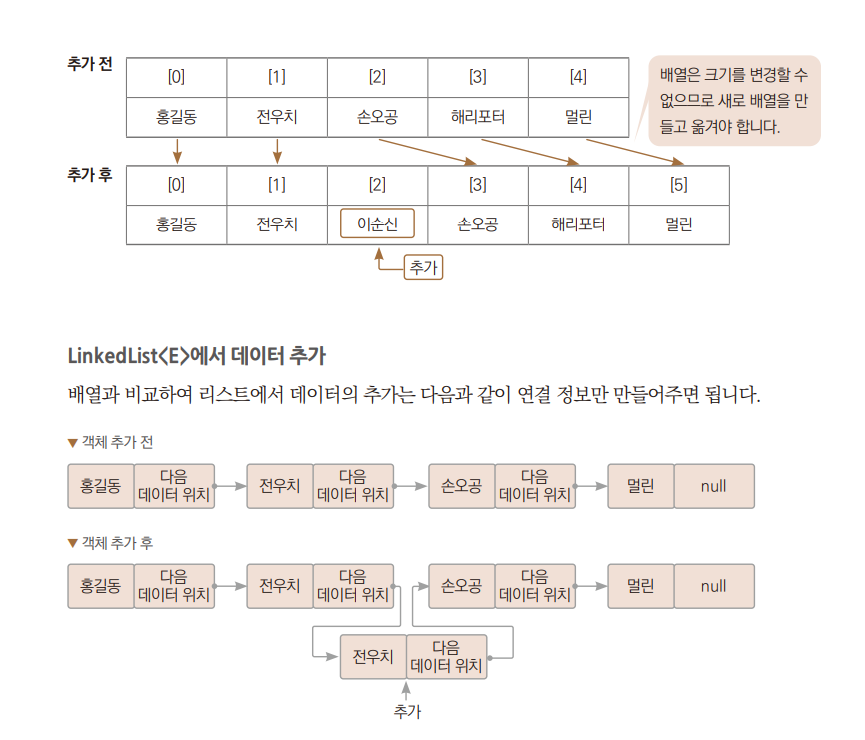

### Iterator 사용하기
> Iteralbe 인터페이스를 구현했기 때문에 저장된 인스턴스의 순차적 접근에 향상된 기능의 for문이나, Iterator반복자를 이용할 수 있다.  
> *→ Ex03_IteratorUse.java*

### 리스트 형식 구하기
> 이 리스트는 배열처럼 선언과 동시에 초기화가 불가능하다.   
+ 그러나 Array 클래스의 유틸 메서드를 사용해서 아래와 같이 사용 가능하다.  
 ``List <String> lsit = Array,asList("홍길도", "이학승", "실바");``

  + 인수로 전달된 객체들을 저장한 컬렉션 객체를 생성 및 반환한다.  
    이렇게 생성된 리스트 객체는 객체에 요소를 추가하거나 삭제할 수 없는 객체이다.
    + 수정을 위해서 아래와 같이 다시 생성해야 한다.
      ````
      List<String> list = Arrays.asList("홍길도", "이학승", "실바");
      list = new ArrayList<>(list);
      ````
      
+ 데이터 성격에 따라 ArrayList나 LinkedList를 선택하고 사용은 그냥 List로 한다.  
 사용 중에도 아래와 같이 데이터 성격을 바꿀 수 있다.  
  ````
  List<String> list = Arrays.asList("홍길동", "전우치", "손오공", "전우치");
  list = new ArrayList<>(list);
  list = new LinkedList<>(list);
  ````

*→ Ex04_Convert.java*

### 컬렉션 프레임워크에 기본 자료형을 데이터로 사용하기
> 컬렉션 프레임워크는 제네릭을 사용하여 자료형을 제한  
> 이 때 제네릭 부분에 클래스 타입을 지정해주어야 한다. 기본 자료형을 직접 적어줄 수는 없다.  
> ``List<Integer> list = new LinkedList<>();    // O``  
> ``List<int> list = new LinkedList<>();      // X``

+ 래퍼 클래스들은 오토 박싱과 오토 언박싱이 되기 때문에 자료형만 래퍼 클래스로 적어줄 뿐 기본 자료형을 사용하는데 제약사항은 없다.  

*→ Ex05_PrimitiveData.java*

---

## Set\<E> 인터페이스를 구현하는 컬렉션 클래스
> Set<E> 인터페이스를 구현하는 컬렉션 클래스들은 다음 두 가지 특성을 갖는다.
> + 저장 순서가 유지되지 않는다.
> + 데이터 중복 저장을 허용하지 않는다.

### HashSet 사용하기
*→ Ex06_Set.java*

### hash와 hashCode() 메서드
> hash :중복 저장을 방지하기 위해 데이터가 입력되기 전 이미 있는 데이터를 검색할 떄 사용하는 알고리즘  
> Set<E> 인터페이스를 구현하는 컬렉션 클래스들은 데이터 중복 저장을 허용하지 않는다.

+ 해시는 정보를 저장하거나 검색할 떄 사용하는 알고리즘이다.

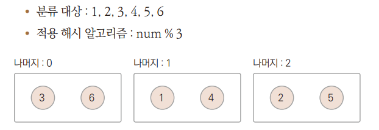
+ 위 사진처럼 분류를 해놓으면 탐색 속도가 매우 빨라진다.
+ Object 클래스의 hashCode 메서드는 이렇듯 개체들을 분류하는 역할을 한다.
+ HashSet에서 중복 저장을 막으려면 hashCode() 메서드에서 반환하는 해시 코드값에 해당하는 내부목록을 찾는다.
  + 비교해야할 탐색의 대상이 확 줄어든다. 
+ 선택된 대상 중에서 equals 메서드를 호출하여 내용이 같은지 비교하게 된다.

### HashSet의 중복 비교
>hashCode() 메서드와 equals() 메서드를 오버라이딩하여 재정의해 직접 만든 클래스를 이용하여 생성된 객체의 중복을 판단할 수 있다.

+ 자바에서 제공하는 메서드를 이용하면 쉽게 만들 수 있다.  
   ````
  public int hashCode() {
      return java.util.Object.hash(가변 인수);
  }
  ````

*→ Ex07_HashSet.java*  
1. 20을 3으로 나누었을 때 나머지와 25를 3으로 나누었을 때 나머지가 다르다
   + 해시코드만 보면 3.과 4.에서 추가한 데이터의 해시코드는 같게된다.
   + 탐색의 단계에서 해시코드가 같고, equals() 메서드의 내용에서 나이가 같은지를 보기 때문에 같은 20이므로 중복된 데이터로 판단
+ 3.과4.에서 추가한 데이터는 같은 데이터라는 판단이 일어나고, HashSet에서는 추가가 되지 않는다.

2. 1.을 주석처리후 2.의 주석을 풀어준다
    + 자바에서 제공해주는 메서드를 이용하여 해시를 구하고 있다.
    + 매개변수에 넣을 데이터는 한 개만 넣어도 되고, 지금처럼 여러개을 넣을 수도 있다.
+ 3., 4., 5.에서 추가한 데티어의 모든 해시값이 다르게 되므로 equals() 메서드가 호출되지도 않고 서로 다른 객체로 처리된다.

### TreeSet
> 컬렉션 프레임워크에서 Tree로 시작하는 클래스는 데이터를 추가한 후 결과를 출력하면 결괏값이 정렬된다.

*→ Ex08_TreeSet.java*
    
+ 데이터를 5개 추가, TreeSet에는 4개만 저장된다.  
 + 정렬되어 출력된다.

+ 반복자의 객체 참조 순서는 오름차순을 기준으로 한다.

### TreeSet의 정렬
> 자바는 TreeSet의 정렬을 구현하기 위해 이진 탐색 트리를 사용한다.

+ 이진 탐색 트리 ( Binary Search Tree, BST )
  + 노드 ( node ) : 트리 자료구조에서 각 자료가 들어가는 공간
  + 부모-자식 노드 ( parent-child node ) :  위아래로 연결된 노드의 관계
  + 노드에 저장되는 자료의 중복을 허용하지 않고, 부모가 가지는 노드 수가 2개 이하이다.  

    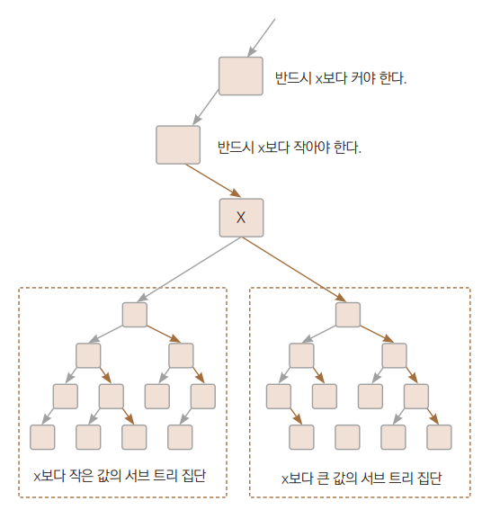
    + 각 노드의 왼쪽 서브 트리에는 해당 노드의 값보다 작은 값을 지닌 노드들로 이루어져 있다.
    + 각 노드의 오른쪽 서브 트리에는 해당 노드의 값보다 큰 값을 지닌 노드들로 이루어져 있다.
    + 중복된 노드가 없어야 한다.
    + 왼쪽 서브 트리, 오른쪽 서브 트리 또한 이진 탐색 트리이다.

  + 어떤 특정 값을 찾으려 할 떄 한 노드와 비교해 비교한 노드보다 작은 값이면 왼쪽 자식노드 방향으로,  
    그렇지 않으면 오른쪽 자식 노드 방향으로 이동
    + 비교 범위가 1/2씩 줄어들어 효과적으로 자료를 검색할 수 있다.
  + 간단한 이진 탐색 트리  
    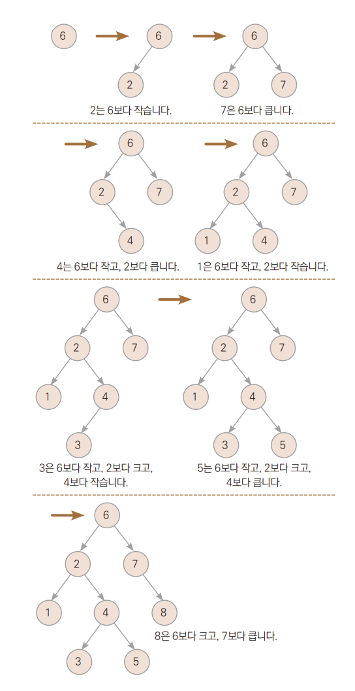
    + 맨 왼쪽 노드부터 시작해서 왼쪽 -> 부모 -> 오른쪽(뭉치) 순으로 순회하면 오름차순이 된다.
    + 순회하다가 노드의 끝은 만나면 부모 노드로 올라간다.
    + 가장 왼쪽 노드인 1부터 순회하면 아래와 같다.
      + 1 → 2 → 오른쪽 뭉치 → 3 → 4 → 5 → 올라감 → 6 → 7 → 9
    + 반대로 오른쪽 → 부모 → 왼쪽 순으로 순회하면 내림차순이 된다.
      + 8 → 7→ 6 → 왼쪽 뭉치 → 5 → 4 → 3 → 올라감 → 2 → 1
    + 자바의 TreeSet은 지금 살펴본 이진 탐색 트리를 활용하여 자료를 정렬한다.
  
    
+ 객체 저장 배열의 정렬'에서는 다음 Comparable 인터페이스를 구현해주었다.
    > interface Comparable  
  >  → int comparableTo(Onject obj)

  + 컬렉션 프레임워크에서는 이 인터페이스에 제네릭을 적용한 인터페이스를 구현해주면 된다.
    >   interface Comparalbe<T>  
  >      → int comparableTo(Object o)
  >   <br>
  >   + 인수로 전달된 o가 작다면 양의 정수 반환
  >   + 인수로 전달된 o가 크다면 음의 정수 반환
  >   + 인수로 전달된 o와 같다면 0을 반환

    + Camparable<T> 인터페이스의 구현 결과를 근거로 객체의 크기 비교가 이루어진다.  
        TreeSet<T>에 저장할 객체들은 모두 Comparable<T> 인터페이스를 반드시 구현한 클래스의 객체여야 한다. 아니면 예외가 발생한다.
        ````
      class Student implements Comparable<Student> {
        private String name;
        private int age;
         . . .
        public int compareTo(Student s) {
        return this.age - s.age;
         }
      }
       ````        
      
+ 클래스의 객체가 TreeSet을 이용할 때 정렬되는 예제  
 *→ Ex09_Comparable.java*

### Comparable\<T> 인터페이스
> Comparable<T> 역시 정렬을 구현하는 데 사용하는 인터페이스로 compare() 메서드를 구현해야 한다.  
> 기존 클래스가 Comparable<T> 인터페이스를 구현하여 이미 정렬 조건이 있다고 하더라도 정렬 조건을 주고 싶을 떄 사용할 수 있다.

+ String 클래스는 Comparable<E> 인터페시으를 구현하여 이미 사전순으로 정렬되도록 만들어져 있다.  
     이 String 클래스의 정렬 조건을 변경하려면 다음 예제러첨 코드를 작성하여 적용한다.  
 *→ Ex10_Comparator.java*
  + 이 Set에 정렬 조건을 우리가 만든 클래스 안의 compare() 메서드로 하겠다는 의미이다.
  + String 클래스 안에는 이미compareTo() 메서드가 있지만, 이제 우리가 만든 클래스의 compare() 메서드로 크기 비교를 하게 된다.  
  + 우리가 만든 조건은 글자 길이로 비교한다.

### 응용 : 중복된 객체 삭제
> 컬렉션 프레임워크의 List와 Set을 다음과 같이 이용하면 중복된 객체의 삭제 등을 편리하게 할 수 있다.  
> *→ Ex11_ConverExt.java*

---

## Queue \<E> 인터페이스를 구현하는 컬렉션 클래스들
> 큐  
> 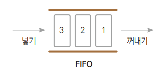  


### Queue의 구현
>LinkedList<E>는 List<E>와 동시에 Queue<E>를 구현하는 컬렉션 클래스이다.  
> 어떠한 타입의 참조 변수로 참조하느냐에 따라 리스트로도 큐로도 동작 가능하다.  
> *→ Ex12_Queue.java*

### Stack의 구현
> 자바에서는 Deque를 기준으로 스택을 구현한다.  
> ``Deque<String> deq = new ArrayDeque<>();``  
> ``Deque<String> deq = new LinkedList<>();``

+ Deque를 이용하면 메서드를 사용하는 방법에 따라 자료구조를 큐처럼 사용할 수도 있고, 스택처럼 사용할 수도 있다.
    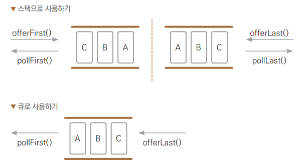
 *→ Ex13_Deque.java*
+ Linked<E>가 구현하는 인터페이스들은 다음과 같다.
  + List\<E>, Queue\<E>, Deque\<E>

---

## MAP<K, V> 인터페이스를 구현하는 컬렉션 클래스들
> Map 인터페이스에는 Key-Value 방식의 데이터를 관리하는 데 필요한 메서드가 정의되어 있다.
> + 객체의 Key값은 유일하며 value값은 중복 될 수 있다.

### HashMap 클래스
> 내부적으로 해시 알고리즘에 의해 구현되어 있다.
+ HashMap<K, V> 클래스를 이용하여 kew-value 방식으로 데이터를 저장하는 예제
    *→ Ex14_HashMap.java*

### HashMap<K, V>의 순차적 접근 방법
> HashMap<K, V>클래스는 Iterable\<T>인터페이스를 구현하지 않았기에 향상된 기능의 for문을 통해서 또는 반복자를 얻어서 순차적 접근을 할 수 없다.
+ 대신 다음 keySet()메서드 호출을 통해서 Key를 따로 모아놓은 컬렉션 객체를 얻을 수 있다.  
    이 떄 반환된 컬렉션 객체대상으로 반복자를 얻을 수 있다.  
    *→ Ex15_HashMapKeySet.java*

### TreeMap<K, V>의 순차적 접근의 예
>keySet() 메서드 호출을 통해서 Key를 따로 모아놓은 컬렉션 객체를 얻어서 순차적 접근을 할 수 있다.  
> *→ Ex16_TreeMapKeySet.java*

### TreeMap
> TreeSet과 마찬가지로 이진 탐색 트리로 구현되어 있다. key값으로 정렬하므로 key값에 해당하는 클래스에  
> Comparable이나 Comparator 인터페이스가 구현되어 있다.

---

## 컬렉션 기반 알고리즘

### 정렬
>List\<E>를 구현한 컬렉션 클래스들은 저장된 객체를 정렬된 상태로 유지하지 않고 입력된 순서대로 유지한다.  
> 그래서 정렬을 해야 한다면 Collection sort()메서드를 사용할 수 있다.  
> 이 때 객체 크기를 비교해야 정렬할 수 있으므로 객체의 클래스를 Comparable\<T>인터페이스를 구현한 상태이어야 한다.

+ String 클래스는 Comparable 인터페이스를 구현한 상태이므로 바로 테스트해볼 수 있다.
    *→ Ex17_CollectionSort.java*
+ 해당 객체의 Comparable인터페이스 구현에 의한 정렬뿐 아니라 다른 정렬 방법을 제공할 수도 있다.  
    이떄도 Comparator 인터페이스를 구현한 객체를 사용할 수 있다.  
    기본적으로 String클래스는 사전순으로 정렬이 된다.
*→ Ex18_CollectionSort2.java*

### 검색
>이진 탐색 기능을 이용하여 리스트 안에 데이터가 있는지 확인할 수 있다.  
> 다만 이진 탐색을 이용하려면 데이터가 먼저 정렬되어 있어야 한다.  
> *→ Ex19_CollectionSearch.java*

### 복사
> *→ Ex20_CollectionCopy.java*
>   1. 크기의 변경이 불가능하지만 초기화된 데이터가 있는 리스트를 만든다.
> 2. 크기의 변경이 가능한 리스트로 다시 만든다.
> 3. 정렬을 한다, 원본 데이터가 변경된다.
> 4. src의 데이터를 dst로 다시 복사한다.
> 5. 데이터를 지워서 수정 가능한 리스트인지 확인한다.