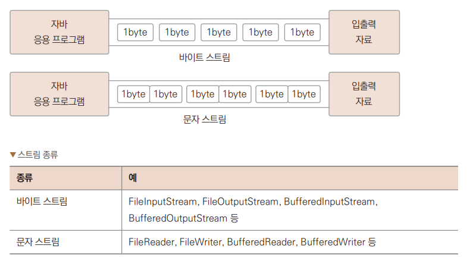
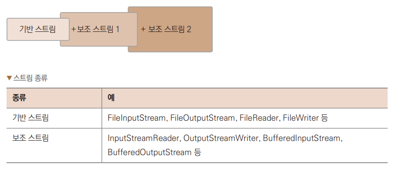
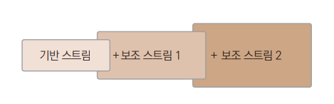

# Chapter 24 입출력 스트림

---

## 자바의 입출력 스트림
> 자바에서의 스트림 : 자료 흐름이 물의 흐름과 같다.

+ 자바 입출력 모델
  + 파일에서의 입출력
  + 키보드와 모니터의 입출력
  + 그래픽카드, 사운드카드의 입출력
  + 프린터, 팩스와 같은 출력 장치의 입출력
  + 인터넷으로 연결되어 있는 서버 또는 클라이언트의 입출력
  >자바는 입출력 장치를 구분하지 않고 일관성 있게 프로그램을 구현할 수 있도록 위와 같은 자바 입출력 모델의  
  > 모든 입출력을 입출력 스트림을 통해 처리하는 기능을 제공한다.
+ 입출력 스트림의 구분
  + 대상 기준에 따라서는 입력 스트림, 출력 스트림으로 나뉜다.
  + 자료의 종류에 따라서는 바이트 단위 스트림, 문자 단위 스트림으로 나눈다.
  + 기능에 따라서는 기반 스트림, 보조 스트림(필터 스트림)으로 나뉜다.

---

## 입출력 스트림의 구분

### 입력 스트림과 출력 스트림
> 대상 기준에 따라 스트림을 구분할 때는 입력 스트림과 출력 스트림으로 나눈다.
> + 입력 스트림 : 대상으로부터 자료를 읽어드리는 스트림
> + 출력 스트림 : 대상으로 자료를 출력하는 스트림  
>  

+ 스트림 종류
  + 입력 스트림 : FileInputStream, FileReader, BufferedInputStream, BufferedReader 등
  + 출력 스트림 : FileOutputStream, FileWriter, BufferedOutputStream, BufferedWriter 등

### 바이트 단위 스트림과 문자 단위 스트림
> 자료의 종류에 따라서 스트림을 구분할 떄는 바이트 단위 스트림과 문자 단위 스트림으로 나눈다.

+ 바이트 단위 스트림 : 동영상, 음악 파일 등을 읽고 쓸 때 사용
+ 문자 단위 스트림 : 바이트 단위로 자료를 처리하면 문자는 깨짐. 2바이트 단위로 처리하도록 구현된 스트림  
  
  

### 기반 스트림과 보조 스트림
> 기능에 따라서 구분

+ 기반 스트림 : 대상에 직접 자료를 읽고 쓰는 기능의 스트림
+ 보조 스트림 : 직접 읽고 쓰는 기능은 없이 추가적인 기능을 더해주는 스트림.  
  항상 기반 스트림이나 또 다른 보조 스트림을 생성자 매개변수로 포함함.  
  
---

## 파일 대상 입출력 스트림 생성
>'파일을 대상으로 하는 입출력 모델'에서 스트림을 생성하여 자바 입출력 스트림의 기능

### 파일 대상 출력 스트림 생성
> 파일을 만드는 가장 간단한 예제  
> *→ Ex01_FileWrite1.java*  
> 1. 파일을 생성하고 해당 파일에 스트림 생성
> 2. 스트림을 통해 데이터를 보낸다. 파일에 데이터가 써진다.
> 3. 파일을 닫는다.
> + 파일은 루트폴더에 생성

### 입출력 스트림 예외 직접 처리
> 예외를 넘기지 않고 직접 처리하는 코드  
> *→ Ex02_FileWrite2.java*  
>   2.에러가 나더라도 close()메서드를 확실히 부르고 종료하기 위해 finally 구문쪽으로 close() 메서드를 옮긴다.  
>   1.지역 변수의 범위가 달라지게 되므로 변수를 바깥에 선언
> + finally 구문에서 close() 메서드를 부를 때 이 메서드 자체도 예외가 발생할 수 있기 때문에  
>   try ~catch로 묶어준다.

### 입출력 스트림 예외 처리 개선
> try ~ catch 구문에서 이런 리소스를 다루는 방법에 대한 개선으로  
> try ~ with ~ resource를 적용하여 코드를 작성할 수 있다.  
> *→ Ex03_FileWrite3.java*
> 1. try 다음 소괄호 안에서 다루고 있다. 이렇게 리소를 열어서 스트림을 생성하면 따로 닫아주지 않아도 자바에서 자동으로 처리해준다.

### 파일 대상 입력 스트림 생성
> try ~ with ~ resource를 적용하여 코드를 작성  
> *→ Ex04_FileRead.java*
> 1. 파일 리소스를 try 다음 소괄호 안에서 열고 있다. 이렇게 리소스를 열어서 스트림을 생성하면 따로 닫아주지 않아도 자바에서 자동으로 처리해준다.
> 2. 데이터를 한 바이트 읽는다.
> 3. 읽은 데이터를 그냥 출력하면 십진수로 출력한다.
> 4. 문자이기 때문에 문자 포맷 %c를 지정해주면 글자로 출력된다.

### 바이트 단위 입력 및 출력 스트림 이용 파일 복사
> 한 바이트를 쓰고 한 바이트를 읽는 것을 연속적으로 처리하면 파일 복사도 할 수 있다.  
> *→ Ex05_Copy1.java*
> 1. try 다음 소괄호 안에서 처리할 수 있는 리소스 여러 개를 한꺼번에 지정할수 있다. ;으로 문장 구분
> 2. try 다음 소괄호 안에서 처리할 수 있는 리소스 여러 개를 한꺼번에 지정할수 있다.
> 3. 복사에 걸리는 시간을 측정하기 위해 시간 관련 클래스를 이용하여 현재 시각을 구해온다.
> 4. 반복문을 통해 한 바이트씩 소스 파일의 스트림으로부터 데이터를 읽어 대상 파일의 스트림에 써준다.
> 5. 입출력 스트림으로부터 더 이상 데이터를 읽지 못하면 -1이 반환된다.
> 6. 더 복사할 내용이 없어 반복을 중단한다.
> 7. 현재 시각을 구해온다.
> 8. 복사 전 구한 시각과 복사가 끝난 후 시각 차이를 구해서 복사에 걸린 시간을 출력한다.

### 버퍼를 이용한 파일 복사
> 입출력 스트림의 데이터를 한 바이트씩 읽고 쓰는 방식은 입출력 I/O가 많이 발생하게 되어서 비용이 많이 발생하고 시간이 많이 걸린다.  
> 메모리를 이용하여 버퍼에 저장해서 한 번에 읽고 쓰는 방식으로 하드웨어적인 I/O의 횟수를 줄여주면 시간을 단축할 수 있다.  
> *→ Ex06_Copy2.java*
> 1. 복사가 되는 대상 파일명을 앞의 예제와 다르게 지정한다.
> 2. 데이터를 담을 버퍼로 바이트 배열을 1KB 크기로 만든다.
> 3. 버퍼 크기만큼 한 번에 읽는다. 크기가 버퍼보다 작으면 그 크기까지만 읽는다.
> 4. 읽어드린 버퍼 크기만큼 출력 스트림에 보내 파일을 작성한다. 맨 마지막은 읽은 크기만큼 써지게 된다.
> + 실행을 하면 실행 속도가 줄어든 것을 확인할 수 있다. 테스트한 파일보다 큰 파일을 이용해서 테스트하면 시간 차이가 더 난다.

---

## 보조 스트림
> 추가적인 기능을 더해주는 스트림  
> 

### 버퍼링 기능을 제공하는 필터 스트림
> 단독으로 사용할 수 없고 기반 스트림에 더해서 같이 사용하게 된다.  
> *→ Ex07_FileCopy3.java*
> 1. 대상 파일의 이름을 지정한다.
> 2. 기반 스트림은 FileInputStream이고 보조 스트림은 BufferedInputStream이 된다. 이렇게 사용하면 기반 스트림에 없는 기능을 추가할 수 있다.
> 3. 라인에서 처음처럼 한 바이트씩 읽고 있지만 보조 스트림에 의해 내부적으로는 버퍼링이 되게된다.
> + 실행 결과를 보면 빠르게 처리되고 있다.

---

## 문자 스트림
> FileRead나 FileWriter 클래스를 사용하게 되면 입출력 스트림에서 두 바이트씩 데이터를 처리해준다.

### FileWriter
> 문자를 FileWriter를 이용하여 저장  
> *→ Ex08_TextWrite.java*
> 1. text.txt 파일을 생성하고 문자 스트림을 생성한다.
> 2. char를 int로 형변환해서 A부터 Z까지 반복, 알파벳 A부터Z는 ASCII 코드표상에서 십진수 값으로 1씩 증가한다.
> 3. out은 문자 스트림이기 때문에 int값을 문자로 변환하여 파일에 저장한다.
> 4. 캐리지 리턴 값 저장, 캐리지 리던 \r은 현재 위치를 나타내는 커서를 맨 앞으로 이동시킨다.
> 5. 라인 피드값을 저장한다. 라인 피드값을 저장한다. 라인 피드 \n은 커서의 위치를 아랫줄로 이동시킨다. 윈도우에서는 캐리지 리턴과 라인 피드를 합쳐서 엔터를 구현
> 6. 대문자 'A'의 아스키코드 값에 32를 더하면 소문자 'a'가 된다. 그러므로 소문자 a부터z까지 반복하게 된다.
> 9. 문자열을 바로 입출력 스트림으로 보내 지정할 수 있다.
> 10. 특수 문자열("\r\n")을 사용하여 저장하고 있다.
>   7,8 과인과 같은 의미가 된다.
> + 실행 결과로 콘솔창에는 출력되는 내용은 없고 프로젝트 루트 폴더에 파일이 생성된다.

### FileReader
> 문자를 FileReader를 이용하여 읽기  
> *→ Ex09_TextRead.java*
> 1. 문자를 스트림으로부터 하나 읽어 int형 변수에 대입한다. 2바이트인 char형을 왜 4바이트인 int형에 저장하나면 데이터를 더 이상 읽을 수 없을 때 -1을 반환받기 위해서이다. -1은 char형 데이터 범위에 없는 값이다.
> 2. 더 이상 읽을 수 없을 때 -1이 반환된다.
> 3. 읽은 데이터를 char로 다시 형변환하여 화면으로 출력한다.

### BufferedWriter
> 문자 스트림도 버퍼링 처리를 위하여 기반 스트림에 보조 스트림을 더할 수 있다.  
> *→ Ex10_BufferedWriter.java*
> 1. 기반 스트림 FileWriter이고, 보조 스트림은 BufferdWriter가 된다. 이렇게 사용하게 되면 기반 스트림에 없는 기능을 추가해줄 수 있다.
> 2. 문자열의 크기만큼 버퍼링하여 한 번에 출력 스트림으로 파일에 저장한다.
> 3. 줄바꿈 문자를 스트림으로 저장한다.
> + 실행을 하면 콘솔창에는 결과가 아무것도 나타나지 않지만 프로젝트의 루트 파일에 파일에 생성된다.

### BufferedRead
> 문자 스트림으로 파일을 읽을 때도 보조 스트림을 적용하여 더 빠르게 읽어들일 수 있다.  
> *→ Ex11_BufferedReader.java*
> 1. 기반 스트림인 FileReader에 보조 스트림인 BufferedReader를 이용하여 버퍼링 기능을 추가한다.
> 2. 입력 스트림에서 라인별로 구분하여 데이터를 읽어드린다.
> 3. 읽을 내용이 없을 때는 null이 반환한다.
> 4. 스트림에서 라인 단위로 읽은 내용을 화면에 출력한다.

---

## IO 스트림 기반의 인스턴스 저장
> 자바 가상 머신의 메모리에 있는 객체 데이터를 바이트 형태로 변환하는 기술인 직렬화 기능을 이용하면 객체 자체를 저장할 수도 있습니다.

### 직렬화
> 직렬화는 객체의 상태를 그대로 저장하거나 다시 복원하는것을 말한다.  
> ObjectInputStream과 ObjectOutputStream을 사용하여 파일에 쓰거나 네트워크로 전송할 수 있다.

|생성사|설명|
|:--|:--|
|ObjectInputStream(InputStream in)|InputStream을 생성자의 매개변수로 받아 ObjectInputStream을 생성한다.|
|ObjectOutputStrema(OutputStream out)|OutputStream을 생성자의 매개변수로 받아 ObjectOuptStream을 생성한다.|

+ 직렬화는 객체의 내용 중 private이 선언된 부분이 있더라도 외부로 내용이 유출되는 것이므로 프로그래머가 직렬화 의도를 표시해야 한다.
+ 이 떄 사용하는 것이 java.io.Serializalbe 인터페이스이다. 이 인터페이스는 구현할 추상 메서드가 없다.
+ 직렬화 의도를 밝히기 위해 인터페이스를 적용하는 것이기 때문에 마커 인터페이스라 부른다.
+ 객체를 저장하는 클래스  
  *→ Ex12_Unit.java*

### ObjectOutputStream
> 앞에서 만든 클래스를 이용해 객체를 만들고 저장  
> *→ Ex13_ObjectOutputStream.java*
> + 문자를 저장한 것이 아니고 객체를 저장한 것이기 때문에 에디터에서 일반적인 텍스트 문서처럼 열어볼 수 없다.

### ObjectInputStream
> ObjectInputStream을 이용하여 객체를 저장한 경우 ObjectInputStream으로 읽어서 객체를 복원해야 정보를 읽을 수 있다.
> *→ Ex14_ObjectInputStream.java*
