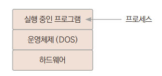
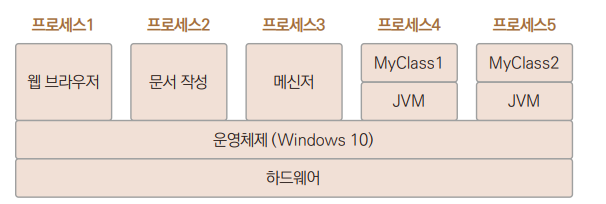
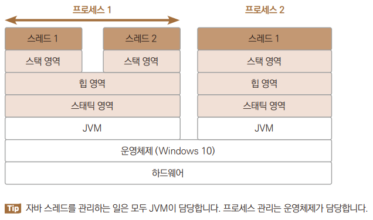
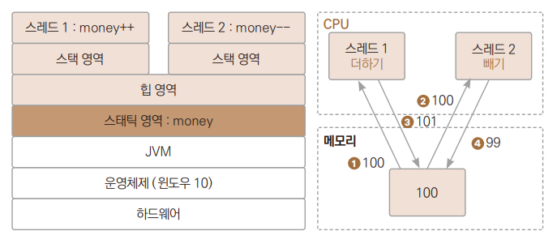
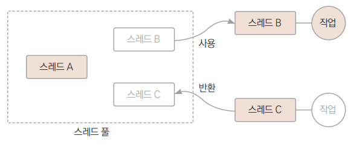
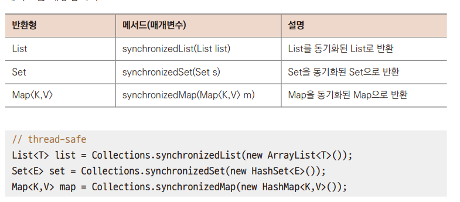

# Chapter 25 스레드

---

## 스레드의 이해
> 운영체제에서 실행 중인 프로그램을 프로세라 부른다.  
>   
> + 프로세스는 자신만의 자원을 가진다. 여러 프로세스가 동시에 실행되더라도 자신마의 메모리를 사용하기 때문에 서로 독립적이다.

> 두 가지 이상의 작업을 동시에 처리하는 것을 멀티태스킹이라 한다.

+ 
  + 실행 중인 어플리케이션, 즉 프로세스에도 동시에 수행할 수 있는 다수의 코드 블록이 있을 수 있다.
  + 자바 어플리케이션은 JVM 위에서 동작하며, 하나의 JVM은 하나의 애플리케이션을 실행할 수 있다.
  + 이 애플리케이션 안에서 여러 작업을 동시에 수행할 수 있는데 이것을 _스레드_라고 한다.
+ 
  + 스레드는 하나의 실행 흐름으로 프로세스 내부에 존재한다.
  + 프로세스는 하나 이상의 실행 흐름을 포함하기 때문에 프로세스는 적어도 하나의 스레드를 가진다.

*→ Ex01_CurrentThread.java*
 + main()도 스레드로 동작한다.
---

## 스레드 생성과 실행
> 자바는 두 가지 방법으로 스레드를 작성할 수 있다.
> + Thread 클래스를 상속받아 run()메서드 오버라이딩
> + Runnalble 인터페이스 구현

### Thread 클래스를 상속받아 만들기
> 부모 클래스로 Thread를 상속받아 클래스를 만들 수 있다.  
> 다만 스레드는 start()메서드를 통해 동작시키게된다.  
> *→ Ex02_ThreadClass.java*
> + 여태까지 프로그램은 코드 순서대로 실행되었는데,  
>   여기서는 6.에서 스레드를 실행시키고 나서 2.가 아니라 7.을 실행하게 된다.  
>   스레드가 실행되는 시간이 조금 필요하기 때문에 대부분 7.의 결과가 먼저 출력되고, 스레드 안의 4.가 나중에 수행되고 나중에 출력된다.

+ 스레드 실행은 메서드 호출과는 처리 방식이 다르다.  
    메서드 호출은 결과를 기다렸다 다음 라인이 실행되지만 스레드 실행은 시작하라는 명령만 내리고 바로 다음 라인으로 실해이 옮겨간다.
+ 실행된 스레드는 메인 스레드와는 별도로 자기 자신만의 실행 순서로 main스레드와 동시에 실행된다.
+ 다만 메인 블록의 코드가 다 실행되었다고 해도 스레드가 실행되고 있다면 스레드 실행이 끝날 때까지 메인 블록 종료가 지연된다.
+ 메인 블록이 끝나면 프로그램이 종료한다.

### Runnable 인터페이스 구현하기
> 자바는 다중 상속이 안되기 때문에 Thread클래스를 상속받아 스레드를 만들면 구현이 힘든 상황이 생긴다.
> Runnable 인터페이스를 구현하여 스레드를 만들면 해결할 수 있다.  
> *→ Ex03_RunnableInterface1.java*


### 람다식으로 Runnable 구현하기
> 스레드를 구현하는 클래스에 run() 메서드만 있다면 많은 부분을 생략하고 익명 클래스나 람다식으로 구현할 수도 있다.  
> *→ Ex04_RunnableInterface2.java*

### 여러 개의 스레드 동시 실행
> 하나의 프로세스에서 스레드는 여러 개가 동시에 실행될 수 있다.  
>+ 여러 개의 스레드가 동시에 실행되면서 자기만의 동작을 하게 된다.  
>   *→ Ex05_MultiThread.java*
>+ 스레드는 각자 자기의 코드를 다른 스레드와 동시에 실행하게 된다.  
>+ 출력되는 숫자의 순서는 다를 수 있다.

+ 멀티 코어 CPU라면 다수의 작업을 각 CPU에 처리를 맡겨 동시에 병렬처리하지만, 싱글 코어 CPU라면 운영체제가 CPU처리 능력을 각 작업에 교대로 할당해 다수의 작업을 동시에 처리한다.

---

## 스레드 동기화
> 동일한 변수의 값을 증감시키는 두 스레드가 있다고 가정해보았을 때, 변수의 값은 메모리에 있다.   
> 이 변수의 값을 증감하는 연산을 하려면 CPU로 값을 옮겨와서 값을 증감시키는 연산을 수행하고 나서 다시 메모리에 저장시켜야 한다.   
> 이런 과정이 있기 때문에 여러 스레드가 같은 변수의 값을 증감시키는 연산을 수행하면 문제가 발생하게 된다.  


+ 스레드 1에서 값을 가져가서 더하고 반환하고, 스레드 2에서 갑을 가져가서 빼고 반환하면 값이 그대로 100이어야할 것 같지만 위 그림에서는 99가 된다.

### 스레드에서의 문제점
>*→ Ex06_ProblemOfThread.java*
> + 스레드가 실행될 때의 CPU의 상황에 따라 진행 속도가 조금씩 달라지면서 매번 다른 결과가 나오게 된다.

### 스레드 동기화로 문제점 해결
> 위 문제를 동기화를 사용하여 해결한다.
> + 메서드에 synchronized 키워드를 지정, 코드의 일부에 동기화 블록 지정
> + synchronized 키워드를 코드의 일부에 동기화 블록 지정

+ 메서드 전체 동기화
````
public synchronized void 메서드( )
{
 // 동기화 대상 코드
}
````

+ 코드 일부 동기화
````
public void 메서드( )
{
 synchronized (공유객체)
 {
 // 동기화 대상 코드
 }
}
````

+ 동기화할 때 발생하는 문제는 병목 현상 *→ Ex07_SynMethod.java*
  + 이렇게 동기화가 메서드나 블록에 적용되면 동기화 영역이 실행되는 동안 다른 스레드의 접근을 제한한다.
  + 동기화 영역의 실행이 끝나면 이제 다른 스레드에서도 접근이 가능하게 된다.
  + 그러므로 이 부분에 많은 스레드가 접근하게 된다면 병목 현상이 발생 할 수 있다.
  + 여러 번 실행해도 위 예제처럼 값이 달라지지않고 예상한 값인 0이 출력되게 된다.

---

## 스레드 풀
> 스레드 개수가 많아지면 스레드 객체 생성과 소멸, 스케줄링 등에 CPU와 메모리에 많은 부하가 발생한다.  
> 스레드 개수도 제한하여 CPU와 메모리에 가해지는 부하를 줄이기 위해 java.util.concurrent 패키지가 추가되었다.
> + 스레드 풀 : 제한된 개수의 스레드를 JVM에 관리하도록 맡기는 방식이다.  
>   실행할 작업을 스레드 풀로 전달하면 JVM이 스레드 풀의 유후 스레드중 하나를 선택해서 스레드로 실행시킨다.  
> 

+ 스레드 풀의 대표적인 유형
  + newSingleThreadExecutor
    풀 안에 하나의 스레드만 생성하고 유지합니다. 스레드의 숫자가 하나이고 하나의 태스크가 완
    료된 이후에 다음 태스크가 실행됩니다. 즉, 여러 스레드가 동시에 실행되지 않으므로 동기화
    가 필요 없습니다.
  + newFixedThreadPool
    풀 안에 인수로 전달된 수의 스레드를 생성하고 유지합니다. 초기 스레드 개수는 0개, 코어 스
    레드 수와 최대 스레드 수는 매개변수 nThreads값으로 지정합니다. 만약 생성된 스레드가 놀
    고 있어도 스레드를 제거하지 않고 내버려둡니다.
  + newCachedThreadPool
    풀 안의 스레드의 수를 작업의 수에 맞게 유동적으로 관리합니다. 초기 스레드와 코어 스레드
    개수는 0개, 최대 스레드 수는 integer 데이터형이 가질 수 있는 최댓값입니다. 만약 스레드
    가 60초 동안 아무 일도 하지 않으면 스레드를 종료시키고 스레드 풀에서 제거합니다.

### 최대 스레드 수가 1개인 스레드 풀
> *→ Ex08_TreadPool1.java*

### 최대 스레드 수가 2개인 스레트 풀
> *→ Ex09_TreadPool2.java*
> 1. Runnable을 이용하여 task1 스레드를 만든다.
> 2. 5초간 스레드를 대시킨다.
> 3. 스레드명을 출력, 스레드가 실행되고 5초 후에 출력된다.
> 4. Runnable을 이용하여 task2 스레드를 만든다.
> 5. 스레드명을 출력한다. 스레드가 실행되면 바로 출력된다.
> 6. Runnable을 이용하여  task3 스레드를 만든다.
> 7. 2초간 스레드를 대기시킨다.
> 8. 스레드명을 출력한다.
> 9. 스레드 풀을 만든다. 현재 스레드 풀은 동시에 스레드 두개를 처리할 수 있다.
> 10. 스레드를 스레드 풀에 전달한다. 스레드 풀은 전달된 스레드를 실행시킨다.
> 11. 마지막 스레드가 종료되면 스레드풀을 종료시킨다.
> + 처음에 task1, task2가 스레드 풀에 전달됩니다. 그런데 task1은 5초 후에 출력해야 하므로 계속
    실행 중에 있습니다. task2는 바로 실행이 되고 종료됩니다. 그러면 그 자리에 task3이 스레드 풀
    에 들어 와서 실행이 됩니다. 그래서 task2와 task3가 실행된 이름이 같은 것을 확인할 수 있습니
    다.

---

## Callable & Future
> 스레드는 실행만 시켜줄 수 있고, 스레드로부터 결과를 반환받을 수 없다.
> Executor프레임워크를 사용하면 작업 대상의 Callable 객체를 만들고 ExecutorService에 등록한 다음 태스크 처리가 끝난 다음 작업 결과를  
> future객체를 통해서 반환받을 수 있다.

*→ Ex10_CallableFuture.java*
1. Runnable대신 Callable과 사용할 자료형을 제네릭으로 지정해서 task1 스레드를 만든다.
2. 제네릭에서 지정한 형태의 값을 반환한다.
3. Runnable대신 Callalble과 사용할 자료형을 제네릭으로 지정해서 task2 스레드를 만든다.
4. 제네릭에서 지정한 형태의 값을 반환한다.
5. 스레드 풀을 만든다. 현재 스레드 풀은 동시에 두스레드를 처리할 수 있다.
6. 스레드를 스레드 풀에 전달한다. 스레들 풀은 전달된 스레드를 실행시킨다. 그리고 결과를 Future형의 변수의 반환한다.
7. Future 형의 변수에서 get() 메서드를 통해 스레드에서 반환받은 값을 구해온다.
8. 마지막 스레드가 종료되면 스레드 풀을 종료 시킨다.

---

## ReentrantLock 클래스 : 명시적 동기화
>기존의 synchronized는 메서드 전체나 구간을 묶어서 동기화시켰다.  
> ReentrantLock클래스를 사용하면 시작점과 끝점을 명백히 명시할 수있다.

+ *→ Ex11_ReentrantLock.java*
    1. 여러 스레드에서 사용할 클래스를 정의한다.
  2. 동기화에 사용할 ReentrantLock 클래스 객체를 만든다.
  3. 명시적으로 동기화 시작점을 설정한다.
  4. 명시적으로 동기화 끝점을 설정한다.
  5. 여러 스레드에서 사용할 객체를 스태틱 영역에 생성한다.
  6. Runnable을 이용하여 task1 스레드를 만든다.
  7. 객체 안의 메서드를 10000번 호출한다.
  8. Runnable을 이용하여 task2스레드를 만든다.
  9. 객체 안의 메서드를 10000번 호출한다.
  10. 스레드 풀을 만든다. 이 스레드 풀은 스레드를 동시에 2개까지 처리할 수있다. 
  11. 스레드를 스레드 풀에 전달한다. 스레드 풀은 전달된 스레드를 실행시킨다.
  12. 마지막 스레드가 종료되면 스레드 풀을 종료시킨다.
  13. 스레드 풀이 완전하게 종료되기를 안전하게 조금 더 기다린다.
  14. 스태틱 영역에 생성된 객체의 메서드를 호출에 변수의 값을 출력한다.
+ synchronized 대신에 ReentrantLock을 이용해 명시적으로 동기화시켰을 뿐 synchronized를 사용해 동기화한 예제와 결과는 같다.

---

## 컬렉션 객체 동기화
> 여러 스레드가 동시에 컬렉션 객체에 접근하여 요소를 변경하면 의도하지 않게 요소가 변경될 수 있다.  
> 즉, 컬렉션 객체도 스레드에 안전하지 않다.

### 동기화 되지 않은 컬렉션 객체의 사용
> 리스트 변수에 대해서 동기화를 적용 X  
> *→ Ex12_SyncArrayList1.java* (여러 번 실행하면 이상한 결과가 나오기도 한다.)
> 1. 스태틱 영역에 컬렉션 프레임워크의 리스트 객체를 하나 생성한다.
> 2. 리스트에 정수 10개를 차례대로 추가한다.
> 3. 리스트 내용 출력
> 4. Runnable을 이용하여 스레드를 생성한다. 
> 5. 리스트의 반복자를 구해온다.
> 6. 리스트의 반복자로 구해온 리스트의 값에 1씩 더해서 다시 저장한다.
> 7. 스레드 풀 생성, 이 스레드 풀은 동시에 스레드 5개를 처리할 수 있다. 
> 8. 스레드 풀에 스레드를 전달, 스레드 풀은 전달된 스레드를 실행시킨다.
> 9. 마지막 스레드가 종료되면 스레드 풀을 종료시킨다.
> 10. 스레드 풀이 완전하게 종료되기를 안전하게 조금 더 기다린다.
> 11. 스태틱 영역에 생성된 리스트의 값을 출력한다.

+ 이 스레드 풀은 스레드 5개가 동시에 리스트 변수에 접근하여 사용합니다. 각자 리스트 변수에 대
해서 반복자를 통해서 돌면서 값을 더해서 다시 세팅하게 됩니다. 데이터가 적기 때문에 CPU가 빠
르게 처리하면 정상적으로 처리가 되지만, 여러 번 실행하면 스레드에 안전하지 않은 처리 결과가
나오게 됩니다. 다음 제시한 결과와 개개인이 실행한 결과가 다를 겁니다.

### synchronized를 이용한 동기화
> 컬렉션 프레임워크도 synchronized를 사용하여 동기화를 하면 정상적으로 처리할 수 있다.  
> *→ Ex13_SyncArrayList2.java*  
> + 예제 12와 같고 1.에서 동기화 처리를 했다.
> + list 변수에 동기화 처리가 되어 있기 때문에 스레드가 list변수의 값을 변경할 때 이상한 결과를 보이지 않는다.

### Colletions 클래스의 메서드를 이용한 동기화
> 자바는 비동기화된 메서드를 동기화된 메서드로 래핑하는 Collectiondml synchronizedXXX() 메서드를 제공한다.  
> 

+ 컬렉션 객체의 동기화를 이렇게 했다고 이 컬렉션 기반으로 생성하는 반복자는 별도로 동기화를 다시 해주어야 한다.  
  + *→ Ex14_SyncArrayList3.java*
    1. 변수를 선언하는 기존 1.을 2.처럼 바꾼다. 반복자는 동기화 처리를 해야 하기 때문에 3.코드는 이전 코드와 같다.

### ConcurrentHashMap 이용
> 스레드가 컬렉션 객체의 요소를 처리할 때 전체 잠금이 발생하여 컬렉션 객체에 접근하는 다른 스레드는 대기 상태가 된다. 이는 객체의 요소를 다루는 것은 안전해졌지만, 처리 속도는 느려진다.
는 이야기가 된다. 따라서 자바는 멀티스레드가 컬렉션의 요소를 병렬적으로 처리할 수 있도록 java.util.concurrent 패키지에서 ConcurrentHashMap, ConcurrentLinkedQueue를
제공한다.

+ 이 클래스는 부분적으로 잠금을 사용하기 때문에 객체의 요소를 처리할 때 스레드에 안전하면서 빠르게 처리가 가능해진다.  
``Map<K, v> map = new ConcurrentHashMap<K, V>();``  
``Queue<E> queue = new ConcurrentQueue<E>();``

  + ConcurrentHashMap을 성능을 체크하는 예제를 만들어 살펴보겠다.  
    *→ Ex15_ConcurrentHashMap.java*
  1. Collections.synchronizedMap을 사용하여 만든 컬렉션 객체를 담을 변수를 선언합니다.
    2. ConcurrentHashMap을 사용하여 만든 컬렉션 객체를 담을 변수를 선언합니다.
    3. Runnable을 이용하여 스레드를 생성합니다. 4 100000 개의 요소를 맵에 추가합니다.
    5. 스레드 풀을 만듭니다. 이 스레드 풀은 동시에 5개의 스레드를 처리할 수 있습니다. 6 스레드 풀에 스레드를 전달합니다. 스레드 풀은 전달된 스레드를 실행시킵니다.
    7. 마지막 스레드가 종료되면 스레드 풀을 종료시킵니다. 8 스레드 풀이 완전하게 종료되기를 안전하게 조금 더 기다립니다.
    9. 실행된 시간을 출력합니다.
    10. Collections.synchronizedMap을 사용하여 객체를 만들고 변수에 대입합니다. 11 객체 변수를 매개변수로 넘기면서 성능을 체크할 메서드를 호출합니다.
    12. ConcurrentHashMap을 사용하여 객체를 만들고 변수에 대입합니다. 13 객체 변수를 매개변수로 넘기면서 성능을 체크할 메서드를 호출합니다.
    + 결과에서도 확인이 가능하듯 Collections .synchronizedMap을 사용할 때보다 ConcurrentHashMap을 사용할 때 속도가 더 빠른 것을 알 수 있습니다.

---

## ex62 - 날짜와 시간 클래스 (Calendar)

```java
import java.text.SimpleDateFormat;
import java.util.Calendar;
import java.util.GregorianCalendar;
import java.util.Locale;

public class ex62 {
    public static void main(String[] args) {
        Calendar cal = new GregorianCalendar(Locale.KOREA);

        System.out.println( cal.getTime() );
        System.out.println( cal.getTimeInMillis() );

        int year = cal.get(Calendar.YEAR);
        int month = cal.get(Calendar.MONTH) + 1;
        int day = cal.get(Calendar.DAY_OF_MONTH);
        int dayOfWeek = cal.get(Calendar.DAY_OF_WEEK);
        int weekOfYear = cal.get(Calendar.WEEK_OF_YEAR);
        int weekOfMonth = cal.get(Calendar.WEEK_OF_MONTH);
        int hour = cal.get(Calendar.HOUR);
        int hourOfDay = cal.get(Calendar.HOUR_OF_DAY);
        int minute = cal.get(Calendar.MINUTE);
        int second = cal.get(Calendar.SECOND);
        int millisecond = cal.get(Calendar.MILLISECOND);

        System.out.printf("%d년 %d월 %d일\n", year, month, day);
        System.out.printf("요일: %d, 연중 %d주차, 이번달 %d주차\n", dayOfWeek, weekOfYear, weekOfMonth);
        System.out.printf("시: %d / %d, 분: %d, 초: %d, 밀리초: %d\n", hour, hourOfDay, minute, second, millisecond);

        cal.add(Calendar.HOUR, 10);
        echoTime(cal);

        cal.add(Calendar.HOUR, -20);
        echoTime(cal);

        cal.add(Calendar.MONTH, 1);
        echoTime(cal);

        cal.add(Calendar.YEAR, 1);
        echoTime(cal);
    }

    static void echoTime(Calendar cal) {
        SimpleDateFormat sdf = new SimpleDateFormat("yyyy-MM-dd HH:mm:ss");
        String strTime = sdf.format(cal.getTime());
        System.out.println(strTime);
    }
}
```

> `Calendar` 클래스는 날짜 계산, 요일, 주차 등의 고급 날짜 기능 제공  
> 윤년 계산, 시차 처리, 시간 추가/감소 등 다룰 수 있음

---

 ex63 - 최신 날짜/시간 클래스 (LocalDate, LocalTime, LocalDateTime)

```java
import java.time.*;

public class ex63 {
    public static void main(String[] args) {
        // LocalDate
        LocalDate now = LocalDate.now();
        System.out.println(now);
        LocalDate birthDay = LocalDate.of(2000, 12, 1);
        LocalDate xmas = LocalDate.parse("2022-12-25");
        System.out.println(birthDay);
        System.out.println(xmas);

        // LocalTime
        LocalTime nowTime = LocalTime.now();
        LocalTime parisTime = LocalTime.now(ZoneId.of("Europe/Paris"));
        LocalTime sleepTime = LocalTime.of(23, 30, 0);
        LocalTime getUpTime = sleepTime.plusHours(8);
        LocalTime inHouseTime = sleepTime.minusHours(5);

        System.out.println(nowTime);
        System.out.println(parisTime);
        System.out.println(sleepTime);
        System.out.println(getUpTime);
        System.out.println(inHouseTime);

        // LocalDateTime
        LocalDateTime dateTime = LocalDateTime.now();
        System.out.println(dateTime);
        System.out.println(dateTime.getYear());
        System.out.println(dateTime.getMonth());
        System.out.println(dateTime.getMonthValue());
        System.out.println(dateTime.getDayOfMonth());
        System.out.println(dateTime.getHour());

        LocalDateTime y2k = LocalDateTime.of(1999, 12, 31, 23, 59, 29, 999);
        LocalDateTime now2 = LocalDateTime.parse("2022-12-01T12:06:06.391847500");
        LocalDateTime now3 = Year.of(2022).atMonth(12).atDay(1).atTime(12, 1, 5);

        System.out.println(y2k);
        System.out.println(now2);
        now2 = LocalDateTime.parse("2022-12-01T12:06:06");
        System.out.println(now2);
        System.out.println(now3);
    }
}
```

> `LocalDate`, `LocalTime`, `LocalDateTime`은 JDK 1.8부터 제공되며 불변(immutable) 객체이고,  
> `Calendar`와 달리 스레드 안전하며 시간대(타임존) 개념 없이 날짜/시간만 표현함.  
> 복잡한 시간 계산 시 `plusX`, `minusX` 등 메서드 체이닝으로 가독성 좋음

---

ex64 - Optional 클래스 사용법 (JDK 1.8 이상)

```java
import java.util.Optional;

public class ex64 {
    public static void main(String[] args) {
        String nullValue = null;

        // 기존 방식
        if (nullValue != null) {
            System.out.println(nullValue.toLowerCase());
        }

        // Optional 방식
        Optional optional1 = Optional.ofNullable(nullValue);
        System.out.println(optional1.isPresent()); // false
        System.out.println(optional1.isEmpty());   // true
        if (optional1.isPresent()) {
            System.out.println(optional1.get());
        }

        String normalValue = "abc";
        Optional optional2 = Optional.ofNullable(normalValue);
        if (optional2.isPresent()) {
            System.out.println(optional2.get()); // abc
        }

        Optional optional3 = Optional.of(normalValue);
        if (optional3.isPresent()) {
            System.out.println(optional3.get()); // abc
        }

        // orElse: 기본값 설정
        String strResult = Optional.ofNullable(nullValue)
                .orElse("Null이군요.");
        System.out.println(strResult);

        // filter: 조건을 만족하면 유지, 아니면 orElse
        String strResult2 = Optional.ofNullable(normalValue)
                .filter(val -> val.contains("abc123"))
                .orElse("abc값 없네요.");
        System.out.println(strResult2);

        // map: 값 변환 처리
        String strResult3 = Optional.ofNullable(normalValue)
                .map(String::toUpperCase)
                .orElse("대문자로 변환이 실패하였습니다.");
        System.out.println(strResult3);
    }
}
```

> `Optional`은 null 안전 처리를 위해 사용되며, `orElse`, `filter`, `map` 등의 메서드를 조합하여 유연하게 null 대처 로직을 구성할 수 있다.

ex65 - ArrayList 기본 사용법 및 정렬

```java
import java.util.ArrayList;
import java.util.Collections;

public class ex65 {
    public static void main(String[] args) {
        //데이타를 담는 그릇 - 데이타구조
        //1.변수 : 단 하나의 값(숫자,문자열,논리)
        //2.배열 : 인덱스가 있는 연속된 공간에 담음.
        //3.리스트 : 인덱스가 있는 연속된 공간
        //          추가/삭제가 간편하다.
        //          제네릭(가변타입)이 가능.
        //4.맵 : Key-Value 형태의 데이타. 순서없음.
        //5.세트 : 집합구조의 데이타(중복없음). 순서없음.

        // 콜렉션 프레임워크 : List, Map, Set
        //1. 리스트(List)
        //   List 인터페이스를 구현해서 ArrayList(일반), LinkedList(알고리즘기반) 클래스
        //  ArrayList : 순차적으로 데이타가 나열되어 있다. 순차적인 데이타에 대한 접근속도가 빠름.
        //  LinkedList : 다음 요소의 주소값을 이전 요소가 가지고 있다. 흩어져있는 데이타에 대한 접근속도가 빠름.
        //2. 맵(Map)
        //   Map 인터페이스를 구현해서 HashMap클래스 사용
        //3. 집합(Set)
        //   Set 인터페이스를 구현해서 HashSet클래스 사용
        //해쉬(HashCode) : 내부데이타간의 연결을 위한 유일한 키(정수)

        //ArrayList
        ArrayList<String> fruits = new ArrayList<>();
        System.out.println( fruits );//[]
        //아이템을 뒤로 추가 add()
        fruits.add("수박");
        System.out.println( fruits );
        fruits.add("망고");
        System.out.println( fruits );
        fruits.add("딸기");
        System.out.println( fruits );

        //맨앞에 추가
        fruits.add(0, "레몬");
        System.out.println( fruits );
        //중간에 추가
        fruits.add(1, "사과");
        System.out.println( fruits );
        //삭제
        fruits.remove( 1 );
        System.out.println( fruits );
        //오름차순 정렬
        Collections.sort( fruits );
        System.out.println( fruits );
        //내림차순 정렬
        Collections.sort( fruits, Collections.reverseOrder());
        System.out.println( fruits );
        //리스트 길이
        System.out.println( fruits.size() );
        //데이타 변경/치환
        fruits.set( 1, "복숭아");
        System.out.println( fruits );
        //전체 지우기
        fruits.clear();
        System.out.println( fruits );
    }
}
```

> `ArrayList`는 `List` 인터페이스의 대표적인 구현체로, 요소의 삽입, 삭제, 검색이 간편하며 순차적 접근에 적합합니다.
> `Collections.sort()`를 활용하면 정렬도 간단하게 구현할 수 있습니다.
