x   # Chpater 12 클래스의 상속

---

## 상속
> 클래스가 가지고 있는 멤버를 다른 클래스에게 계승시키는 방법  
> 객체 지향 언어의 가장 큰 특징 중 하나  
> 상속한 멤버는 자식 클래스에서 저의하지 않아도 사용할 수가 있으며, 자식 클래스 내에세 멤버를 추가로 정의해서도 사용 가능  
> 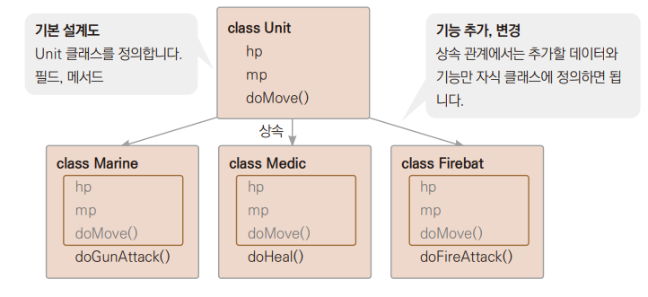
>   
> <장점>
> + 클래스 간의 전체 계층 구조를 파악하기 쉽다.
> + 재사용성 증대 : 기존 클래스에 있는 것을 재사용할 수 있다.
> + 확장 용이 : 새로운 클래스, 데이터, 메서드를 추가하기 쉽다
>   + 고스트, scv 등 추가 할 유닛이 생기면 쉽게 추가할 수 있다.
> + 유지보수 용이 : 데이터와 메서드를 변경할 때 상위에 있는 것만 수정하여 전체적으로 일관성을 유지할 수 있다.
>   + 종족 간 밸런스를 맞추고자 테란 유닛의 기본 체력을 일괄 변경 할 수 있다.

+ 상속 관련 다양한 호칭

    | 상속 대상 클래스 호칭 |    | 상속을 받은 클래스 호칭 |
    |:------------:|:--:|:--------------|
    |    슈퍼 클래스    | ↔  | 서브 클래스        |
+ |    부모 클래스    | ↔  | 자식 클래스        |
+ |    기반 클래스    | ↔  | 파생 클래스        |
+ |    조상 클래스    |↔    | 자손 클래스        |
+ |    상위 클래스    | ↔   | 하위 클래스        |
  + private 으로 접근 제한이 되어 있는 멤버들은 서브 클래스로 상속되지 않는다.  
  + 자바에서 이런 자식 클래스를 코드로 구현할 때 다음과 같이 extends 예약어를 사용한다.
  + ``clss Marine extends Unit { }``  *→ MyTerran.java*

### 자바의 다중 상속
>자바는 여러 클래스를 동시에 상속하는 다중 상속을 지원하지 않습니다. 예를 들어 두 개
이상의 상위 클래스에 같은 이름의 메서드가 정의되어 있다면, 다중 상속을 받는 하위 클래
스는 어떤 클래스의 메서드를 상속받아 사용해야 할지 헷갈리게 됩니다. 다중 상속을 지원
하는 C++ 같은 언어는 이것을 문법적으로 구분해서 사용하지만, 자바는 이런 모호함 자체
를 없애기 위해 다중 상속 대신 단계별 상속을 사용합니다.

---

## 오버라이딩
> overriding : 상속된 메서드와 동일한 이름, 동일한 매개변수를 가지는 메서드를 정의하여 메서드를 덮어씌운다. 반환값의 형도 같아야 한다.  
>+ 목적
>  + 상속받은 부모 클래스 메서드의 기능 변경
>  + 상속받은 부모 클래스 메서드의 기능 추가
    
*→ MyTerran.java*  [기능 추가]
````
void doMove()       // 1.
{
System.out.println("이동속도 10으로 이동");
}

class Marine extends Unit 
{
int attack;

    void doMove()       // 2.
    {
        super.doMove();     // 3.
        System.out.println(attack + " 공격");     // 4.
    }
    void printMarine()          
    {
        printUnit();
        System.out.println("공격력 : " + attack);      
    }
    class Medic extends Unit        
{
    int heal;      
    
    void doMove()       // 5.
    {
        System.out.println("이동속도 8으로 이동");
        System.out.println(heal + "치유");
    }
    void printMedic()       
    {
        printUnit();
        System.out.println("치유량 : " + heal);
    }
}
 ````
1. 메서드 정의
2. 부모에서 상속받은 메서드에는 super예약어를 이용하여 구분해서 정의
3. 부모의 메서드 호출
4. 자체 기능 추가
5. 메서드를 따로 호출하지 않았기 때문에 부모의 기능은 사용하지 않고 자체 구현한 기능만 사용

---

## 상속이 제한되는 final
> final은 필드나 메서드, 클래스에 붙이는 예약어이다.    
> final 상수 때처럼 클래스도 "이 클래스가 마지막이야 더 이상 상속 안됨" 이라는 의미로 클래스 앞에 붙혀 준다.  
> `` final int MAX_NUM = 100;
> final class Maine { }``

+ final 위치 별 의미

    | 사용 위치 |                설명                 |
    |:-----:|:---------------------------------:|
    |  변수   |         final 변수는 상수를 의미          |
+ |  메서드  | final 메서드는 하위 클래스에서 오버라이딩 할 수 없다. |
+ |  클래스  |      final 클래스는 상속을 할 수 없다.       |
+ 클래스의 일부 메서드를 상속 제한하려면 메서드에 접근 제한자 private을 사용한다.

---

## 추상 클래스
> 구체적인 처리 내용을 기술하지 않고, 호출하는 방법만을 정의한 메서드를 추상 메서드라고 한다.   
> 메서드를 표현할 떄 구상(concrete)메서드라고 하는 반면 추상(abstract)메서드가 있다.

````
// 구상 메서드
public int adder (int n1, n2)
{
    return n1 + n2;
}

// 추상 메서드
abstract public int adder (int n1, n2);
````
> 추상 메서드를 가진 클래스를 추상 클래스라고 한다.   
> abstract표시를 클래스 앞에 붙여주어 추상 메서드를 가진 클래스라고 표시한다
>> + 추상 클래스로 객체를 직접 만들게 되면 추상 메서드를 어떻게 동작시켜야 할지 알 수 없기 때문에 추상 클래스로는 객체를 생성할 수 없다.  
>> + 상속받은 클래스의 기능을 미리 지정하기 위해 추상 클래스를 이용한다.
>>   + 클래스를 상속받은 클래스는 이런 기능이 반드시 있어야 하므로 어떤 클래스가 상속받을지 모르기 때문에 그 기능을 구체적으로 미리 만들어 놓을 수 없을 떄 사용한다.
>
> *→ MyStarcraft.java*

 ---

## 인터페이스
> 상속 관계가 아닌 클래스에 기능을 제공하는 구조, 추상 클래스처럼 메서드로 기능을 제공  
> 정의와 추상 메서드제공, 디폴트 메서드, 스태틱 메서드까지 인터페이 멤버가 되어 활용성이 올라간다.  

### 인터페이스 구현
+ 추상 클래스
````
abstract class Unit
{
 String name;
 int hp;

 void printUnit()
 {
 System.out.println(" 이름 : " + name);
 System.out.println("HP : " + hp);
 }
 abstract void doMove();
}
````
+ 인터페이스
````
interface A
{
 public static final int a = 2;
 public abstract void say();
 public default void desc()
 {
 System.out.println("기능이 구현된 메서드입니다.");
 }
}
````
+ 줄여서
 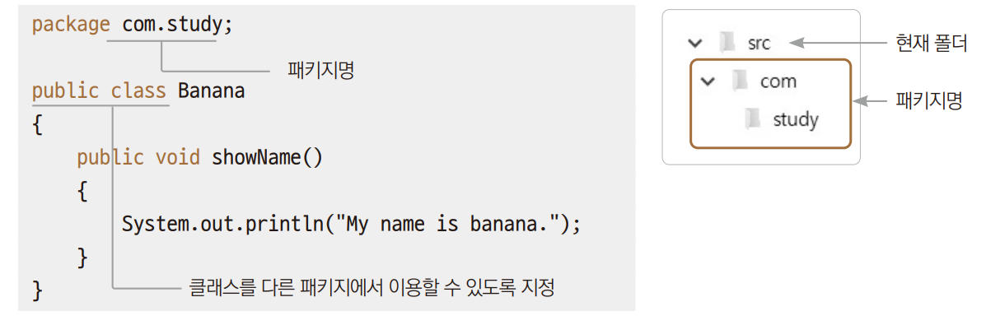
> 인터페이스끼리 상속 가능 / 인터페이스가 일반 클래스를 상속 불가
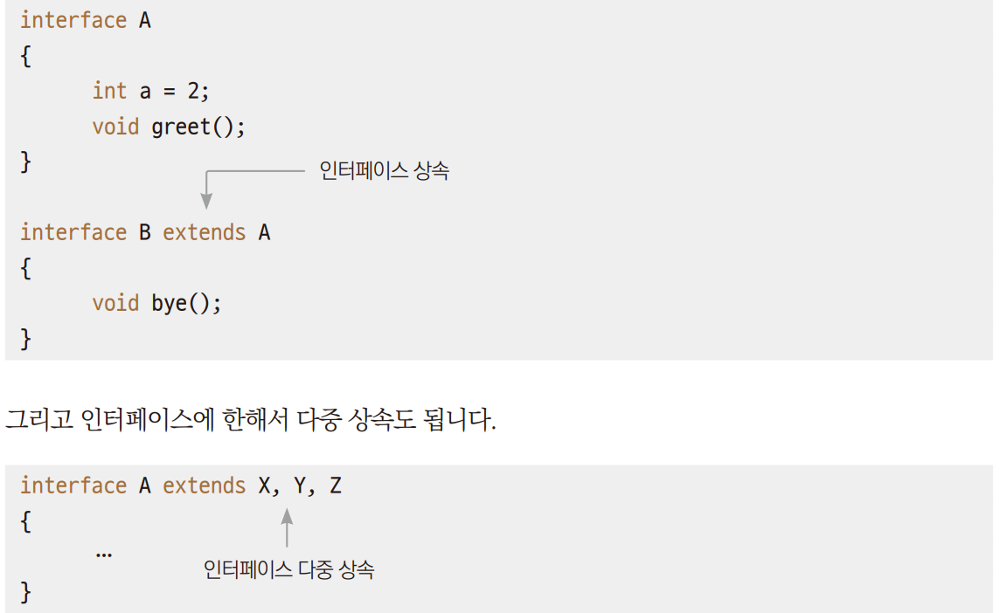

+ implements 예약어를 이용해서 코드를 작성한다.
+ 인터페이스의 메서드는 추상 메서드이므로  implements 예약어를 사용했다면 반드시 추상 메서드를 구상 메서드로 오버라이딩해서 구현해주어야 한다.
+ 클래스에서 인터페이스를 이용하도록 하는 것이 인터페이스 구현이라고 한다.

````
class B implements A
{
public void say()
{

}
}
````
+ 클래스의 상속은 extends 예약어 사용
+ 인터페이스의 구현은 implements 예약어 사용
인터페이스는 한 번의 여러 개를 구현할 수 있다.  
 


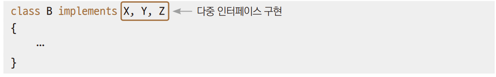
> 상속과 인터페이스를 동시에 사용한다면 다음 순서를 따른다.
> + 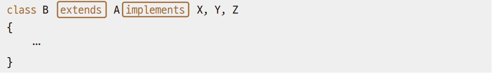


*→ Ex01Meet.java*

### 인터페이스와 추상 클래스의 차이
> 클래스 간의 상속 관계를 통해 건물이라는 본질을 유지하게 하려면 추상 클래스를 통한 상속기능을 사용.  
> 단지 기능만을 구현하려면 인터페이스를 사용한다.  
>  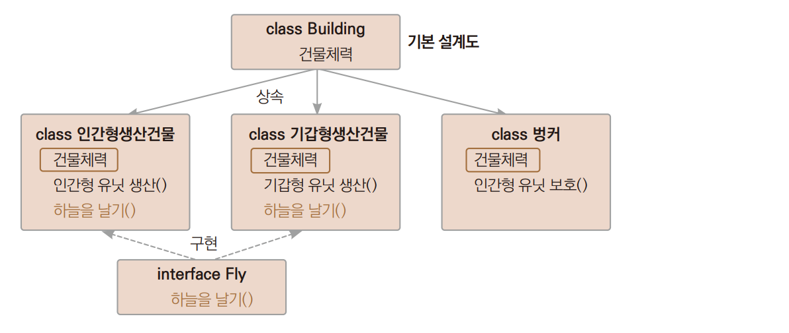  
> *→ Ex02_Starcraft.java*

### 디폴트 메서드
> 호환성을 유지하면서 기존 인터페이스에 새로운 기능을 추가 할 수 있다.  
> 어떤 인터페이스를 구현한 클래스가 이미 사용되고 있는 상태에서 새로운 클래스가 그 인터페이스를 구현하면서 기능이 부족해서 기능을 추가하고자 할떄  
> 기존에 그 인터페이스를 사용하던 모든 클래스에 추가된 기능을 구현해야 하는 불편함이 있다.
> 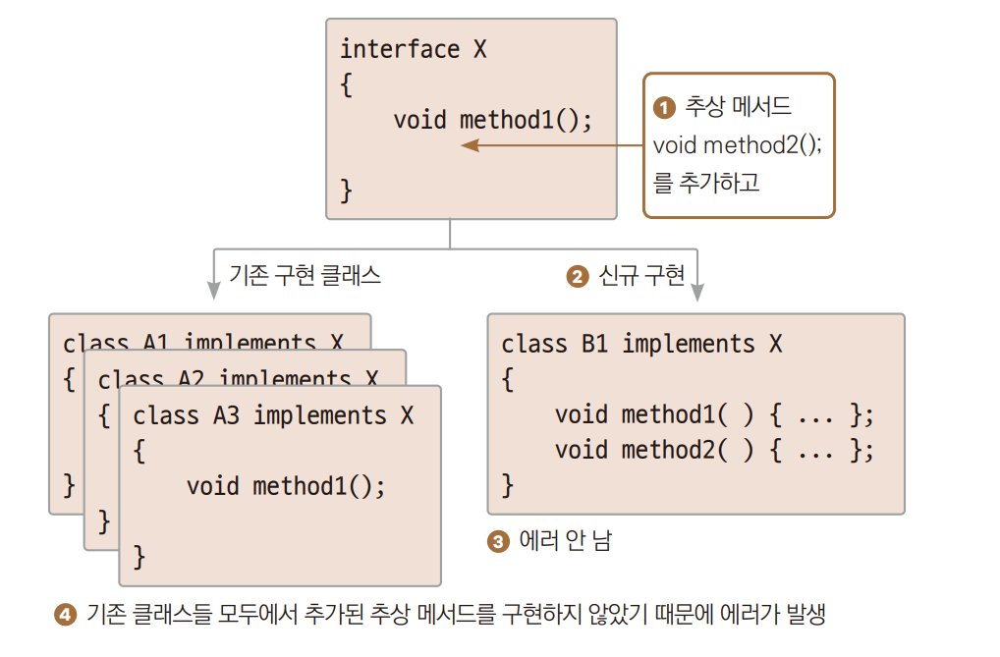

+ 네이밍이 문제이기 때문에 디폴트 메서드를 이용하면 해결 할 수 있다.
+ 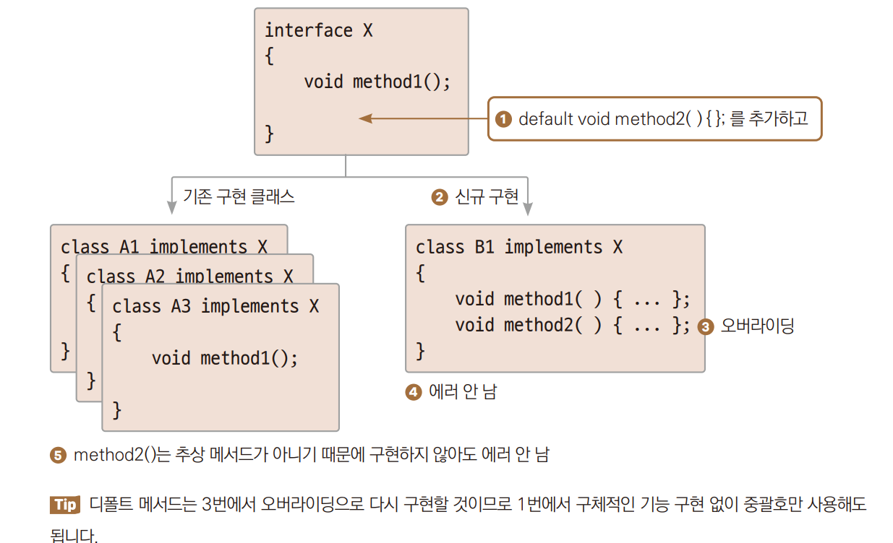

---

## 다형성
> polymorphism : 상속한 클래스의 객체는 슈퍼 클래스로도 다룰 수 있다.  
> 하나의 객체와 메서드가 많은 형태를 가지고 있는 것

+ 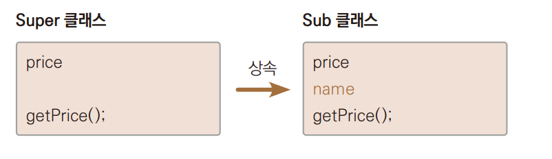
  + 위와 같이 super클래스를 상속받은 Sub 클래스가 있다고 할떄 하위 클래스 객체를 상위 클래스형의 변수에 대입하여 사용 가능
+ 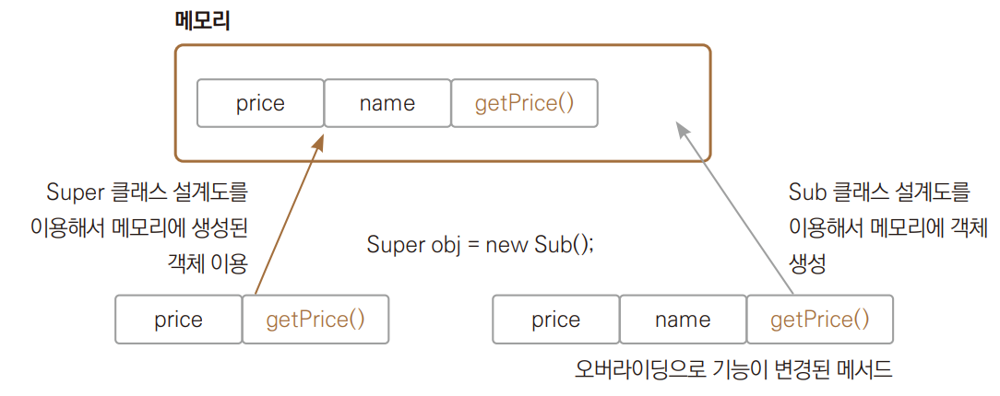
  + 실제 객체는 Sub 클래스의 설계도를 이용해 힙에 만들어져 있지만 스택에 마늘어진 변수는 Super의 설계도를 이용한다.
  + obj 변수는 설계도상 name은 몰라서 못쓰겠지만 나머지 price나 getPrice()메서듣를 사용 할 수 있다.
  + 상위 클래스의 객체를 하위 클래스형의 변수로 대입 할 수는 없다.
+ 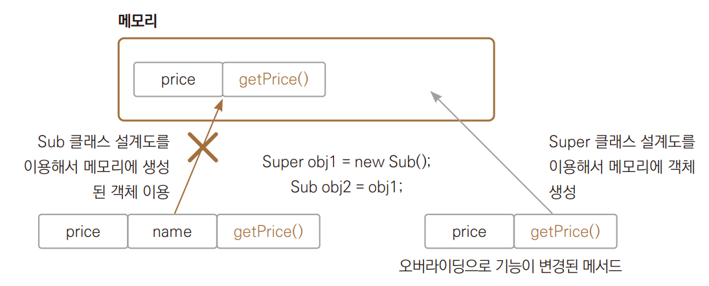
  + 실제 객체는 Super클래스의 설계도를 이용해 힙에 만들어져 있다.
  + 그런데 스택에 만들어진 변수가 Sub의 설계도를 이용하게 된다면, name이라는 변수에 접근하려고 할 때 100% 에러가 발생한다.
  + 자바 컴파일러 입장에서 에러가 날 게 뻔한 이런 상황을 허용하지 않는다.
+ ★ 자식 클래스의 객체는 부모 클래스형의 변수에 대입할 수 있다. 

*→ Ex01_Polymorphism1.java*
+ 다형성을 사용하는 이유
  + *→ Ex02_Polymorphism2.java*
````
public static Human humanCreate(int kind)
{
if (kind == 1)
{
//Human m = new Man();      // 2.
//return m;
return new Man();           // 3.
} else {
//Human = new Woman();
//return w;
return new Woman();
}
}
````
+ humanCreate() 메서드는 입력되는 매개변수에 따라 두 가지 타입의 객체를 만드는데 메서드의 반환값은 하나밖에 지정을 못한다.
2. 객체를 만드로 상위 클래스형의 변수에 넣어서 반환해 줄 수 있다.
3. 자동 형변환한다.

---

## instanceof 연산자
> 객체가 지정한 클래스형의 객체인지를 조사하는 연산자  
> 지정한 인터페이스를 오브젝트가 구현하고 있는지 조사할 수 있다.  
``boolean bCheck = obj instanceof MyClass;``
> + obj = 클래스형 변수
> + MyClass = 클래스명
> 
> ``boolean bCheck = obj instanceof MyInterface;``
> + obj = 클래스형 변수
> + MyIterface = 인터페이스명

*→ Ex03_instanceof.java*

+ instanceof연산자는 결국 다형성을 잘 사용하려고 한다. *→ Ex04_Polymorphism3.java*

---

---

## tossbank 부캠
✅ 클래스 상속 (Inheritance)
> 기존 클래스(부모)의 기능을 물려받아 새로운 클래스를 만드는 것

### 📌 상속의 장점
- 코드 재사용성 향상
- 유지보수 용이
- 계층적 구조 표현 가능

### 📌 상속 문법
```java
class 부모클래스 { ... }
class 자식클래스 extends 부모클래스 { ... }
```

### 📌 예제: 동물 클래스 상속하기
```java
class Animal {
    int age = 20;

    void eat() {
        System.out.println("먹는다.");
    }
}

class Dog extends Animal {
    void bark() {
        System.out.println("짖는다.");
    }
}

class Cat extends Animal {
    void grooming() {
        System.out.println("손질한다.");
    }
}

public class ex28 {
    public static void main(String[] args) {
        Dog dog = new Dog();
        dog.bark();          // Dog 고유 기능
        System.out.println(dog.age); // Animal에서 상속받은 필드
        dog.eat();           // Animal에서 상속받은 메서드
    }
}
```

### ✅ 상속 구조 예시
- Animal 클래스: 공통 속성 및 동작 제공
- Dog, Cat 클래스: Animal을 확장하여 고유 기능 추가

| 클래스명 | 상속 여부 | 메서드 예시 |
|----------|-----------|-------------|
| Animal   | -         | eat()       |
| Dog      | extends Animal | bark(), eat() |
| Cat      | extends Animal | grooming(), eat() |

> 📝 상속은 코드 중복을 줄이고, 객체 간의 계층적 관계를 표현할 때 사용된다. 상속받은 자식 클래스는 부모 클래스의 변수와 메서드를 그대로 사용할 수 있다.

✅ 상속 관계에서 생성자 호출 순서
> 자식 클래스의 생성자가 실행되기 전에 **부모 클래스의 생성자가 먼저 호출**됨

### 📌 개념 정리
- 자식 클래스 객체를 생성할 때, 자식 클래스 생성자에서 먼저 부모 생성자를 호출해야 객체가 완성됨
- 자식 클래스 생성자 내에서 `super()`를 명시하지 않으면, 컴파일러가 **기본 생성자(super())**를 자동 호출함
- 명시적으로 `super(...)`를 쓰면 원하는 부모 생성자를 지정해 호출할 수 있음

### 📌 키워드 정리
| 키워드      | 설명 |
|-------------|------|
| `this.`     | 현재 클래스의 필드/메서드 접근 |
| `this(...)` | 현재 클래스의 다른 생성자 호출 |
| `super.`    | 부모 클래스의 필드/메서드 접근 |
| `super(...)`| 부모 클래스의 생성자 호출 |

### 📌 예제 코드
```java
class Energy {
    int price = 1000;

    public Energy() {
        System.out.println("Energy()");
    }

    public Energy(int price) {
        this.price = price;
        System.out.println("Energy(int)");
    }
}

class WindEnergy extends Energy {
    int price = 2000;

    public WindEnergy() {
        System.out.println("WindEnergy()");
    }

    public WindEnergy(int price) {
        super(price); // 부모 클래스 생성자 호출
        this.price = price;
        System.out.println("WindEnergy(int)");
    }
}

public class ex32 {
    public static void main(String[] args) {
        //WindEnergy we = new WindEnergy();
        WindEnergy we2 = new WindEnergy(3000);
    }
}
```

### ✅ 실행 결과
```
Energy(int)
WindEnergy(int)
```

---

### 📌 핵심 요약
- 자식 클래스의 생성자가 실행되기 전에 부모 클래스의 생성자가 **반드시 먼저 호출**됨
- `super(...)`로 부모 생성자를 명시적으로 호출할 수 있음
- 부모 생성자의 초기화 작업이 끝난 후, 자식 클래스의 생성자 코드가 실행됨

> 📝 상속에서 생성자 호출 순서를 이해하면, 객체 초기화 흐름을 더 정확하게 설계할 수 있다.

✅ `final` 키워드의 용도와 사용 예시
> `final` 키워드는 "변경 불가"의 의미로, 변수, 메서드, 클래스에 사용됨

---

### 📌 final 키워드의 용도
| 사용 위치       | 의미 및 특징                                  |
|----------------|--------------------------------------------|
| `final 변수`    | 값 변경이 불가능한 **상수**                   |
| `final 메서드`  | **오버라이딩 불가**. 하위 클래스에서 재정의 불가 |
| `final 클래스`  | **상속 불가**. 다른 클래스가 확장할 수 없음     |

---

### 📌 예제 코드
```java
class FinalClass {
    String name = "파이널 클래스";
    int age;                     // 기본값 0으로 초기화
    final int price = 1000;     // 상수형 변수, 반드시 선언 시 초기화 필요

    final void disp() {
        // 오버라이딩 불가능한 메서드
    }
}

// final 클래스는 상속 불가하므로, FinalClass가 final이면 에러 발생
class LastClass extends FinalClass {
    // 아래 코드는 컴파일 오류 발생
    // @Override
    // void disp() { }
}

public class ex33 {
    public static void main(String[] args) {
        int i = 10;
        final int j = 20; // 상수로 선언됨. j는 이후 값 변경 불가

        // j = 30; // 오류: final 변수는 값 변경 불가
    }
}
```

---

✅ 요약 정리

| final 대상   | 효과                              | 사용 목적               |
|--------------|-----------------------------------|------------------------|
| 변수         | 값 변경 불가 (상수)                | 고정된 값 유지        |
| 메서드       | 하위 클래스에서 오버라이딩 불가     | 메서드 변경 제한       |
| 클래스       | 다른 클래스에서 상속 불가           | 클래스 구조 고정       |

> 📝 `final`은 코드의 **안정성과 불변성**을 보장할 수 있도록 도와주는 키워드로, 주요 API 설계 시 자주 사용됨
--- 
### ✅ 다형성 (Polymorphism) & 형변환 (Casting)
> 자식 클래스 객체는 부모 클래스 타입으로도 참조될 수 있음 → **타입의 유연성** 제공


#### 📌 다형성의 개념
- 하나의 객체가 여러 타입의 참조 변수에 담길 수 있는 특성
- 보통 상속 관계에서 발생
- "부모 타입으로 자식 객체를 담을 수 있음"


#### 📌 업캐스팅 (Upcasting)
> 자식 객체를 **부모 타입으로 참조**
- 자동 형변환 (묵시적)
- 자식 고유 멤버에는 접근 불가, 부모로부터 상속된 멤버만 사용 가능

#### 📌 다운캐스팅 (Downcasting)
> 부모 타입으로 참조된 객체를 **다시 자식 타입으로 형변환**
- 강제 형변환 필요 (`(자식타입)`)
- 원래 자식 객체였을 때만 가능 (그렇지 않으면 `ClassCastException` 발생)


#### 📌 예제 코드
```java
class Parent {
    String name = "Parent";

    void parentMethod() {
        System.out.println("Parent 내 이름은 " + this.name);
    }
}

class Child extends Parent {
    String name = "Child";

    void childMethod() {
        System.out.println("Child 내 이름은 " + this.name);
    }
}

public class ex35 {
    public static void main(String[] args) {
        Parent p1 = new Parent();
        System.out.println(p1.name); // Parent

        Child c1 = new Child();
        System.out.println(c1.name); // Child

        // 1. 업캐스팅 - 자식 → 부모
        Parent p2 = new Child();
        System.out.println(p2.name); // Parent (변수는 부모 기준)

        // 2. 업캐스팅 - 강제형변환
        Parent p3 = (Parent) c1;
        System.out.println(p3.name); // Parent

        // 3. 다운캐스팅 - 부모 → 자식 (원래 자식 객체였을 때만 가능)
        Child c2 = (Child) p2;
        System.out.println(c2.name); // Child

        // 4가지 조합 예시
        Parent a = new Parent();
        Child b = new Child();
        Parent c = new Child();
        Child d = (Child) c;

        // Child e = new Parent(); // 컴파일 오류 (불가능한 다운캐스팅)
    }
}
```


 ✅ 출력 요약
```
Parent
Child
Parent
Parent
Child
```

 ✅ 핵심 요약

| 구분        | 설명                                | 형변환 필요 여부 |
|-------------|-------------------------------------|------------------|
| 업캐스팅    | 자식 → 부모 (확장된 내용을 숨김)       | ❌ 자동 형변환     |
| 다운캐스팅  | 부모 → 자식 (원래 자식일 경우만 가능) | ✅ 강제 형변환 필요 |

> 📝 다형성과 캐스팅은 **유연한 메서드 처리**나 **컬렉션에 다양한 타입 담기** 등에 유용하게 활용됨

### ✅ 추상 클래스 (Abstract Class)
> 추상 클래스는 **일반 메서드 + 추상 메서드**를 함께 가질 수 있는 클래스
> 주로 **설계 용도**로 사용되며, 객체를 직접 생성할 수 없음


 📌 개념 정리
- `abstract` 키워드를 클래스 또는 메서드에 붙여 선언함
- **추상 메서드**는 구현 없이 선언만 존재하며, 자식 클래스에서 반드시 `override` 해야 함
- 추상 클래스는 **불완전한 클래스**, 직접 객체 생성 불가 (`new 불가`)


 📌 사용하는 이유
1. 설계와 구현을 분리할 수 있음
    - 설계: 어떤 기능이 필요한지를 명세 (인터페이스처럼)
    - 구현: 구체적인 동작은 하위 클래스가 책임짐
2. 유지보수 및 확장 용이
    - 코드 변경 시 상위 구조는 그대로 유지
3. 다양한 구현체(자식 클래스)를 다형성으로 유연하게 처리 가능

📌 예제 코드
```java
abstract class Picture {
    // 추상 메서드: 선언만 존재
    abstract void draw();

    // 일반 메서드
    void sale() {
        System.out.println("판다.");
    }
}

class Picasso extends Picture {
    @Override
    void draw() {
        System.out.println("피카소가 그림을 그린다.");
    }
}

class SuperPicasso extends Picture {
    @Override
    void draw() {
        System.out.println("수퍼피카소가 그림을 그린다.");
    }
}

public class ex37 {
    public static void main(String[] args) {
        Picasso picasso = new Picasso();
        picasso.draw();

        SuperPicasso superPicasso = new SuperPicasso();
        superPicasso.draw();

        // 다형성 사용 예시
        Picture p1 = new Picasso();
        Picture p2 = new SuperPicasso();
        p1.draw();
        p2.draw();
    }
}
```
✅ 핵심 요약

| 키워드        | 의미                             |
|---------------|----------------------------------|
| `abstract` class | 추상 메서드를 포함한 설계용 클래스 |
| `abstract` method| 선언만 존재, 반드시 자식에서 구현 |
| 일반 method   | 구현되어 있어 바로 사용 가능       |

> 📝 추상 클래스는 **공통 구조 정의 + 세부 구현은 자식에게 위임**하는 데 매우 적합함


### ✅ 인터페이스 (Interface)
> 인터페이스는 **추상 메서드만 가지는 설계용 구조체**
> 클래스는 인터페이스를 **구현(implements)** 하여 구체적인 동작을 정의함

📌 개념 정리
- 모든 메서드는 기본적으로 **public abstract** (생략 가능)
- 필드는 `public static final`만 선언 가능 (상수형태)
- 다중 구현(다중 상속) 가능 → 클래스와는 차별점
- 인터페이스 자체로는 객체를 생성할 수 없음

📌 추상 클래스 vs 인터페이스 비교

| 항목             | 추상 클래스                | 인터페이스               |
|------------------|----------------------------|---------------------------|
| 선언 키워드       | `abstract class`           | `interface`               |
| 상속 키워드       | `extends`                  | `implements`              |
| 메서드 종류       | 추상 + 일반 메서드          | 추상 메서드만 (Java 8+ 부터 default 가능) |
| 필드 선언         | 제한 없음                  | `public static final`만 가능 |
| 다중 상속         | 불가능                     | 가능                      |
| 객체 생성         | 직접 생성 불가              | 직접 생성 불가            |
| 접근 제어자       | `public`, `protected`, `private` 가능 | `public`만 가능            |

📌 예제 코드
```java
interface Drawing {
    // 모든 메서드는 abstract, public (생략 가능)
    void draw();
    void sketch();
}

class Painter implements Drawing {
    @Override
    public void draw() {
        System.out.println("드로윙");
    }

    @Override
    public void sketch() {
        System.out.println("스케치");
    }
}

public class ex38 {
    public static void main(String[] args) {
        Painter p = new Painter();
        p.draw();     // 출력: 드로윙
        p.sketch();   // 출력: 스케치
    }
}
```


 ✅ 핵심 요약

| 키워드         | 의미                                  |
|----------------|-----------------------------------------|
| `interface`    | 추상 메서드만 가지는 설계도             |
| `implements`   | 인터페이스 구현 시 사용하는 키워드       |
| 메서드         | 기본적으로 `public abstract`             |

> 📝 인터페이스는 "무엇을 해야 하는가"에만 집중하며, 실제 "어떻게"는 구현 클래스가 결정함

---

### ✅ 인터페이스 (Interface)
> 인터페이스는 **추상 메서드만 가지는 설계용 구조체**
> 클래스는 인터페이스를 **구현(implements)** 하여 구체적인 동작을 정의함


📌 개념 정리
- 모든 메서드는 기본적으로 **public abstract** (생략 가능)
- 필드는 `public static final`만 선언 가능 (상수형태)
- 다중 구현(다중 상속) 가능 → 클래스와는 차별점
- 인터페이스 자체로는 객체를 생성할 수 없음

 📌 추상 클래스 vs 인터페이스 비교

| 항목             | 추상 클래스                | 인터페이스               |
|------------------|----------------------------|---------------------------|
| 선언 키워드       | `abstract class`           | `interface`               |
| 상속 키워드       | `extends`                  | `implements`              |
| 메서드 종류       | 추상 + 일반 메서드          | 추상 메서드만 (Java 8+ 부터 default 가능) |
| 필드 선언         | 제한 없음                  | `public static final`만 가능 |
| 다중 상속         | 불가능                     | 가능                      |
| 객체 생성         | 직접 생성 불가              | 직접 생성 불가            |
| 접근 제어자       | `public`, `protected`, `private` 가능 | `public`만 가능            |

 📌 예제 코드
```java
interface Drawing {
    // 모든 메서드는 abstract, public (생략 가능)
    void draw();
    void sketch();
}

class Painter implements Drawing {
    @Override
    public void draw() {
        System.out.println("드로윙");
    }

    @Override
    public void sketch() {
        System.out.println("스케치");
    }
}

public class ex38 {
    public static void main(String[] args) {
        Painter p = new Painter();
        p.draw();     // 출력: 드로윙
        p.sketch();   // 출력: 스케치
    }
}
```

 📌 예제 확장: 추상 클래스와 인터페이스의 다중 구현
```java
// 추상 클래스 (일반 클래스 포함): 다중 상속 불가, 다단계 상속 가능
class A {}
class B extends A {}
class C extends B {}

// 인터페이스: 다중 상속 가능
interface IA {}
interface IB {}

// 클래스는 인터페이스 여러 개 구현 가능
class E implements IA, IB {}

// 추상 클래스 1개 상속 + 인터페이스 여러 개 구현도 가능
class SupermanClass extends C implements IA, IB {}

public class ex39 {
    public static void main(String[] args) {
        // 타입 유연성 예시
        IA obj1 = new SupermanClass();
        IB obj2 = new SupermanClass();
        C obj3 = new SupermanClass();
    }
}
```
 ✅ 핵심 요약

| 키워드         | 의미                                  |
|----------------|-----------------------------------------|
| `interface`    | 추상 메서드만 가지는 설계도             |
| `implements`   | 인터페이스 구현 시 사용하는 키워드       |
| `extends`      | 클래스 상속 또는 인터페이스 간 상속 시 사용 |

> 📝 추상 클래스는 "일반 메서드와 상태도 함께 정의"할 수 있지만, 인터페이스는 "기능 명세"에 집중해 설계를 유도함

---
### 📌 예제 확장: 익명 객체 (Anonymous Object)
```java
// 인터페이스 정의
interface NormalCar {
    void run();
}

public class ex40 {
    public static void main(String[] args) {
        // 익명 객체: 일회성 메서드 구현 시 사용
        NormalCar normalCar = new NormalCar() {
            @Override
            public void run() {
                System.out.println("수퍼카가 달린다.");
            }
        };

        normalCar.run(); // 출력: 수퍼카가 달린다.
    }
}
```

> 익명 객체는 이름 없는 클래스를 일시적으로 생성하여 일회성 로직에 활용됨.
> - 인터페이스나 추상 클래스를 기반으로 사용
> - 람다식(Java 8 이상)과도 연관 있음

---

### ✅ 핵심 요약
| 키워드         | 의미                                  |
|----------------|-----------------------------------------|
| `interface`    | 추상 메서드만 가지는 설계도             |
| `implements`   | 인터페이스 구현 시 사용하는 키워드       |
| `extends`      | 클래스 상속 또는 인터페이스 간 상속 시 사용 |
| 익명 객체       | 이름 없는 일회성 구현체, 인터페이스 기반 생성 |

> 📝 추상 클래스는 "일반 메서드와 상태도 함께 정의"할 수 있지만, 인터페이스는 "기능 명세"에 집중해 설계를 유도함

---

### 📌 예제 확장: Class 클래스 활용 (리플렉션)
```java
import java.lang.annotation.Annotation;
import java.lang.reflect.Constructor;
import java.lang.reflect.Method;

public class ex41 {
    public static void main(String[] args) throws ClassNotFoundException {
        // Class 클래스 : 클래스의 정보를 담고 있는 클래스
        //                : 멤버변수, 메서드, 생성자, 어노테이션 정보 등 제공

        // 1. 클래스 참조
        Class<?> cl = String.class;

        // 2. 인스턴스를 통해 클래스 참조
        String str = new String();
        Class<?> c2 = str.getClass();

        // 3. 클래스명으로 직접 로딩
        Class<?> c3 = Class.forName("java.lang.String");

        // 생성자 정보 확인
        Constructor<?>[] cons = c3.getConstructors();
        for(Constructor<?> con : cons) {
            System.out.println(con);
        }
        System.out.println("---------");

        // 메서드 정보 확인
        Method[] methods = c3.getMethods();
        for(Method m : methods) {
            System.out.println(m);
        }
        System.out.println("---------");

        // 어노테이션 정보 확인
        Annotation[] annotations = c3.getAnnotations();
        for(Annotation a : annotations) {
            System.out.println(a);
        }
    }
}
```

> 리플렉션(Reflection)을 통해 클래스의 내부 구조를 런타임에 조사할 수 있음.
> - 프레임워크, DI, 컴파일 타임 정보 분석 등 고급 활용에 쓰임


 ✅ 핵심 요약

| 키워드         | 의미                                  |
|----------------|-----------------------------------------|
| `interface`    | 추상 메서드만 가지는 설계도             |
| `implements`   | 인터페이스 구현 시 사용하는 키워드       |
| `extends`      | 클래스 상속 또는 인터페이스 간 상속 시 사용 |
| 익명 객체       | 이름 없는 일회성 구현체, 인터페이스 기반 생성 |
| `Class` 클래스 | 클래스 정보를 메타 수준에서 다루는 도구     |

> 📝 추상 클래스는 "일반 메서드와 상태도 함께 정의"할 수 있지만, 인터페이스는 "기능 명세"에 집중해 설계를 유도함
> 🧠 리플렉션은 프레임워크나 동적 클래스 분석에 자주 활용됨

---
