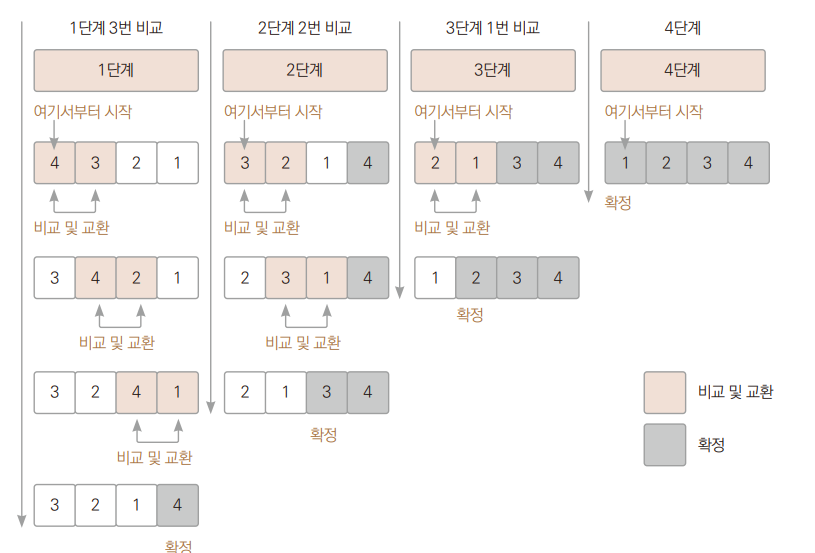
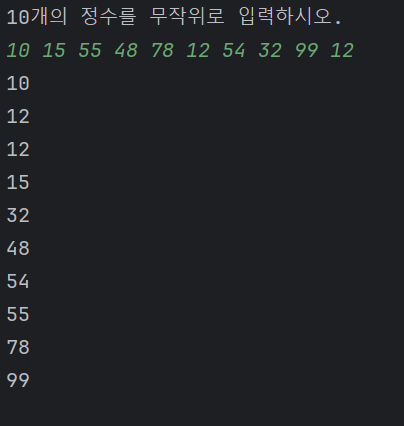

# Chpater 19 정렬 알고리즘 만들기

---

##  사전 지식 ( 정렬 알고리즘 )

### 사전지식 2 : 버블 정렬 알고리즘
> 인접한 두 원소를 비교하고 필요에 따라 위치를 교환하는 방식
> + 동작 규칙
>   1. 인접한 요소끼리 비교하여 더 작은 값을 앞으로, 큰 값을 뒤로 지정
>   2. 1번과정을 마지막 원소까지 반복
>   3. 더 이상 자리를 교환하지 않을 때까지 1번 2번을 반복

### 사전지식 2 :  삽입 정렬 알고리즘
> 리스트를 순차적으로 탐색하면서 각 요소를 정렬된 부분 리스트에 삽입하는 방식으로 동작이다.
> + 동작 규칙
>   1. 리스트의 두 번째 요소부터 시작.  
      현재 요소를 선택하고, 이를 정렬된 부분 리스트에 올바른 위치에 삽입
>   2. 첫 번째 단계에서 정렬된 부분 리스트의 길이는 1이 된다.
   두 번째 요소를 선택하고, 이를 정렬된 부분 리스트에 올바른 위치에 삽입
>   3. 이 과정을 계속해서 리스트의 모든 요소가 정렬될 때까지 반복  
각 단계에서 현재 선택된 요소를 정렬된 부분 리스트에 적절한 위치에 삽입

## 프로젝트 

---
### 프로젝트의 목적
+ 배열과 배열을 매개변수로 넘기는 방법을 이용하여 값들을 정렬해보기
+ 실행 화면  
    

### 구현 방법
+ 입력 처리 코드를 메서드로 분리, 매개변수로 배열을 사용
+ 입력된 값을 정렬 ( 버블 정렬, 삽입 정렬 사용)

### 의의
+ 참조 변수의 개념을 이용하여 배열을 가리키는 참조 변수는 여러개가 되었다.
+ 힙에 만들어진 배열의 값이 정렬되는 것 확인

### 마치며
+ 다양한 정렬 알고리즘을 시도해보는 것이 좋을 것 같다.
+ 참조 변수에 대한 정확한 개념을 숙지해야 할 것 같다.