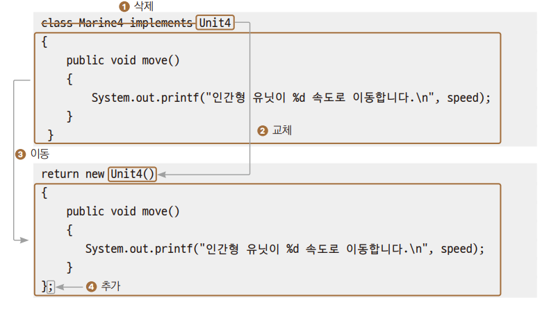
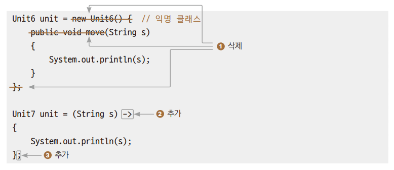

# Chpter 22 내부 클래스, 람다식

---

## 내부 클래스
> 클래스 안에 클래스를 선언할 수 가 있는데, 안쪽에 있는 클래슬르 중첩 클래스(nested class)라고 하고,  
> 중첩 클래스를 가지고 있는 클래스를 외부 클래스(outer class)라고 한다.

+ 중첩 클래스
  + 스태틱 중첩 클래스 : 중첩이지만 내부 클래스는 아니다.
  + 논스태틱 중첩 클래스 : 내부 클래스라고 부른다.
    + 멤버 내부 클래스
    + 지역 내부 클래스
    + 익명 내부 클래스

+ 변수
````
class MyClass
{
    static int n1; // 스태틱 변수
    int n2; // 멤버 변수 (인스턴스 변수)
    
     public void myFunc()
     {
        int n3; // 지역 변수
            …
        }
}  
````

+ 내부 클래스
````
class MyClass // 외부 클래스
{
     static class NestedButNotInner { }
    class c1 { } // 멤버 내부 클래스
    
    public void myFunc()
    {
        class c2 { } // 지역 내부 클래스
           …
    }
}
````

---

## 멤버 내부 클래스
>다른 클래스와는 연관되어 사용되지 않고 해당 클래스에서만 특정 클래스를 사용할 떄 하나의 소스파일로 묶어 관리를 편하게 할 수있다.  
> 외부 클래스는 내부 클래스를 멤버 변수처럼 사용할 수 있고,  
> 내부 클래스는 외부 클래스의 자원을 직접 사용할 수 있는 장점이 있다.  
> 멤버 내부 클래스는 외부 클래스 뒤에 .new를 붙이면 된다.  
> ``외부클래스.new 내부클래스생성자();``

*→ Ex01_MemberInner.java*

---

## 지역 내부 클래스
>클래스의 정의 위치가 메서드 ,if문, while문 같은 중괄호 블록 안에 정의된다는 점에서 멤버 내부 클래스와 구분된다.  
> 해당 메서드 안에서만 객체 생성이 가능해지므로 클래스의 정의를 깊이 숨기는 효과가 있다.  
> *→ Ex02_LocalInner.java*

---

## 익명 내부 클래스
> 지역 내부 클래스는 해당 메서드에만 클래스 생성이 가능하므로 클래스명이 상당히 제한적으로 사용된다.  
> 그래서 클래스명을 생략하기도 한다.  
> *→ Ex03_AnnonymousInner1.java*
>   1. 내부 클래스명이 딱 한번 사용된다. 
>     이름이 없으므로 부모 클래스나 인터페이스의 이름을 임시로 사용한다.
>   
 + *→ Ex04_AnnoymousInner2.java*  
   1 까지의 내부클래스명은  
   2 에서 딱 한 번 사용된다.  
   4 블록을 3.처럼 유지하고 이름을 생략한다
    그리고 부모 클래스나 인터페이스 이름을 3.에서처럼 블록을 대표하는 이름으로 이용한다.
 
+ 안드로이드 프로그래밍에서 위젯의 이벤트를 처리하는 핸들러를 구현할 떄 이런 익명 내부 클래스를 사용하고 있다.
  안드로이드 프로그래밍에서는 아주 기본이 되는 사항이므로 반드시 숙지가 필요한 내용입니다.

## 람다식
> 자바는 객체를 기반으로 프로그램을 구현하고 클래스 기반의 객체지향 언어이기 때문에 간단한 클래스를 만들어줘야 한다.  
> 클래스를 먼저 만들고, 클래스 안에 기능을 구현한 메서드를 만든 후 객체를 통해 그 메서드를 호출해야 한다.  
> 자바는 클래스가 없으면  메서드를 사용할 수 없다.
> + 위 불현함을 해소하기 위해 함수형 프로그래밍 기법인 람다식(lambda expression)을 지원한다.

### 익명 내부 클래스 → 람다식
>일반적으로 클래스를 사용하기 위해 만든 코드  
> *→ Ex05_Lambda1.java* 
   + 1.기능을 익명 내부 클래스로 만든 예제  
       *→ Ex06_Lambda2.java*
    
     1. 중괄호 블록의 코드로 익명 내부 클래스 구현, 이 클래스는 다른 곳에서는 사용하지 않으므로 익명으로 생성한다.  
        인테페이스 이름으로 대충 블록에 이름을 붙여준다
     + 위 코드를 람다식으로 변환
        1. 익명 클래스를 나타내는 의미 없이 붙인 이름과 외부위 중괄호를 제거
       2. 함수 이름, 반환형을 없애고 화살표 (->)를 추가
       3. 함수의 실행문 {} 블록을 남기고 문장의 끝을 알려주기 위해 ;으로 마지막 표시
       
     
+ 완성된 람다식 예제
  *→ Ex07_Lambda3.java*

### 람다식 문법
> 매개변수가 하나이면 자료형과 소괄호를 생략할 수 있다.  
> ``str -> { System.out.println(str); }``  
> 중괄호 안의 구현부가 한 문장이면 중괄호를 생략할 수 있다.  
> ``str -> System.out.println(str);``

*→ Ex08_LambdaRule1.java*

+ 중괄호 안의 구현부가 한 문장이라도 return문이 있다면 중괄호를 생략할 수 없다.
  + ``str -> return str.length();``
+ 매개변수가 두 개 이상이면 소괄호를 생략할 수 없다.
  + ``x, y -> { System.out.println(x + y); }``// 잘못된 형식
+ 중괄호 안의 구현부가 반환문이 하나라면 return과 중괄호 모두 생략할 수 있다.
  + ``str -> str.length();``        // 문자열의 길이를 반환함
  + ``(x, y) -> x + y;``          // 두 값을 더하여 반환함

+ 람다 예제  
*→ Ex09_LambdaRule2.java*

+ 매개변수가 없을 경우에는 소괄호를 생략할 수 없다.
    ``(  ) -> System.out.println("Hello~);``

+ 매개변수가 없는 람다식 예제   
    *→ Ex10_LambdaRule3.java*

---

## 함수형 인터페이스
> 람다식을 선언하는 전용 인터페이스이다.  
> 함수형 인터페이스는 익명 함수와 매개변수만으로 구현되므로 단 하나의 메서드만을 가져야 한다.  
> 인터페이스에 @FunctionalInterFace 어노테이션을 붙여서 함수형 인터페이스임을 표시한다.

*→ Ex11_Functional.java*

---

---

## tossbank 부트캠프

### 람다식
    > 람다식은 "코드를 변수처럼 다루기 위한 문법"이다.
    > - JDK 1.8부터 도입됨
    > - 함수형 언어의 영향을 받아 자바에서도 함수를 변수처럼 전달할 수 있게 해준다.
    > - 자바는 원래 클래스 기반 언어이므로, 객체에 메서드를 담아 전달하면 코드 전달이 가능하나, 이를 더 간결하게 만들기 위해 도입됨

 - 핵심 개념 정리

| 구분 | 설명 |
|------|------|
| 일반 변수 | 값을 저장 (정수, 문자열 등) |
| 참조 변수 | 객체 주소값을 저장 |
| 함수형 변수 | 코드를 저장 (함수 자체를 변수처럼) |

### 자바의 람다식 문법

- 함수형 인터페이스
```java
@FunctionalInterface
interface MyFunc1 {
    int calc(int x, int y); // 추상 메서드 하나만 있어야 함
}
```

- 람다식 구현
```java
MyFunc1 f1 = (x, y) -> { return x + y; };
System.out.println(f1.calc(10, 20));  // 출력: 30
```

- 람다식을 메서드의 인자로 전달
```java
execFunc(f1);

static void execFunc(MyFunc1 func) {
    System.out.println(func.calc(30, 40));  // 출력: 70
}
```

---

- 실행 예시 전체 코드
```java
@FunctionalInterface
interface MyFunc1 {
    int calc(int x, int y); // 추상 메서드 하나만 존재
}

public class ex61 {
    public static void main(String[] args) {
        MyFunc1 f1 = (x, y) -> { return x + y; };
        System.out.println(f1.calc(10, 20));

        execFunc(f1);
    }

    static void execFunc(MyFunc1 func) {
        System.out.println(func.calc(30, 40));
    }
}
```
주요 키워드
- `@FunctionalInterface` : 함수형 인터페이스임을 명시하며, 추상 메서드가 반드시 하나만 존재해야 함
- `->` (화살표 연산자) : 람다식에서 매개변수와 구현부를 구분하는 문법
