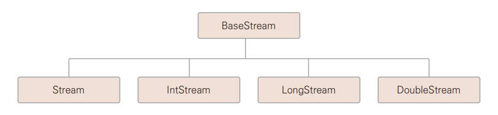
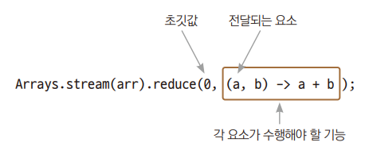

# Chapter 23 스트림

---

## 스트림 ( stream )
> 데이터의 흐름  
> + 데이터가 여러 개가 있어야 흐름을 만들 수 있기 떄문에 스트림 데이터 소스로는 컬렉션, 배열 등이 주로 사용된다.

+ 스트림의 특징
  + 스트림 연산은 기존 자료를 변경하지 않는다.
  + 스트림 연산은 중간 연산과 최종 연산으로 구분된다.
  + 한 번 생성하고 사용한 스트림은 재사용할 수 없다.

 + 스트림은 java.util.stream 패키지의 멤버이며, BaseStream 인터페이스를 부모로 한다.
   

---

## 중간 연산, 최종 연산
+ 중간 연산
  + filter() : 조건에 맞는 요소 추출
  + map() : 조건에 맞는 요소 반환
  + sorted() :  정렬
+ 최종 연산
  + 스트림의 자료를 소모하면서 연산을 수행
  + 최종 연산 후에 스트림은 더 이상 다른 연산을 적용할 수 없음
  + forEach() : 요소를 하나씩 꺼내옴
  + count() : 요소 개수
  + sum() : 요소의 합

*→ Ex01_Stream1.java*

---

## 파이프라인 구성
> Stream 인터페이스가 제공하는 메서드는 대부분 반환 타입이 Stream이므로 메서드를 연속해 호출할 수 있다.  
> 따라서 스트림 연산을 연결해 파이프라인으로 구성할 수 있다.

*→ Ex02_Pipeline.java*

---

## 컬렉션 객체 vs 스트림
> 스트림을 사용하면 컬렉션만 사용한 것보다 코드가 간결하고, 쉽게 의미를 알 수 있다.  

+ 배열에서 홀수만 골라내서 정렬하여 출력하는 코드  
    *→ Ex03_CollectionVsStream.java*

---

## 여러 가지 연산들
> 중간 연산으로 내용을 정렬하는 메서드롸 내용을 변환하는 메서드

### sorted()
> 스트림을 구성하는 데이터를 조건에 따라 정렬하는 연산  
> *→ Ex04_Sorted.java*

### map()
> 중간 연산은 스트림을 수성하는 데이터를 조건에 따라 변환하는 연산을 한다.  
> *→ Ex05_Map.java*

### sum(), count(), average(), min(), max()
>*→ Ex06_PreTerminal.java*

### reduce()
> reduce() 최종 연산은 정의된 연산이 아닌 프로그래머가 직접 지정하는 연산  
  

+ 문자열 길이를 세서 긴 문자열을 남기는 예제  
  *→ Ex07_Reduce.java*