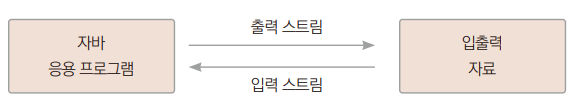
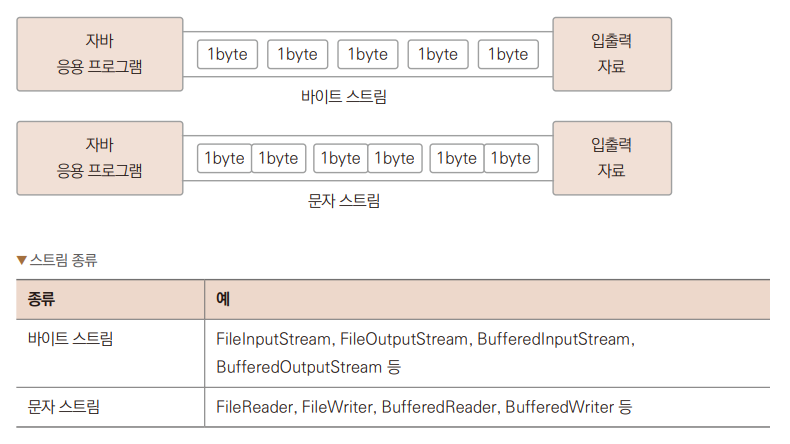
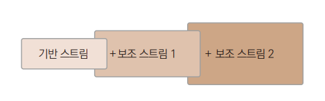

# Chapter 24 입출력 스트림

---

## 자바의 입출력 스트림
> 자바에서의 스트림 : 자료 흐름이 물의 흐름과 같다.

+ 자바 입출력 모델
  + 파일에서의 입출력
  + 키보드와 모니터의 입출력
  + 그래픽카드, 사운드카드의 입출력
  + 프린터, 팩스와 같은 출력 장치의 입출력
  + 인터넷으로 연결되어 있는 서버 또는 클라이언트의 입출력
  >자바는 입출력 장치를 구분하지 않고 일관성 있게 프로그램을 구현할 수 있도록 위와 같은 자바 입출력 모델의  
  > 모든 입출력을 입출력 스트림을 통해 처리하는 기능을 제공한다.
+ 입출력 스트림의 구분
  + 대상 기준에 따라서는 입력 스트림, 출력 스트림으로 나뉜다.
  + 자료의 종류에 따라서는 바이트 단위 스트림, 문자 단위 스트림으로 나눈다.
  + 기능에 따라서는 기반 스트림, 보조 스트림(필터 스트림)으로 나뉜다.

---

## 입출력 스트림의 구분

### 입력 스트림과 출력 스트림
> 대상 기준에 따라 스트림을 구분할 때는 입력 스트림과 출력 스트림으로 나눈다.
> + 입력 스트림 : 대상으로부터 자료를 읽어드리는 스트림
> + 출력 스트림 : 대상으로 자료를 출력하는 스트림  
>  

+ 스트림 종류
  + 입력 스트림 : FileInputStream, FileReader, BufferedInputStream, BufferedReader 등
  + 출력 스트림 : FileOutputStream, FileWriter, BufferedOutputStream, BufferedWriter 등

### 바이트 단위 스트림과 문자 단위 스트림
> 자료의 종류에 따라서 스트림을 구분할 떄는 바이트 단위 스트림과 문자 단위 스트림으로 나눈다.

+ 바이트 단위 스트림 : 동영상, 음악 파일 등을 읽고 쓸 때 사용
+ 문자 단위 스트림 : 바이트 단위로 자료를 처리하면 문자는 깨짐. 2바이트 단위로 처리하도록 구현된 스트림  
  
  

### 기반 스트림과 보조 스트림
> 기능에 따라서 구분

+ 기반 스트림 : 대상에 직접 자료를 읽고 쓰는 기능의 스트림
+ 보조 스트림 : 직접 읽고 쓰는 기능은 없이 추가적인 기능을 더해주는 스트림.  
  항상 기반 스트림이나 또 다른 보조 스트림을 생성자 매개변수로 포함함.  
  
---

## 파일 대상 입출력 스트림 생성
>'파일을 대상으로 하는 입출력 모델'에서 스트림을 생성하여 자바 입출력 스트림의 기능

### 파일 대상 출력 스트림 생성
> 파일을 만드는 가장 간단한 예제  
> *→ Ex01_FileWrite1.java*  
> 1. 파일을 생성하고 해당 파일에 스트림 생성
> 2. 스트림을 통해 데이터를 보낸다. 파일에 데이터가 써진다.
> 3. 파일을 닫는다.
> + 파일은 루트폴더에 생성

### 입출력 스트림 예외 직접 처리
> 예외를 넘기지 않고 직접 처리하는 코드  
> *→ Ex02_FileWrite2.java*  
>   2.에러가 나더라도 close()메서드를 확실히 부르고 종료하기 위해 finally 구문쪽으로 close() 메서드를 옮긴다.  
>   1.지역 변수의 범위가 달라지게 되므로 변수를 바깥에 선언
> + finally 구문에서 close() 메서드를 부를 때 이 메서드 자체도 예외가 발생할 수 있기 때문에  
>   try ~catch로 묶어준다.

### 입출력 스트림 예외 처리 개선
> try ~ catch 구문에서 이런 리소스를 다루는 방법에 대한 개선으로  
> try ~ with ~ resource를 적용하여 코드를 작성할 수 있다.  
> *→ Ex03_FileWrite3.java*
> 1. try 다음 소괄호 안에서 다루고 있다. 이렇게 리소를 열어서 스트림을 생성하면 따로 닫아주지 않아도 자바에서 자동으로 처리해준다.

### 파일 대상 입력 스트림 생성
> try ~ with ~ resource를 적용하여 코드를 작성  
> *→ Ex04_FileRead.java*
> 1. 파일 리소스를 try 다음 소괄호 안에서 열고 있다. 이렇게 리소스를 열어서 스트림을 생성하면 따로 닫아주지 않아도 자바에서 자동으로 처리해준다.
> 2. 데이터를 한 바이트 읽는다.
> 3. 읽은 데이터를 그냥 출력하면 십진수로 출력한다.
> 4. 문자이기 때문에 문자 포맷 %c를 지정해주면 글자로 출력된다.

### 바이트 단위 입력 및 출력 스트림 이용 파일 복사
> 한 바이트를 쓰고 한 바이트를 읽는 것을 연속적으로 처리하면 파일 복사도 할 수 있다.  
> *→ Ex05_Copy1.java*
> 1. try 다음 소괄호 안에서 처리할 수 있는 리소스 여러 개를 한꺼번에 지정할수 있다. ;으로 문장 구분
> 2. try 다음 소괄호 안에서 처리할 수 있는 리소스 여러 개를 한꺼번에 지정할수 있다.
> 3. 복사에 걸리는 시간을 측정하기 위해 시간 관련 클래스를 이용하여 현재 시각을 구해온다.
> 4. 반복문을 통해 한 바이트씩 소스 파일의 스트림으로부터 데이터를 읽어 대상 파일의 스트림에 써준다.
> 5. 입출력 스트림으로부터 더 이상 데이터를 읽지 못하면 -1이 반환된다.
> 6. 더 복사할 내용이 없어 반복을 중단한다.
> 7. 현재 시각을 구해온다.
> 8. 복사 전 구한 시각과 복사가 끝난 후 시각 차이를 구해서 복사에 걸린 시간을 출력한다.

### 버퍼를 이용한 파일 복사
> 입출력 스트림의 데이터를 한 바이트씩 읽고 쓰는 방식은 입출력 I/O가 많이 발생하게 되어서 비용이 많이 발생하고 시간이 많이 걸린다.  
> 메모리를 이용하여 버퍼에 저장해서 한 번에 읽고 쓰는 방식으로 하드웨어적인 I/O의 횟수를 줄여주면 시간을 단축할 수 있다.  
> *→ Ex06_Copy2.java*
> 1. 복사가 되는 대상 파일명을 앞의 예제와 다르게 지정한다.
> 2. 데이터를 담을 버퍼로 바이트 배열을 1KB 크기로 만든다.
> 3. 버퍼 크기만큼 한 번에 읽는다. 크기가 버퍼보다 작으면 그 크기까지만 읽는다.
> 4. 읽어드린 버퍼 크기만큼 출력 스트림에 보내 파일을 작성한다. 맨 마지막은 읽은 크기만큼 써지게 된다.
> + 실행을 하면 실행 속도가 줄어든 것을 확인할 수 있다. 테스트한 파일보다 큰 파일을 이용해서 테스트하면 시간 차이가 더 난다.

---

## 보조 스트림
> 추가적인 기능을 더해주는 스트림  
> 

### 버퍼링 기능을 제공하는 필터 스트림
> 단독으로 사용할 수 없고 기반 스트림에 더해서 같이 사용하게 된다.  
> *→ Ex07_FileCopy3.java*
> 1. 대상 파일의 이름을 지정한다.
> 2. 기반 스트림은 FileInputStream이고 보조 스트림은 BufferedInputStream이 된다. 이렇게 사용하면 기반 스트림에 없는 기능을 추가할 수 있다.
> 3. 라인에서 처음처럼 한 바이트씩 읽고 있지만 보조 스트림에 의해 내부적으로는 버퍼링이 되게된다.
> + 실행 결과를 보면 빠르게 처리되고 있다.

---

## 문자 스트림
> FileRead나 FileWriter 클래스를 사용하게 되면 입출력 스트림에서 두 바이트씩 데이터를 처리해준다.

### FileWriter
> 문자를 FileWriter를 이용하여 저장  
> *→ Ex08_TextWrite.java*
> 1. text.txt 파일을 생성하고 문자 스트림을 생성한다.
> 2. char를 int로 형변환해서 A부터 Z까지 반복, 알파벳 A부터Z는 ASCII 코드표상에서 십진수 값으로 1씩 증가한다.
> 3. out은 문자 스트림이기 때문에 int값을 문자로 변환하여 파일에 저장한다.
> 4. 캐리지 리턴 값 저장, 캐리지 리던 \r은 현재 위치를 나타내는 커서를 맨 앞으로 이동시킨다.
> 5. 라인 피드값을 저장한다. 라인 피드값을 저장한다. 라인 피드 \n은 커서의 위치를 아랫줄로 이동시킨다. 윈도우에서는 캐리지 리턴과 라인 피드를 합쳐서 엔터를 구현
> 6. 대문자 'A'의 아스키코드 값에 32를 더하면 소문자 'a'가 된다. 그러므로 소문자 a부터z까지 반복하게 된다.
> 9. 문자열을 바로 입출력 스트림으로 보내 지정할 수 있다.
> 10. 특수 문자열("\r\n")을 사용하여 저장하고 있다.
>   7,8 과인과 같은 의미가 된다.
> + 실행 결과로 콘솔창에는 출력되는 내용은 없고 프로젝트 루트 폴더에 파일이 생성된다.

### FileReader
> 문자를 FileReader를 이용하여 읽기  
> *→ Ex09_TextRead.java*
> 1. 문자를 스트림으로부터 하나 읽어 int형 변수에 대입한다. 2바이트인 char형을 왜 4바이트인 int형에 저장하나면 데이터를 더 이상 읽을 수 없을 때 -1을 반환받기 위해서이다. -1은 char형 데이터 범위에 없는 값이다.
> 2. 더 이상 읽을 수 없을 때 -1이 반환된다.
> 3. 읽은 데이터를 char로 다시 형변환하여 화면으로 출력한다.

### BufferedWriter
> 문자 스트림도 버퍼링 처리를 위하여 기반 스트림에 보조 스트림을 더할 수 있다.  
> *→ Ex10_BufferedWriter.java*
> 1. 기반 스트림 FileWriter이고, 보조 스트림은 BufferdWriter가 된다. 이렇게 사용하게 되면 기반 스트림에 없는 기능을 추가해줄 수 있다.
> 2. 문자열의 크기만큼 버퍼링하여 한 번에 출력 스트림으로 파일에 저장한다.
> 3. 줄바꿈 문자를 스트림으로 저장한다.
> + 실행을 하면 콘솔창에는 결과가 아무것도 나타나지 않지만 프로젝트의 루트 파일에 파일에 생성된다.

### BufferedRead
> 문자 스트림으로 파일을 읽을 때도 보조 스트림을 적용하여 더 빠르게 읽어들일 수 있다.  
> *→ Ex11_BufferedReader.java*
> 1. 기반 스트림인 FileReader에 보조 스트림인 BufferedReader를 이용하여 버퍼링 기능을 추가한다.
> 2. 입력 스트림에서 라인별로 구분하여 데이터를 읽어드린다.
> 3. 읽을 내용이 없을 때는 null이 반환한다.
> 4. 스트림에서 라인 단위로 읽은 내용을 화면에 출력한다.

---

## IO 스트림 기반의 인스턴스 저장
> 자바 가상 머신의 메모리에 있는 객체 데이터를 바이트 형태로 변환하는 기술인 직렬화 기능을 이용하면 객체 자체를 저장할 수도 있습니다.

### 직렬화
> 직렬화는 객체의 상태를 그대로 저장하거나 다시 복원하는것을 말한다.  
> ObjectInputStream과 ObjectOutputStream을 사용하여 파일에 쓰거나 네트워크로 전송할 수 있다.

|생성사|설명|
|:--|:--|
|ObjectInputStream(InputStream in)|InputStream을 생성자의 매개변수로 받아 ObjectInputStream을 생성한다.|
|ObjectOutputStrema(OutputStream out)|OutputStream을 생성자의 매개변수로 받아 ObjectOuptStream을 생성한다.|

+ 직렬화는 객체의 내용 중 private이 선언된 부분이 있더라도 외부로 내용이 유출되는 것이므로 프로그래머가 직렬화 의도를 표시해야 한다.
+ 이 떄 사용하는 것이 java.io.Serializalbe 인터페이스이다. 이 인터페이스는 구현할 추상 메서드가 없다.
+ 직렬화 의도를 밝히기 위해 인터페이스를 적용하는 것이기 때문에 마커 인터페이스라 부른다.
+ 객체를 저장하는 클래스  
  *→ Ex12_Unit.java*

### ObjectOutputStream
> 앞에서 만든 클래스를 이용해 객체를 만들고 저장  
> *→ Ex13_ObjectOutputStream.java*
> + 문자를 저장한 것이 아니고 객체를 저장한 것이기 때문에 에디터에서 일반적인 텍스트 문서처럼 열어볼 수 없다.

### ObjectInputStream
> ObjectInputStream을 이용하여 객체를 저장한 경우 ObjectInputStream으로 읽어서 객체를 복원해야 정보를 읽을 수 있다.
> *→ Ex14_ObjectInputStream.java*

---

---

## tossbank 부트캠프

### ex57_client - 클라이언트 코드
```java
import java.io.InputStream;
import java.io.OutputStream;
import java.net.InetSocketAddress;
import java.net.Socket;

public class ex57_client {
    public static void main(String[] args) {
        Socket socket = null;
        socket = new Socket();
        try {
            socket.connect(new InetSocketAddress("localhost", 5001));
            System.out.println("서버 접속 성공!");

            // 서버에 데이터 전송
            byte[] bytes;
            String message = "Hi! This is Client~";
            OutputStream os = socket.getOutputStream();
            bytes = message.getBytes("UTF-8");
            os.write(bytes);
            os.flush();
            System.out.println("데이타보내기 성공!");

            // 서버로부터 데이터 수신
            InputStream is = socket.getInputStream();
            bytes = new byte[1024];
            int readByteCount = is.read(bytes);
            message = new String(bytes, 0, readByteCount, "UTF-8");
            System.out.println("데이타받기 성공:" + message);

            os.close();
            is.close();
        } catch (Exception e) {
            System.out.println("서버 접속 오류!");
        }
    }
}
```

### ex58_server - 서버 코드
```java
import java.io.InputStream;
import java.io.OutputStream;
import java.net.InetSocketAddress;
import java.net.ServerSocket;
import java.net.Socket;

public class ex58_server {
    public static void main(String[] args) {
        ServerSocket serverSocket = null;
        try {
            serverSocket = new ServerSocket();
            serverSocket.bind(new InetSocketAddress("localhost", 5001));
            while (true) {
                System.out.println("서버가 연결을 기다리는 중...");
                Socket socket = serverSocket.accept();
                InetSocketAddress isa = (InetSocketAddress) socket.getRemoteSocketAddress();
                System.out.println("서버가 연결을 수락함:" + isa.getHostName());

                // 클라이언트 데이터 수신
                byte[] bytes = new byte[1024];
                InputStream is = socket.getInputStream();
                int readByteCount = is.read(bytes);
                String message = new String(bytes, 0, readByteCount, "UTF-8");
                System.out.println("서버가 받은 데이타:" + message);

                // 클라이언트에 응답 전송
                OutputStream os = socket.getOutputStream();
                message = "Hi~ This is Server~";
                bytes = message.getBytes("UTF-8");
                os.write(bytes);
                os.flush();

                is.close();
                os.close();
                socket.close();

                if (message.equals("exit")) {
                    break;
                }
            }
        } catch (Exception e) {
            System.out.println("서버 초기화 에러!");
        }
    }
}
```

> TCP/IP 소켓 통신은 양방향 연결 지향 통신 방식으로, 실시간성과 신뢰성을 보장하는 방식이다.
> `ServerSocket`은 연결을 수락하고, `Socket`은 데이터 송수신에 사용된다.

ex58_server - 서버 코드
```java
import java.io.InputStream;
import java.io.OutputStream;
import java.net.InetSocketAddress;
import java.net.ServerSocket;
import java.net.Socket;

public class ex58_server {
    public static void main(String[] args) {
        ServerSocket serverSocket = null;
        try {
            serverSocket = new ServerSocket();
            serverSocket.bind(new InetSocketAddress("localhost", 5001));
            while (true) {
                System.out.println("서버가 연결을 기다리는 중...");
                Socket socket = serverSocket.accept();
                InetSocketAddress isa = (InetSocketAddress) socket.getRemoteSocketAddress();
                System.out.println("서버가 연결을 수락함:" + isa.getHostName());

                // 클라이언트 데이터 수신
                byte[] bytes = new byte[1024];
                InputStream is = socket.getInputStream();
                int readByteCount = is.read(bytes);
                String message = new String(bytes, 0, readByteCount, "UTF-8");
                System.out.println("서버가 받은 데이타:" + message);

                // 클라이언트에 응답 전송
                OutputStream os = socket.getOutputStream();
                message = "Hi~ This is Server~";
                bytes = message.getBytes("UTF-8");
                os.write(bytes);
                os.flush();

                is.close();
                os.close();
                socket.close();

                if (message.equals("exit")) {
                    break;
                }
            }
        } catch (Exception e) {
            System.out.println("서버 초기화 에러!");
        }
    }
}
```

> TCP/IP 소켓 통신은 양방향 연결 지향 통신 방식으로, 실시간성과 신뢰성을 보장하는 방식이다.  
> `ServerSocket`은 연결을 수락하고, `Socket`은 데이터 송수신에 사용된다.

---

ex62 - 날짜와 시간 클래스 (Calendar)

```java
import java.text.SimpleDateFormat;
import java.util.Calendar;
import java.util.GregorianCalendar;
import java.util.Locale;

public class ex62 {
    public static void main(String[] args) {
        Calendar cal = new GregorianCalendar(Locale.KOREA);

        System.out.println( cal.getTime() );
        System.out.println( cal.getTimeInMillis() );

        int year = cal.get(Calendar.YEAR);
        int month = cal.get(Calendar.MONTH) + 1; // 0부터 시작
        int day = cal.get(Calendar.DAY_OF_MONTH);
        int dayOfWeek = cal.get(Calendar.DAY_OF_WEEK);
        int weekOfYear = cal.get(Calendar.WEEK_OF_YEAR);
        int weekOfMonth = cal.get(Calendar.WEEK_OF_MONTH);
        int hour = cal.get(Calendar.HOUR);
        int hourOfDay = cal.get(Calendar.HOUR_OF_DAY);
        int minute = cal.get(Calendar.MINUTE);
        int second = cal.get(Calendar.SECOND);
        int millisecond = cal.get(Calendar.MILLISECOND);

        System.out.printf("%d년 %d월 %d일\n", year, month, day);
        System.out.printf("요일: %d, 연중 %d주차, 이번달 %d주차\n", dayOfWeek, weekOfYear, weekOfMonth);
        System.out.printf("시: %d / %d, 분: %d, 초: %d, 밀리초: %d\n", hour, hourOfDay, minute, second, millisecond);

        // 시간 계산 예시
        cal.add(Calendar.HOUR, 10);
        echoTime(cal);

        cal.add(Calendar.HOUR, -20);
        echoTime(cal);

        cal.add(Calendar.MONTH, 1);
        echoTime(cal);

        cal.add(Calendar.YEAR, 1);
        echoTime(cal);
    }

    static void echoTime(Calendar cal) {
        SimpleDateFormat sdf = new SimpleDateFormat("yyyy-MM-dd HH:mm:ss");
        String strTime = sdf.format(cal.getTime());
        System.out.println(strTime);
    }
}
```

> `Calendar` 클래스는 날짜 계산, 요일, 주차 등의 고급 날짜 기능 제공  
> 윤년 계산, 시차 처리, 시간 추가/감소 등 다룰 수 있음

---

ex67 - LinkedList 사용법 및 특화 메소드

```java
import java.util.LinkedList;
import java.util.List;

public class ex67 {
    public static void main(String[] args) {
        //LinkedList
        //   : ArrayList와 사용법은 비슷함.
        //   : 내부적으로 처리하는 방법이 다름.
        //   : 한 요소가 다음의 요소의 주소값을 가지는 구조를 가짐.
        //   : 흩어진 데이타를 접근할 때 빠르다.
        //   : 인터페이스 List구현체, Queue의 구현체
        LinkedList<Integer> nums = new LinkedList<>();
        nums.add( 10 );
        nums.add( 20 );
        nums.add( 30 );
        System.out.println( nums );
        nums.add( 0, 40 );
        System.out.println( nums );

        //차별화된 함수들
        System.out.println( nums.getFirst() );
        System.out.println( nums.getLast() );
        //자료구조(알고리즘)에서 사용하는 함수들
        System.out.println( nums.peek() ); //처음 요소 반환
        System.out.println( nums );
        System.out.println( nums.poll() ); //처음 요소 반환 후 삭제
        System.out.println( nums );
        nums.push( 50 ); //맨 왼쪽(처음)으로 추가
        System.out.println( nums );
        System.out.println( nums.pop() ); //맨 왼쪽 요소를 지우면서
        //지운 값을 반환함.
        System.out.println( nums );
    }
}
```

> `LinkedList`는 삽입/삭제에 최적화된 자료구조로, `peek`, `poll`, `push`, `pop`과 같은 메소드를 통해 스택이나 큐처럼 활용 가능하다.

## ex67 - LinkedList 사용법 및 특화 메소드

```java
// 생략된 코드: ex67
```

> `LinkedList`는 삽입/삭제에 최적화된 자료구조로, `peek`, `poll`, `push`, `pop`과 같은 메소드를 통해 스택이나 큐처럼 활용 가능하다.

---

ex68 - Stack과 Queue 사용 예시

```java
import java.util.LinkedList;
import java.util.Queue;
import java.util.Stack;

public class ex68 {
    public static void main(String[] args) {
        //스택과 큐
        //스택(Stack) : LIFO(Last In First Out)
        //           : 맨 나중에 들어간 요소가 맨 처음에 나온다.
        //           : 사용예) 함수 호출시 주로 사용하는 구조
        //큐(Queue) : FIFO(First In First Out)
        //           : 맨 처음 들어간 요소가 맨 처음에 나온다.
        //          : 사용예)버퍼(Buffer) -
        //             입력속도와 출력속도가 다른 경우에 완충역활을 한다.
        //             프린터의 버퍼를 생각하면 됨.
        Stack<Integer> stack = new Stack<>();
        stack.push( 10 );
        stack.push( 20 );
        stack.push( 30 );
        System.out.println( stack );
        stack.pop();
        System.out.println( stack );
        System.out.println( stack.peek() ); //최상단의 값을 반환
        System.out.println( stack.size() );
        System.out.println( stack.contains(10) );
        System.out.println( stack.empty() );//비어있는가?

        Queue<Integer> queue = new LinkedList<>();
        queue.add( 10 );
        queue.add( 20 );
        queue.add( 30 );
        queue.offer( 40 );
        System.out.println( queue );
        System.out.println( queue.poll() ); //제일 먼저 들어간 값을 제거, 그 값을 반환
        System.out.println( queue );
        System.out.println( queue.peek() ); //맨첫번째 값을 반환, 제거안됨.
        System.out.println( queue );
        System.out.println( queue.size() );
    }
}
```
> `Stack`은 LIFO 구조로 마지막에 추가된 요소를 먼저 꺼내며, `Queue`는 FIFO 구조로 먼저 들어온 요소부터 꺼냅니다.
> `Stack`은 함수 호출 스택과 같은 구조에서, `Queue`는 입력/출력 버퍼처럼 순서 보장이 필요한 경우 유용하게 사용됩니다.

---
 ex69 - Map (HashMap) 기본 사용 예

```java
import java.util.*;

public class ex69 {
    public static void main(String[] args) {
        //맵(Map) : 키와 값으로 된 데이타 구조
        //        : Key(문자열형) - Value(객체,기본데이타형)
        //        : JSON, XML 데이타와 연결
        //        : 인덱스나 순서 없음.
        //Hash : 해쉬테이블을 이용한 Map데이타구조를 구현한 구현클래스
        //Hash Table : 데이타를 빨리 검색하기 위한 데이타구조
        Map<String, String> map = new HashMap<>();
        map.put("username", "hong"); //아이디
        map.put("password", "1234"); //비밀번호
        System.out.println( map );

        System.out.println( map.get("username") );
        System.out.println( map.get("password") );

        //향상된 for문으로 전체 순회
        Set<String> keys = map.keySet();
        for( String key : keys ){
            System.out.println( map.get(key) );
        }

        //이터레이터를 이용한 전체 순회
        Iterator<String> it = keys.iterator();
        while (it.hasNext()) {
            String key = it.next();
            System.out.println( map.get(key) );
        }
    }
}
```

> `Map`은 키와 값 쌍으로 데이터를 저장하는 자료구조입니다.
> `HashMap`은 키 기반으로 빠른 검색을 제공하며, `keySet()`과 `Iterator`를 이용해 전체 항목을 순회할 수 있습니다.

---
 ex70 - Set (HashSet) 기본 사용 예 및 집합 연산

```java
import java.util.HashSet;
import java.util.Iterator;
import java.util.Set;

public class ex70 {
    public static void main(String[] args) {
        Set<String> set = new HashSet<>();
        set.add("홍길동");
        set.add("사임당");
        set.add("변사또");
        System.out.println( set );

        //중복허용 안됨
        boolean isAdded = set.add("홍길동");
        System.out.println( isAdded );
        System.out.println( set );

        //전체 순환
        for( String name : set ){
            System.out.println( name );
        }
        Iterator<String> it = set.iterator();
        while( it.hasNext() ){
            System.out.println( it.next() );
        }

        //집합 연산
        Set<Integer> setA = new HashSet<>();
        Set<Integer> setB = new HashSet<>();
        setA.add(10); setA.add(20); setA.add(30);
        setB.add(30); setB.add(40); setB.add(50);

        //차집합 A - B = [10,20]
        setA.removeAll( setB );
        System.out.println( setA );

        //집합 A가 B를 포함하는지 확인
        System.out.println( setA.containsAll(setB) );
    }
}
```

> `Set`은 중복을 허용하지 않는 자료구조이며, 집합 연산(`합집합`, `교집합`, `차집합`)을 쉽게 수행할 수 있습니다.
> `HashSet`은 순서를 보장하지 않지만 빠른 검색 성능을 제공합니다.
---
 ex71 - 재귀 함수(Recursive Function)

```java
public class ex71 {
    public static void main(String[] args) {
        //재귀함수 (Recursive Function)
        //   : 자기가 자기를 호출하는 함수
        System.out.println("메인함수 시작");
        myFunc();
        System.out.println("메인함수 종료");
        return;
    }//main
    static int count = 0;
    static void myFunc(){
        System.out.println("MyFunc 시작:"+count);
        count++;
        //탈출조건
        if(count > 2){
            count--;
            System.out.println("탈출1:count="+count);
            return;
        }
        myFunc();
        count--;
        System.out.println("탈출2:count="+count);
        return;
    }
}//class
```

> 재귀 함수는 함수 내부에서 자기 자신을 호출하는 방식으로, 반복적인 작업을 함수 호출로 대체할 수 있습니다.

> 반드시 탈출 조건을 포함해야 하며, 그렇지 않으면 무한 반복에 빠질 수 있습니다.

> 위 예제에서는 `count` 변수를 이용해 재귀 호출을 제어하고 있으며, 호출 구조와 반환 시점을 출력으로 확인할 수 있습니다.  

